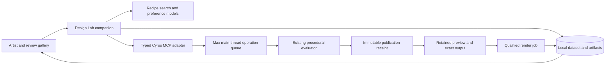
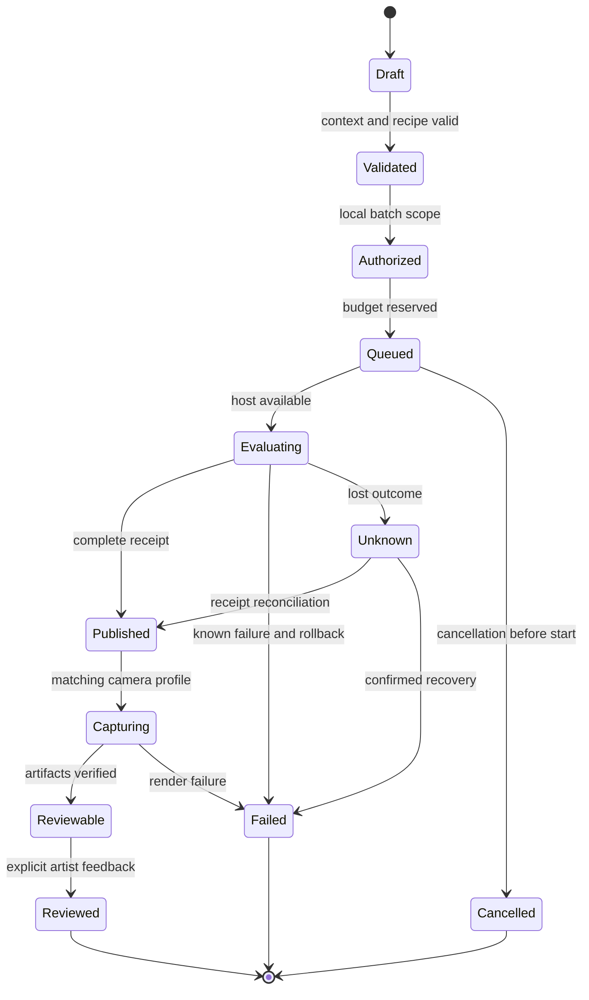

# Architecture, graphs and bounded agent loops

## Proposed process boundaries

Start with a local companion, SQLite metadata, an artifact directory and a single worker queue. These are proposed implementation choices. A studio server, external job broker, object store or vector service should follow demonstrated multi-user/scale needs. Keep storage access behind small interfaces so migration does not require changing recipe semantics.

The companion owns dataset writes, model loading, image feature extraction, search, review and training jobs. Max owns scene objects, native evaluation, preview and renderer integration. Heavy inference must not enter a redraw callback or UI timer. Autodesk explicitly disallows worker-thread `pymxs` interaction; its old `mxstoken` mechanism is deprecated and ineffective. [Max 2027 threading documentation](https://help.autodesk.com/cloudhelp/2027/ENU/MAXDEV-Python/files/MAXDEV_Python_threading_html.html).

Pure native computations can have their own measured threading design, but that is separate from calling host APIs. Do not hold Max node references in background Python workers. Pass copied plain data or content-addressed artifacts across the boundary.

## Four different graphs

| Graph | Nodes and edges | Cyrus use | Initial implementation |
| --- | --- | --- | --- |
| Scene relationship graph | Site objects/roles linked by spatial constraints | Represent paths, beds, visibility, adjacency and plant roles | Typed JSON plus geometry functions; no graph database needed |
| Workflow state graph | Jobs/stages linked by allowed transitions | Resume generation, rendering, review and model evaluation | Explicit state machine with durable records |
| Evaluation dependency graph | Inputs/caches/publications linked by invalidation | Preserve the existing engine's ordered dependencies and reuse | Extend current keys/revisions only when a feature requires it |
| Knowledge graph / GraphRAG | Concepts/documents/entities linked by semantic relationships | Optional retrieval across a large documentation/asset corpus | Begin with versioned metadata and full-text/tag search |

A graph neural network is a **model operating on graph data**, not a fifth required infrastructure service. It may later encode scene or preference relationships. It needs a dataset and a comparison against pooled geometry/image features. A scene graph can be useful without any learned graph model.

GraphRAG extracts graph structure and community summaries from text for retrieval. It does not turn a photo into a valid planting plan or optimize collisions. For this repository, exact capability lookup and a small curated recipe catalogue should precede it. [GraphRAG documentation](https://microsoft.github.io/graphrag/).

## Proposed job state machine

Add a separate cancellation-request field while work is in progress. Do not force a job into `cancelled` before the host confirms its state. A retry is a linked attempt with a bounded policy; it does not erase the first failure. A partially rendered candidate may be inspectable for debugging but is not automatically reviewable for aesthetic training.

Every stage writes its input digests, expected base revision, operation key, artifact references and outcome. Persist job admission and budget reservation before sending a mutating command. Only mark an artifact complete after an atomic file replacement and verification. Orphan artifacts can be reconciled later by a scoped maintenance tool; broad directory cleanup is not part of normal recovery.

## Completion and cache checks added by the second pass

Before `Capturing → Reviewable`, require the complete declared view set and verify file decoding, hashes, dimensions, candidate/publication IDs and render profile. A workflow checkpoint records progress; it is not proof that cached files still exist or match their manifest. Reconcile after restart, reject late artifacts from older attempts, and test deleted/replaced intermediates. These are Cyrus requirements informed by the [PDG lessons](14_HOUDINI_ENGINEERING_LESSONS.md#a-batch-graph-is-not-an-artifact-validator); adopting PDG is not required.

Model worker admission explicitly: a host lease, one mutation at a time, supported mode, estimated memory, expanded camera/retry cost and persistent attempted-work quotas. Treat slot count, worker-process count, internal render threads and GPU use as separate resource quantities. Start with the qualified private host mode and measure before introducing a second worker.

## Where an agent belongs

An optional agent interprets the artist brief, retrieves capabilities/examples and proposes typed recipes or refinements. The ordinary workflow decides when those proposals can run. It has a maximum number of proposals, retries, evaluations, renders and elapsed time. It stops on stale input, unsupported capability, exhausted budget or unresolved outcome.

Use deterministic code for counts, distances, identity checks, consent checks and state transitions. Use a model where interpretation or preference prediction adds value. A second model critique can be an advisory signal; a second model agreeing with the first is not equivalent to artist validation.

Research systems such as Scenethesis demonstrate planning, visual refinement and physical optimization in scene generation, but their results do not qualify Max integration or guarantee general composition quality. [Scenethesis](https://arxiv.org/abs/2505.02836).

## Framework decision

| Option | Appropriate when | Watch for |
| --- | --- | --- |
| Python state machine + SQLite | First local batch/review workflow, few stages, strong reproducibility needs | Define transitions, leases and recovery explicitly |
| LangGraph + persistent checkpointer | Branching interactions and interrupted human input make handwritten orchestration cumbersome | Replay of nodes and side effects; framework state is not the host transaction ledger |
| Distributed workflow system | Multiple render hosts and substantial scheduled workloads are demonstrated | More operations, licensing, resource control and deployment burden |
| Autonomous multi-agent architecture | Benchmarks show distinct roles improve outcomes under equal budget | Extra cost, coordination failures, judge bias and poor attribution |

LangGraph documents persistent checkpoints and replay behaviour. Code before an interrupt can run again; side effects need idempotency or separate task boundaries. This reinforces the need for host operation IDs regardless of framework. A memory-only checkpointer does not provide restart durability. [Persistence](https://docs.langchain.com/oss/python/langgraph/persistence), [interrupts](https://docs.langchain.com/oss/python/langgraph/interrupts).

Use the smallest orchestration mechanism that passes the crash/recovery suite. The recommendation is an explicit state machine first, with LangGraph as a measured integration option. General agent engineering guidance also distinguishes predictable workflows from more autonomous agents. [Building effective agents](https://www.anthropic.com/engineering/building-effective-agents).

## Context engineering for Cyrus

Provide each model call with the relevant capability version, compact site summary, approved assets, active brief/profile, current candidate/diagnostics and a few representative examples. Retrieve deeper documentation on demand. Avoid repeatedly sending the entire source tree, every transform or all interaction logs.

Use structured facts for geometry and counts, thumbnails for visible composition, and brief text for intent. Include explicit unknowns. Version the prompt, tool schema and model together so an improved result can be attributed. Keep a compact public action trace and explanations; there is no need to request or persist private model reasoning.

## Scaling and fault containment

One mutating job per host is the first rule. Multiple hosts may execute independent disposable studies after memory, renderer licensing and resource admission are qualified. The companion can perform file I/O and inference independently, but must account for contention with the renderer and the artist's viewport.

Do not assume a crash is a safe rollback. Record the last known scene fingerprint and publication receipt, reopen the disposable base when necessary, and mark ambiguous outcomes. The artist's normal scene is never the scratch database for a large batch.

Maintain fallback operation with no model provider and no network: curated recipes, manual review, deterministic generation and saved records. Learning is an optional improvement to the workflow, not a dependency of ordinary scatter editing.
