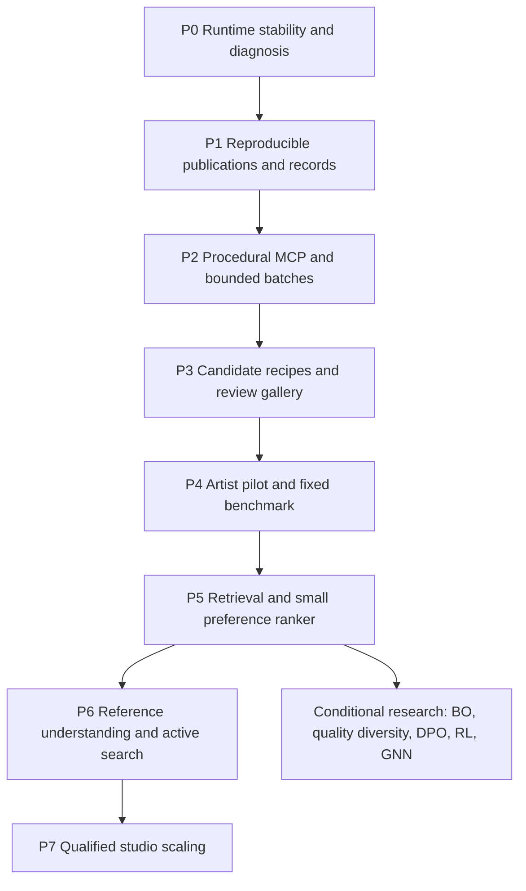

# Delivery roadmap and work queue

This is a proposed roadmap, not a claim that the following features are implemented. Deliver one reviewable vertical slice at a time. Keep product development labels in 0.7.x or a deliberately chosen later development series; reserve 1.0 for publication readiness.

**Second-pass revision, 5 October:** the delivery sequence is retained. Official Houdini/Autodesk research adds identity, artifact, callback/worker-mode and feature-contract gates below. [The report](16_SECOND_PASS_REPORT.md) explains why; vendor feature availability does not mark any Cyrus task complete.

## Delivery order

Architecture/data design and offline recipe research can proceed while runtime defects are investigated. Unattended generation must wait for its required execution gates. Do not bundle all phases into one large rewrite or release.

### Coordination with the current product roadmap

The separately maintained [current-system roadmap](../Current_System_2026-10-05/ROADMAP.md) coordinates product work. This package supplies specialist research and acceptance detail. Its work-queue IDs map to these phases as follows: D01/R01/R02/D02 → P0 host state and diagnostics; M02 → P1 publications; M01/M03/M04/M05 → P2 capabilities, mutations and jobs; A01 → P3 review pilot; A02 → P4/P5 data and ranking; A03 → conditional P6 reference/search. P7 includes the current roadmap's cross-cutting qualification. Catalog design and a restricted recipe pilot may proceed earlier within already supported capabilities; large automated studies still need their execution gates.

## P0 — Diagnose and qualify the host path

**Deliverable:** a matching source/binary private build, causal trace for the IR restart issue, and a focused fix in a later implementation loop.

- [ ] Record script, native DLL, Max/SDK and renderer identities from the tested process.
- [ ] Trace invalidation, cache decisions, publication and renderer notifications on a disposable scene.
- [ ] Reproduce idle and relevant-edit behaviour; isolate the initiating path.
- [ ] Fix the smallest demonstrated cause, preserving required updates and Undo.
- [ ] Re-run retained Mesh/Point Cloud navigation checks and relevant UI/Brush lifecycle checks.
- [ ] Qualify production rendering and IR separately; record unsupported hosts/renderers.
- [ ] Verify callback phase, ownership, reload/teardown, Undo/Redo and save/reset behaviour; compare diagnostics enabled/disabled. Keep notification semantics distinct from cache validity.

**Acceptance:** no unexplained idle restart loop in the agreed soak; one relevant edit updates the expected output; camera/UI browsing does not regenerate placements or upload unchanged buffers; an evaluation failure leaves the preceding valid publication usable. Counters, actual output and visual evidence must agree. See experiments E01/E02 and the interactive lifecycle portion of E17.

**Stop condition:** if the initiating cause remains unknown, publish the trace and keep unattended renderer batches disabled. Do not suppress all refreshes or blame licensing without evidence.

## P1 — Export complete, reproducible candidate evidence

**Deliverable:** policy-3 publication record and immutable candidate/artifact storage in a local companion prototype.

- [ ] Define versioned context, recipe, publication, view and attempt schemas.
- [ ] Export actual transforms/radii, stable IDs, source membership, reasons and exact epoch.
- [ ] Add portable asset references and explicit lineage; preserve generation-scoped IDs where necessary.
- [ ] Add camera/render-profile metadata and matching image/publication receipts.
- [ ] Implement durable artifact writes, checksums and restart reconciliation.
- [ ] Keep operational exports non-training by default.
- [ ] Publish an identity-survival matrix and golden transform/radius/surface fixtures; distinguish source slots, candidate keys, asset registrations and publication identities.
- [ ] Require a complete declared view set with decodable matching artifacts; test replacement, truncation, stale late results and restart reconciliation.

**Acceptance:** save/reload/replay reproduces the intended configuration and matching output under a pinned environment; stale images cannot attach to a new generation; interrupted writes are visible as incomplete; invalid units/IDs fail cleanly. No image-level bitwise promise across hardware or renderer versions is required. E03/E04/E15/E16. In P1, artifact checks may use fixtures and prior qualified captures; the new public render-job contract is completed in P2.

## P2 — Expose procedural tasks and a real batch contract

**Deliverable:** a new versioned procedural API plus explicit disposable-batch authorization, preserving old plans.

- [ ] Generate capability documentation from the supported setting registry.
- [ ] Add ordered layers/sets, shared defaults, radii, collision scopes, cleanup/refill and supported coverage options.
- [ ] Add source-container membership snapshots and revision invalidation.
- [ ] Add bounded Brush/area authoring only after its dedicated contract passes.
- [ ] Add complete-plan dry run and effect summary.
- [ ] Add persistent batch quotas, one mutating job per host, operation status and cancellation requests.
- [ ] Add a separately qualified camera/render job contract.
- [ ] Test the installed MCP library against intended clients/protocol versions; negotiate optional extensions only when supported.
- [ ] Declare the qualified host mode and explicitly evaluate jobs; qualify noninteractive Batch separately from the private interactive worker, including timer/message-loop dependencies.
- [ ] Account for the expanded candidate × camera × retry workload before admission; separate process status from semantic completion.

**Acceptance:** old schemas behave as before; policy-3 plans round-trip with the native UI; unauthorized or unsupported mutations are rejected; crash/retry never silently duplicates a scene change; expired/stale scope cannot continue. Batch attempts and render failures consume their documented budgets. E05/E06/E16 and the worker-mode portion of E17. Support only the modes that pass.

**Scope cut if needed:** start with fixed enrolled zones, no remote Brush strokes and a small supported source set. Describe the restriction clearly. Do not fake complete feature coverage to accelerate the demo.

## P3 — Useful generation and review without trained ML

**Deliverable:** curated recipe families, a variation generator, persistent gallery and explicit comparison UI.

- [ ] Curate artist-authored example recipes and asset-role metadata.
- [ ] Implement bounded parameter variation, seed tracking and near-duplicate detection.
- [ ] Generate a small diverse batch from an immutable base site.
- [ ] Support A/B, tie, neither, skip, favourite and explicit approval.
- [ ] Add per-artist/studio/project profile selection and versioning.
- [ ] Replay/apply a chosen candidate through a separate working-scene transaction.
- [ ] Support feedback retraction, artifact retention and dataset eligibility review.
- [ ] Make gallery selection artifact-only; provide separate explicit scratch-load and apply actions. Reject unsupported spatial clustering controls instead of confusing them with source-diversity assignment.

**Acceptance:** artists can find, compare, revisit and apply a candidate with its ordinary controls intact. No feedback is lost or duplicated on restart. The same card always resolves to the same recipe/publication/views. The workflow is useful with inference disabled. E07/E08.

## P4 — Establish the dataset and benchmark

**Deliverable:** an eligible pilot dataset, annotation guide, grouped holdout and baseline report.

- [ ] Choose a small range of design briefs and distinct sites with the studio.
- [ ] Run review-usability sessions before asking for thousands of labels.
- [ ] Measure agreement, skips, preference diversity, review effort and technical failure rate.
- [ ] Freeze grouped splits and a human audit set.
- [ ] Predeclare baseline, primary quality/time metric, practical margin and budgets.
- [ ] Audit consent, asset/reference provenance and exclusions.
- [ ] Version feature definitions, fitted normalization, vocabularies, units and image preparation. Reserve golden inputs for training/inference parity; do not fit preprocessing on the holdout.

**Acceptance:** enough independent task coverage to estimate uncertainty; no seed/camera/lineage leakage; reviewer disagreements remain visible. Dataset size is set from pilot evidence, not a promised universal threshold. E08/E09.

## P5 — First learned improvement

**Deliverable:** retrieval and a small preference ranker, with model registry and rollback.

- [ ] Fit a recipe/geometry-feature baseline.
- [ ] Compare retrieval, linear pairwise and small nonlinear ranking under equal candidate budgets.
- [ ] Add frozen image features only as an ablation.
- [ ] Measure calibration, new-site performance and per-profile results.
- [ ] Shadow the model before using it to select visible candidates.
- [ ] Run a blinded artist study against the strongest simple baseline.
- [ ] Pass feature/inference parity and missing/out-of-domain input checks; qualify an exported model or alternative execution provider only if actually used.

**Acceptance:** a predeclared meaningful improvement in time-to-approved result or held-out preference, with no material feasibility/diversity regression. A rollback restores the previous model or recipe-only workflow. E09/E10/E18.

**Stop condition:** if a richer model only improves training accuracy, improve data, features or controls. Do not scale training to conceal leakage or weak labels.

## P6 — References and informative search

**Deliverable:** editable reference interpretation, scene relationships and measured active comparison selection.

- [ ] Extract tentative roles/masks/relationships with provenance and confidence.
- [ ] Let artists choose which reference aspects to transfer.
- [ ] Compile confirmed intent into currently supported recipe controls.
- [ ] Compare human-only, model-assisted and corrected-mask interpretations.
- [ ] Test uncertainty/diversity/random mixtures for review selection.
- [ ] Add preference BO or quality-diversity search only where pilot results justify them.
- [ ] Compare an inverse recipe initializer with retrieval plus search; permit multiple plausible recipes and verify each through the exact engine. Do not infer a unique scene from a reference image.

**Acceptance:** fewer artist corrections or better final designs under matched budgets; correct handling of ambiguous scale, unavailable assets and occlusion; exact scene geometry remains authoritative. E11/E12/E13.

## P7 — Studio operations and release qualification

**Deliverable:** supported multi-user workflow, bounded storage/resources and documented deployment.

- [ ] Qualify any additional render hosts and concurrency admission.
- [ ] Define studio profile governance, project isolation, access and retention.
- [ ] Audit model/dependency/checkpoint terms before distribution.
- [ ] Separate plugin license checks from renderer/model/data permissions.
- [ ] Add import/export verification, backup/restore and dataset/model migration tests.
- [ ] Test long sessions, large libraries, network/provider failure and no-network fallback.
- [ ] Qualify supported Max versions and matching packages independently.

**Acceptance:** the declared host/renderer matrix passes, resources remain bounded, restore/recovery works, and documentation describes actual limitations. Existing licensing planning remains its own workstream; this research does not declare commercialization complete.

## Conditional research queue

| Topic | Start only when | Required win |
| --- | --- | --- |
| GraphRAG | Relevant evidence is missed by simple versioned retrieval across a genuinely large corpus | Better grounded proposals at tolerable indexing/query cost |
| GNN scene/preference encoder | Relational features appear important and sufficient graph-labelled data exists | Better new-site results than pooled/handcrafted features |
| DPO recipe proposer | Many context-matched valid preference pairs and a useful generative baseline exist | More valid preferred proposals than retrieval/search |
| Sequential RL | Multi-step correction tasks show a gap that simpler search/imitating edits cannot close | Better final outcomes under equal host calls and artist effort |
| GPU scatter compute | CPU profiles identify a dominant parallelizable stage after cache/bound improvements | End-to-end improvement including transfer, synchronization and memory |
| Automatic camera optimization | Planting quality can be evaluated independently of camera changes | Useful framing without hiding world-space defects |
| Technical surrogate | Qualified execution has useful measured outcomes and prediction can save material evaluation/search cost | Calibrated held-out cost/outcome prediction improves the bounded workflow; exact checks still decide feasibility |
| Inverse recipe initializer | P6 has a supported descriptor/intent representation and a strong retrieval/search baseline | Better verified proposals or less artist effort under matched budgets; no single-answer assumption |

Collect technical outcome measurements during qualified P1/P2 work. Training a surrogate is conditional and does not delay the first artist-review workflow. Keep its targets and evaluation separate from the preference ranker; synthetic technical labels are not professional aesthetic labels.

## Loop for each implementation task

1. Select one requirement and its observable failure/success criterion.
2. Freeze relevant source/build/runtime identities and a disposable fixture.
3. Implement the smallest supported contract and UI behaviour.
4. Run focused offline tests, failure injection and required host validation.
5. Compare the measured result with the baseline and check affected dependencies.
6. Update capability docs and evidence; keep failures visible.
7. Review the change and choose the next task. Package or publish only under a separate qualified delivery decision.

Do not treat pass counts as complete evidence. Each result needs its environment, coverage, outcome and remaining gaps.

## Recommended next coding loop

Begin with **P0: causal IR tracing and stability**, then **P1: exact policy-3 publication records**. Those two tasks make every later automated experiment more reliable. In parallel with design work, artists can curate a small recipe/asset-role catalogue without training a model or altering the plugin.

No effort estimate is presented as a commitment. After P0/P1 and the first render-cost pilot, estimate subsequent phases using actual host integration complexity, artist availability and batch throughput.
