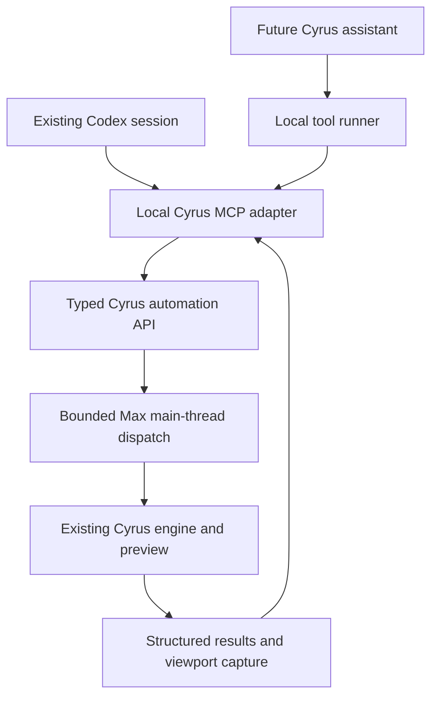

# 17 — ChatGPT connection, engineering tools and reference-assisted design

**Date: 2026-10-02. Status: PROPOSED implementation; current OpenAI documentation and selected Cyrus source paths inspected.** No MCP server, account connection or AI scene-generation workflow was implemented or runtime-qualified by this addendum.

## Decision

Build one provider-neutral Cyrus automation API with a thin MCP adapter. Use it first from the existing Codex desktop session to inspect and test Cyrus; extend the same API to bounded scene creation and reference-assisted design. Consider a built-in Cyrus assistant and its own ChatGPT connection after the tools prove useful.

This refines the implementation order in [15 — Roadmap](15_Phased_Implementation_Roadmap.md): a small observation milestone can precede the full mutation API. The original five design tools, transaction requirements and artist-controlled scope remain the basis for scene creation. The graphics work in [Scatter 0.63](../Retained_Point_Preview_2026-10-02/README.md) remains a separate implementation and measurement track.

MCP makes Cyrus capabilities discoverable and callable. Cyrus still calculates placements, validates geometry and draws the viewport. Model reasoning happens when the artist requests a task, not during ordinary navigation. Connecting MCP does not itself increase viewport FPS.

## Subscription access: what is verified

**Primary-source facts, checked 2026-10-02:** OpenAI documents Sign in with ChatGPT, including optional use of eligible Plus/Pro plan allowances for eligible Responses API requests. Identity sign-in and permission to use a plan are separate. The documented launch scope includes open-source tools, personal projects running locally and selected private apps. Paid or remotely hosted applications must request access before offering this integration to users. Cyrus commercial eligibility is **unverified**; publishing a small open-source adapter does not by itself establish eligibility for the paid product. [Integration guide](https://developers.openai.com/cookbook/articles/sign-in-with-chatgpt), [availability and scopes](https://developers.openai.com/siwc/quickstart).

Plan-backed requests consume existing Codex / ChatGPT work allowance; they do not create a separate unlimited allowance. This permission does not expose a person's ChatGPT conversations or memories. [User-facing plan and access documentation](https://learn.chatgpt.com/docs/sign-in-with-chatgpt).

| Route | Cyrus integration | Recommendation |
| --- | --- | --- |
| Existing subscribed Codex session | Codex calls a local Cyrus MCP server; Codex manages model authentication | First internal integration; Cyrus does not need the user's OpenAI credentials |
| Assistant embedded in Cyrus | A companion process uses the documented Sign in with ChatGPT flow and executes local tools | Later, after eligibility and end-to-end integration tests |
| Platform API credentials | Companion uses separately billed API inference with the same domain tools | Alternative deployment option; distinct from plan-backed OAuth |

Codex supports local stdio MCP servers and Streamable HTTP. Start with stdio to the local adapter and a separately bounded local connection to Max. Cloud reachability is a different deployment problem. [Codex MCP documentation](https://learn.chatgpt.com/docs/extend/mcp), [Codex authentication](https://learn.chatgpt.com/docs/auth).

Keep four decisions separate: OpenAI identity, permission to spend model allowance, Cyrus licensing/seat entitlement, and authority to inspect or change the selected scene. A ChatGPT login is not a Cyrus license. The application owns its own authorization and sessions. [Sign-in responsibilities](https://developers.openai.com/siwc/quickstart).

### A current integration constraint

The plan-backed Responses route supports function/custom tools and image inputs when the selected model accepts them, but currently excludes hosted MCP/connectors. Therefore our local client must execute Cyrus tool requests and return results; it cannot simply submit a hosted MCP definition to this route. The route also has its own streaming, history and parameter restrictions. [Current preview limitations](https://developers.openai.com/siwc/token-sharing-open-source/preview-limitations).

For a later direct integration, use the official authorization flow and protected credential storage, discover the selected account's available models, and verify a completed inference request. Do not copy Codex credentials, assume a model from the ChatGPT picker is available, or use private ChatGPT endpoints. [Integration guide](https://developers.openai.com/cookbook/articles/sign-in-with-chatgpt), [model discovery and inference](https://developers.openai.com/siwc/token-sharing-open-source/models-and-inference).

Codex app-server is another possible embedding experiment, using its own RPC protocol. The current documentation labels the command and WebSocket transport experimental and unsupported for production workloads; it is not a prerequisite for the local MCP milestone. [App-server documentation](https://learn.chatgpt.com/docs/app-server).

## One connection, two useful workflows

**Engineering:** inspect the actual loaded build, compare requested/generated/displayed counts, read cache and upload diagnostics, run a named isolated fixture, and obtain a report with build identity and measurement conditions. This can reduce manual copying and ambiguous test results. Transport latency and workflow time must be measured before claiming a speedup.

**Design:** interpret a brief/reference, inspect approved assets, propose planting regions and parameters, validate a complete plan, apply it as one coherent change, and examine a revision-bound viewport capture. Send a few semantic decisions to Cyrus; let the engine produce thousands or millions of placements. Do not send one model tool call per plant.

Network/model work stays outside Max. Max-facing calls use a supported, qualified main-thread dispatch mechanism. The IPC choice and host-busy behavior require an implementation spike; the diagram is not evidence of an existing connection.

## Current code provides a starting point

**VERIFIED IN CURRENT CODE, not a new runtime test:**

| Source | Useful evidence | Required adaptation |
| --- | --- | --- |
| [point_display.cpp](../../AminScatter/src/point_display.cpp), `cyrusRetainedStats` | Owner generation/counts, display callbacks, process counters, failure state and fingerprints | Versioned named fields; distinguish owner-local values from process totals and interval deltas. These are not presented-frame FPS or measured VRAM |
| [AminScatterObject.ms](../../AminScatter/scripts/AminScatterObject.ms), `previewStats` | Cached build count, duration and displayed point count | Bounded snapshot with sample time and explicit freshness |
| Same file, `layerEntries` / `allStatus` | Existing layer access and text status | Do not use as pure inspection: `layerEntries` can synchronize fields and invalidate previews; `allStatus` invokes it |
| [Private fixture transport](../../tools/performance/retained_integration/transport.ms) | Existing repeatable test entry point | It polls every 500 ms and evaluates fixture scripts. Keep this development harness separate from the proposed typed product API |

Implement pure inspection without triggering regeneration. Keep live cache objects and full point arrays out of model context. A deliberate viewport capture can cause redraw work; report that separately from a pure getter.

## Implementation sequence and acceptance

These milestones add a smaller first step to [15](15_Phased_Implementation_Roadmap.md); later gates in that roadmap still apply. Proposed names below are not installed commands.

| Milestone | Deliverable | Evidence required to advance |
| --- | --- | --- |
| **M0 — Observe** | Direct read-only API, then MCP access to `scene.get_context`, `scatter.get_status`, `scene.capture_viewport`; a bounded `scatter.get_diagnostics` development tool | Correct host/build identity and units; snapshots leave parameters, selection, save-dirty state, undo history and cached generation unchanged; capture freshness verified; busy/reset/reconnect behavior tested |
| **M1 — Reproduce** | Development-only `diagnostics.run_fixture` with named, allowlisted fixtures and operation IDs | Run in an isolated Max test session; compare hashes/counts and appropriately labelled timing distributions; bounded work; explicit failure/timeout results; no automatic replay after an uncertain outcome |
| **M2 — Create** | Existing `scatter.validate_plan` and `scatter.apply_plan` contracts | One new owned controller, correct layer/source arrays, one undoable change, stale-state rejection, deterministic seeds, duplicate-request suppression, failure-injection recovery and final geometric checks |
| **M3 — Design from references** | Asset cards, interpreted composition, constrained plan and one visual refinement | Artist-correctable layout; protected areas respected; final state matches reported revision; paired manual comparison includes review and correction time |
| **M4 — Embed and distribute** | Optional Cyrus assistant UI and eligible ChatGPT connection | Eligibility established; login/denial/revocation/quota/account-switch behavior tested; selected model completes image/function-tool workflow; no credentials in logs or scene files |

### First coding assignment: M0

1. Define a small versioned snapshot contract with host process/version, loaded plugin identity, session epoch, scene revision, units, enrolled controllers and capabilities. Prove binary identity separately from a reported script version. Report unavailable fields explicitly.
2. Add genuinely read-only accessors for controller/layer parameters, cached counts and diagnostics. Return bounded summaries; retain the existing distinction between requested plants, emitted placements and displayed preview samples.
3. Implement a bounded local dispatcher and reconnect lifecycle. Qualify ordinary operation, modal/render/load/reset/shutdown states. Never block Max waiting for a model response.
4. Add the thin MCP adapter and a test client. Use a fresh owned fixture before attaching to the artist's scene. Scope enrollment comes from the local user/client, not IDs invented by the model.
5. Add revision-bound viewport capture with a bounded artifact destination. Identify the camera, viewport, dimensions, display mode and generation. If freshness cannot be established, return that result explicitly.
6. Record tests and a short usage example: “Inspect this scatter and explain which work changes while the camera moves.” Captures and sampled diagnostics must distinguish observation overhead from the behavior being measured.

The first delivery does not depend on an embedded chat panel, a new login system, a vector database or custom ML. Model-provider changes should not require rewriting the Cyrus API.

Mutation authority should follow the artist's actual instruction: approve a concrete scope once, then allow bounded iteration within it. Local Cancel and Undo stay available without model cooperation. Keep arbitrary MAXScript execution, shell commands and unrestricted property/path access outside the model-facing product tools.

## Make reference-assisted design practical

An asset card should identify the approved model, a small preview, real dimensions, pivot/orientation, conservative footprint and useful artistic tags. The model can then select a tall narrow tree rather than guessing from a filename. Enrollment and capability checks must reject unsupported source types.

Interpret the image into composition: foreground/background height, clusters, open areas, paths, density transitions and palette. Ground those decisions in the actual site, units, camera and artist-confirmed regions. A single image does not uniquely determine hidden geometry or metric scale, and vision has known spatial limitations. Target an editable layout inspired by the reference; evaluate exact constraints with geometry. [Official vision limitations](https://developers.openai.com/api/docs/guides/images-vision).

The first design trial keeps the existing bounded scope: one static planar site, three approved mesh sources, at most three layers, 2,000 requested instances and an initial candidate plus one refinement. Those are pilot limits, not a proposed engine capacity limit. Raise them only after tool correctness and artist value are established.

Example brief: “Use these trees for a loose border, place low shrubs beside this path, and preserve the central lawn.” The assistant reads the site and asset cards, proposes regions and layer settings, validates protected-space and footprint constraints, then applies the authorized plan. It captures the result from the chosen view and can make one permitted refinement. Artist edits or a stale revision stop automatic application until the plan is reconciled.

Useful improvements after that trial are reusable planting recipes, artist-locked regions, controlled A/B variants with a shared seed, and budget-aware source selection. Store accepted recipes before considering training. Measure time to an accepted result, correction work, geometric validity and preservation of artist intent; an attractive first screenshot alone is insufficient.

Point Cloud preview supports checking distribution and silhouette. Material/leaf-level comparison may require a separately qualified, bounded render path; renderer automation remains later work.

## Status and next decision

- [x] Locate the existing AI/MCP roadmap and reconcile this proposal with it.
- [x] Verify current official subscription, tool-execution and connection constraints.
- [x] Inspect the current diagnostics and private test transport entry points.
- [x] Define M0 and the engineering-to-design progression.
- [ ] Implement and test M0 against an identified Max build.
- [ ] Run model inference, authenticate Cyrus directly, or measure AI task value.

**Recommended next implementation:** M0, using the existing Codex session. Its durable output is an inspectable Cyrus tool interface that helps the ongoing performance work and becomes the foundation for scene design.
