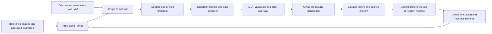

# Artist style learning for Cyrus Scatter

<!-- CURRENT_SYSTEM_2026-10-05 -->

Current coordination: [system roadmap](../Current_System_2026-10-05/ROADMAP.md), [MCP boundaries](../Current_System_2026-10-05/CAPABILITY_MATRIX.md), and [5 October AI-design research](../AI_Design_Learning_Research_2026-10-05/README.md). This package remains research/proposal material; style-profile and learning implementation is still pending.

Research and proposed implementation guide · 4 October 2026

**Recommendation: build a separate Cyrus design companion with portable Artist Style Profiles.** A profile should work with references, approved examples and editable preferences before it contains a trained model. Add a personal preference model or LoRA only when it improves results on projects it has not seen.

The intended outcome is an editable planting layout in Max: ordinary Cyrus layers, sources, coverage and spacing rules, produced from the artist's assets and site. The learning system helps choose those rules. The existing scatter engine remains responsible for generating, validating and displaying the plants.

## What this answers

| Artist's question | Proposed answer |
| --- | --- |
| Can different artists have different styles? | Yes. Keep separate profiles, with several profiles per artist or project: formal courtyard, dense tropical planting, restrained architectural framing, etc. |
| Can they supply their own references? | Yes. References guide visual intent; accepted Cyrus scenes and authored planting patches supply measurable placement examples. These are different kinds of evidence. |
| Does everyone need a LoRA? | No. A reference/recipe library is useful immediately. Statistical pattern fitting and a small preference model are alternatives. A LoRA is an optional adaptation of a particular compatible model. |
| Do we give the LoRA to MCP? | A model runtime loads an adapter and generates a typed proposal. MCP carries context and approved operations between the design system and Max. The current Cyrus MCP does not load model weights. |
| What does ML produce? | Initially: recipe recommendations or rankings of valid alternatives. Later: typed procedural recipes or bounded density fields. Individual learned point placement needs a separate future contract. |
| What problem does it solve? | Repeated setup, style transfer between projects, choosing among plausible layouts, and reducing artist correction time. It does not itself increase viewport FPS. |

## Current position

Source baseline: `e3518f8f87f3144d531f20afbb6790ce243f2cfc`, Scatter 1.2.3, MCP 1.1.0. This investigation inspected source and primary research; it did not run Max, train a model or benchmark ML.

**Implemented:** deterministic scatter controls, paint sets and Brush, retained previews, bounded MCP plan validation/application, configuration inspection and export of an actual published layout.

**Not implemented:** style profiles, semantic scene interpretation, reference retrieval, ML inference/training, automatic artist feedback collection or a dataset service. Current exported records explicitly carry `training_eligible: false`.

MCP design automation is narrower than the interactive plugin: Max 2027, a horizontal convex receiver, up to three enrolled mesh assets and three independent layers, and 2,000 aggregate requested candidates. Brush-set/history mutation and density-map enrollment are unavailable. The long-term design described here must not be advertised as already supported.

## The complete proposed workflow

Camera navigation stays on the cached preview path. It does not pass through the learning loop.

An artist would create a profile, add references, mark what they like, associate plant roles with available models, choose the target zones and request a draft. They would see the proposed density, organization, assets, constraints and unsupported requests before applying it. Their manual controls remain available afterward. A new profile revision is published only after evaluation; approving a layout does not silently retrain anything.

## Read by decision

| Document | Purpose |
| --- | --- |
| [Research and alternatives](RESEARCH.md) | LoRA versus retrieval, learning from planting patches, relevant papers, and what evidence does not establish |
| [Architecture and contracts](ARCHITECTURE.md) | Processes, style profiles, actual outputs, MCP compilation, fields, runtime and performance |
| [Data and evaluation](DATA_AND_EVALUATION.md) | Collection, labels, synthetic examples, training, splits, metrics and experiments |
| [Implementation roadmap](ROADMAP.md) | Ordered tasks, dependencies, acceptance gates and the first coding loop |
| [Source audit](CODEBASE_AUDIT.md) | Current integration points, missing capabilities and precise source anchors |
| [Primary-source ledger](sources.csv) | Sources, reading scope, supported claims and limitations |
| [Synthetic examples](examples/README.md) | A proposed profile and recipe, plus a current plan-2.0 example checked against existing validators |
| [Verification record](evidence/validation.json) | Documentation/example checks; explicitly not ML or Max qualification |

This extends the [30 September AI/MCP/ML roadmap](../AI_MCP_ML_Roadmap_2026-09-30/README.md). That roadmap anticipated retrieval, correction records and optional specialized models. This addendum specifies per-artist profiles, the model-to-procedural-output boundary, learning from authored 3D patches, and a concrete path to personal training. Historical reports retain their dated evidence.

## First delivery to build

Build the **Style Profile and Recipe Pilot**: save personal preferences and approved recipes, map semantic plant roles to current enrolled sources, compile only supported settings, present a reviewable draft, apply it through the existing approval path, and export the actual result for explicit feedback. Include a manual recipe baseline and a general-model/retrieval comparison.

This gives artists a useful workflow and gives engineering real examples. It also reveals whether the next investment should be better procedural patterns, better scene context, or a learned preference model. LoRA training is a later evidence-based gate, not a prerequisite for using a personal style.
