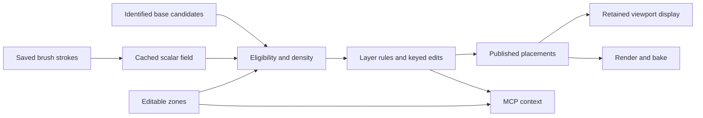

# Artist zones, procedural masks and the unified planting workflow

3 October 2026. **Research and implementation proposal; no product code or Max scene was changed by this review.**

**Later follow-up:** Brush ownership, stable identities and native UI were subsequently integrated in [Scatter v1](../Cyrus_Scatter_V1_2026-10-03/README.md). The [plant-group diagnosis](PLANTING_GROUPS_REVIEW.md) now tests artist feedback against installed 1.0.1 and provides the [next implementation plan](PLANTING_GROUPS_IMPLEMENTATION.md). Read those for current behavior. The starting-state inventory below remains historical; its zone/map proposals remain open.

## Recommendation

Build artist-authored zones into the existing layer system. A zone defines **where** planting is allowed; a layer defines **what and how much** to plant; Brush adjusts a continuous density mask; spacing rules resolve conflicts; CS Edit preserves individual corrections. Surface Analyzer supplies optional geometric guides. MCP reads these explicit inputs and proposes changes through the same evaluated system.

The artist should be able to draw a lawn, assign grass, draw an overlapping tree zone, paint density, erase a path, and move a particular tree without switching to a second scatter system. This works manually before AI is involved. Explicitly authored zones also give the AI stronger spatial instructions than guessing from a viewport image.

**Keep editable surface strokes as the first authoritative Brush input, display a black/white or tinted mask, and add mapped image import/export as a separate capability.** A visible paint map and a saved bitmap are different decisions. The current prototype already stores surface-attached paint independently of the generated plants; it does not merely remember a list of painted plant positions.

This proposal extends the [Brush contracts](../Brush_Tool_2026-10-02/IMPLEMENTATION_PLAN.md). It adds zone identity and a later final-placement spacing mode; it does not silently replace legacy overlap behavior or claim that prototype integration is finished. The [fresh source audit](CODEBASE_AUDIT.md) identifies the changes needed, and [inspection provenance](audit.json) records the inspected working-tree hashes.

## What exists today

| Capability | Current evidence | What remains |
| --- | --- | --- |
| Named layers, source palettes, density and transform settings | Production source | Persistent semantic zone/layer identities and target-subset bindings |
| Closed spline Include/Exclude areas | Production source; world-XY masks | Unified zone UI, mesh-patch adapter, explicit projection rules |
| Grayscale density input | Production source; a rendered 128 × 128 map sampled through UV channel 1 | Editable painting UI, resolution/mapping controls and safe dispatch; see A04 |
| Layer separation | Production source; fixed or source radii plus gap | Different rules per layer pair and optional final edited placement blockers |
| Surface Analyzer integration | Scatter already consumes Analyzer paths/points as area filters | Semantic zone records; arbitrary curved-surface area filtering is not established |
| Procedural Brush | Isolated native lab with earlier plane/sphere, persistence and Undo results | Main-layer ownership/UI, continuous mask display, production identity and lifecycle integration |
| CS Edit | Production modifier with internal edit identities | Explicit persistent candidate IDs at its scatter entry point |
| Artist-supplied MCP regions | Implemented bounded MCP 1.0 workflow | Persistent zone context, Brush/spacing contracts and authorized existing-layer edits |

The Brush lab is separate intentionally. `AMIN_BUILD_BRUSH_LAB` defaults off, its document is attached to a helper, and the main UI generator has no Brush stage. Adding a button alone would not supply the missing data flow.

## What the artist should do

1. Select the terrain or other receiving surface.
2. Draw or pick a closed spline, or assign a supported surface patch. Name the zone, for example `Courtyard lawn` or `North tree belt`, and assign a role and display color.
3. Create a layer using that zone and choose its source assets. Start with one zone per layer in the UI; permit shared zones and unions without duplicating their geometry.
4. Set density, a boundary setback if needed, and which other layers this layer should keep away from.
5. Use Paint/Erase in the selected layer. Show the evaluated mask even when there are few plants. White permits full configured density, black permits none, and gray permits a fraction, subject to other constraints.
6. Make individual CS Edit corrections. Save and reopen the scene with zones, strokes, bindings and edits intact. Manual mode still requires Update to publish changed plants.

Place Zone, Density, Brush and Separation controls in the same selected-layer editor. Keep the existing layer counts/status and add only useful state, such as `Mask edited · Update pending` or `Zone target missing`. A collapsed panel must not rebuild planting. Implement controls in the authoritative generator/current qualified UI host; a separate UI framework migration is not a prerequisite.

### Give each concept its own identity

| Record | Responsibility |
| --- | --- |
| Zone | Persistent ID, artist name/role/color, boundary inputs, eligible surface references, coordinate/projection rule and revision |
| Layer | Persistent ID, zone references, assets, population recipe, mask reference, spacing rules and manual corrections |
| Paint document | Independent ID, ordered strokes, mask initialization, surface bindings and evaluator/schema version |
| Candidate | Population ID, persistent candidate key, surface/triangle/barycentric anchor, source identity and transform data |

These are **proposed product records**, not existing public APIs. An ID is not a layer row number, a material ID, an Analyzer element number or an object name. Roles and colors are editable metadata. Several independent masks can overlap at the same location; a single categorical color map cannot represent that relationship by itself.

A copied layer gets independent paint by default. Sharing a zone keeps its boundary shared; duplicating a zone creates a new identity. Explicitly linked masks can be considered later. Use actual Max references and clone remapping rather than matching names after load.

## Zones on planes and curved geometry

Support these meanings explicitly rather than treating every drawn object alike:

| Artist input | Recommended interpretation |
| --- | --- |
| Closed planar spline | An Include/Exclude boundary projected using a declared coordinate frame onto selected target surfaces; existing XY behavior is the first adapter |
| Plane or mesh patch used as the receiving surface | Scatter directly on that patch; no projection is necessary |
| Separate mesh used as a boundary over another surface | Requires a declared footprint/projection conversion; do not silently scatter on both objects |
| Open line | A path with an explicit width, using existing qualified line/Analyzer support where applicable; an open curve does not enclose an area |
| Brush on a curved target | Use the validated surface anchor and connected visible-patch evaluator; no UV requirement for the first implementation |

A world-XY boundary does not identify the intended side of a wall or distinguish stacked floors. Target references are mandatory. Initially reject an unsupported projection or ambiguous coincident receiver rather than assigning it to an arbitrary surface. The existing Analyzer handles supported planar elements in their own planes, but the current **Scatter Analyzer Area adapter evaluates in world XY**. Those are different capabilities.

Keep geometry zone boundaries editable through Max's own modeling/spline tools. A new spline drawing engine, automatic UV atlas or universal geodesic solver is unnecessary for the first delivery.

## Black-and-white paint: appearance, meaning and storage

Use one scalar density field per painted layer. A value of 0.5 means approximately half the eligible candidates survive; it does not promise exactly half the final plants after spacing and exclusions. Zone colors can tint this field without changing its values or the object's render material.

For a fixed identified candidate population, the proposed acceptance rule is:

```text
eligible(x) = inside the union of this layer's zones AND outside hard exclusions
weight(x)   = clamp(brush(x) * optional_density_map(x), 0, 1)
keep(x)     = eligible(x) AND stable_threshold(candidate_id) < weight(x)
```

Density determines the base population; the normalized mask modulates it. Multiple Include zones form a union rather than generating duplicate plants in their overlap. Exclusion wins. Brush cannot paint a plant back into a prohibited region. Disabled Brush has weight 1; an enabled empty painted layer has weight 0. Offer an explicit undoable **Fill allowed zone** action for artists who want to start full and erase. Its saved initialization value is a small schema extension; it is not in the current lab document.

Mask-only edits must not resample surviving positions, asset choices or transforms. Do not refill elsewhere to force an exact visible count. The existing Count path can make extra attempts after area/map rejection, so simply inserting Brush into that loop would not meet the contract. Preserve old scenes' behavior and introduce the new behavior explicitly for Brush-enabled layers. Seed, source-recipe or reference-geometry changes have their own binding rules; stable IDs do not make every procedural edit position-preserving.

| Representation | Useful for | Limitations / decision |
| --- | --- | --- |
| Editable surface strokes + cached field | No-UV flat/curved painting, history edits, scene-contained ownership | Long overlapping history needs local indexing/replay; changed topology needs explicit rebind. **First implementation.** |
| World-plane image mask | Terrain plans, CAD-derived beds, reuse on consistently mapped sites | Needs scale/origin/axis metadata and adequate resolution; unsuitable as a universal wrap around arbitrary geometry |
| UV image mask | Reuse on mapped assets, external image editing, detailed paint on coarse meshes | UV seams, shared islands, distortion, channel and missing-file rules must be explicit |
| Original mesh vertex weights | Simple low-detail attributes | Cannot represent a tiny independent spot inside a four-vertex plane |
| Weights stored only on current plants | Fast derived acceptance cache | Cannot recover paint between those plants or at newly generated candidates; never the authoritative input |

Neither strokes nor maps are loss-proof. Strokes need scene persistence and compatible target bindings. Images need retained data and mapping. Save authoritative strokes inside `.max`; treat field caches as rebuildable. For map import, first copy the data into a managed scene-owned mask. For later export, package pixels with channel/projection, units, transform, resolution, border policy, numeric/color interpretation and version. Use scalar values as data, without an accidental display-gamma conversion. UVs outside the supported domain must have a declared behavior; today's clamped channel-1 sampling is not a general UDIM solution.

**A bitmap is not automatically cheaper.** As an illustrative calculation, one uncompressed 4096² float channel occupies 64 MiB before mips, Undo or scratch data. Across a one-kilometre site its texels are approximately 24.4 cm wide. Resolution and occupied area matter. Conversely, a cached image can make repeated sampling very cheap. Benchmark both on the same precision and coverage requirements before adding a second evaluator. Exporting strokes to a map is a lossy rasterization, not a reversible replacement for their history.

## Overlapping zones without unwanted plant intersections

Keep three controls separate:

1. **Boundary setback:** distance from a permitted/protected boundary, optionally accounting for the plant footprint.
2. **Within-layer spacing:** tree-to-tree or shrub-to-shrub clearance.
3. **Between-layer spacing:** a rule for a specific pair, with an explicit winning layer.

For circular footprints on a supported plane, test centre distance against `radius A + radius B + pair gap`. This is a footprint approximation, not triangle-accurate plant collision. A trunk/ground footprint and a crown footprint are different artistic choices. Grass under a canopy can be intentional; a large canopy-based exclusion would remove too much grass.

An example recipe could keep shrubs away from tree trunks while allowing grass beneath trees, and give the tree layer priority. The actual radii/gaps remain artist settings, not inferred botanical facts. Provide a simple `Keep away from: Trees / gap` control before introducing a large rule-matrix UI.

The current source uses **raw blocker placements**, before those blockers' own overlap cleanup and CS Edit. That avoids recursive dependencies but can reserve space around a subsequently removed or moved plant. Retain that behavior for existing scenes. For the new integrated recipe, add an explicit **final-placement priority mode**: evaluate higher-priority layers completely, publish their accepted edited positions/radii, then evaluate dependent layers. Reject dependency cycles; do not recursively call final placement evaluation in both directions. Cache by the published placement revision, including paint and edit changes.

Final relaxation must keep roots inside allowed zones/masks, and final scaling must participate in clearance checks. Manual CS Edit changes need a visible rule too: paint membership stays attached to the declared procedural surface root, while CS Edit offsets remain saved downstream overrides. If painting hides that candidate, its edits become dormant and return with the same candidate. A moved copy may therefore lie beyond painted coverage; do not claim black pixels automatically prohibit every explicit override. Flag final-position zone/spacing violations, preserve the edit record, and require explicit correction or an artist exception for a strict recipe. AI-generated layouts must not silently acquire such exceptions. A future mode that repaints at moved roots needs its own anchor/reprojection contract.

## Caching and performance



Cache target geometry, the base population, mask evaluation, final placements and display buffers separately. Inactive navigation must not replay strokes, resample maps, rerun Analyzer or regenerate plants. Changing viewport quality must not change the underlying mask or render population.

The earlier [Brush implementation measurements](../Brush_Tool_2026-10-02/IMPLEMENTATION_2026-10-03.md) already identify a concrete problem: 1,000 single-dab strokes over 10,000 candidates took about 333 ms distributed or 657 ms overlapping to evaluate in that probe. These are historical single-run kernel results, not fresh timings or FPS. The face-based index is too coarse when many dabs occupy one large triangle, and the lab rebuilds/evaluates the full field after changes.

The next optimization should add a spatial index within coarse faces, cached weights for affected candidates, and provisional active-stroke state. Appending a stroke can update touched candidates. Editing an older stroke must replay the ordered affected history over the union of old/new coverage; paint and erase cannot simply be summed. Reuse the exhaustive evaluator as an oracle. Budget Undo/history memory as well as computation.

A continuous overlay also needs its own sample/display domain. The current overlay samples surviving candidate locations and cannot show all painted intent. Compare a bounded surface overlay/atlas against the same field without subdividing the artist's mesh. Retain completed output until a valid replacement is ready; stale previews must be visibly marked and cannot silently stand in for a valid production render.

Start with bounded native CPU work and existing retained display. Introduce worker jobs, tiling, GPU mask evaluation or partial uploads only after measurements identify the relevant cost. A small painted bed on a huge target may eventually justify spatially partitioned candidate generation, but it must preserve the declared identity and density semantics. GPU display support does not make field replay free.

## Implementation order and acceptance

The following is the combined backlog. It refines the existing Brush M0–M3 gates; unchecked items are proposed, including where an isolated prototype already covers part of a test.

| Phase | Work | Exit condition |
| --- | --- | --- |
| Z0 — identity and dispatch | Persistent layer/zone/surface IDs; a native candidate batch with keys and anchors; keyed CS Edit entry; audit fast/advanced dispatch | Same candidates keep transforms and edits after mask filtering; removed candidates never transfer edits to new rows; disabled new features preserve existing outputs |
| Z1 — artist zones | Adapt existing spline areas; target subsets; shared-zone references; roles/colors; first direct surface-patch input | Include union, exclusions, holes, copy/remap, rename, disabled/deleted targets and units behave as specified; unsupported projection is reported |
| Z2 — integrated Brush | Layer-owned native document; generated UI; explicit fill/empty; independent mask overlay; local evaluation; Undo and Manual scheduling | Flat/coarse/curved fixtures, same-field overlay, Save/Open, copy, cancellation and long-history latency/memory gates pass |
| Z3 — complete planting recipe | Pair gaps/footprints, final-placement priority mode, edit conflicts, final admissibility and consumer revisions | Three overlapping vegetation layers obey declared clearances after painting, scale changes, CS Edit and layer enable/reorder; cycles reject deterministically |
| Z4 — output qualification | Mesh/Proxy/Point Cloud, render/IR/bake, old scenes and supported Max versions | One agreed committed population per operation; viewport limits cannot alter render output; no paint work on inactive navigation |
| Z5 — reuse and automation | Optional mapped image import/export; MCP reads persistent zones/revisions, then scoped plan edits | Map/mapping round-trip tolerance is measured; MCP respects protected zones, artist ownership, stale revisions and local approval |

Z5 map reuse and MCP are separate deliveries and can be prioritized independently after the core contracts pass. No custom ML is needed for Z0–Z4. Keep current limits until measured evidence supports changing them.

**First artist pilot:** one terrain with a protected building/path, three overlapping grass/shrub/tree zones, one plane patch, one curved paint target, and one manually moved tree. Paint a small patch on very coarse geometry; erase; lower and restore density; adjust an old stroke; reshape a zone; Undo/Redo; copy; Save/Open; switch display modes; render/bake. Track the same plant IDs and all declared spacing violations. Reuse the existing Brush and performance fixtures instead of constructing a second general test framework.

Record generation, field evaluation, hit testing, overlay publication, main-thread input latency, memory and dependency rebuild counts separately. Include median/p95/worst latency for realistic long paths and overlapping history; the lab's 250 ms timer is not an acceptable substitute for latency measurement. Any responsiveness target must name the hardware, population, affected area and history size. Compare warm inactive navigation against the retained-display baseline.

## MCP and later AI design

MCP 1.0 already lets an artist enroll named planting splines. That is a useful initial form of your workflow, but its IDs describe an enrolled context and its geometry scope is limited. It does not yet edit artist-owned layers, Brush documents, mesh zones or pair-spacing rules.

The next read-only context should expose persistent zone IDs, human roles/names, surface bindings, evaluated bounds, exclusions, coordinate frames, mask summaries/revisions, source footprints and rule ownership. An AI can then propose, for example, more shrubs inside an already authored shrub zone without guessing the zone from its color. Only afterward add typed operations for narrowly authorized changes. Revalidate context and dependencies before applying a plan; never expose arbitrary script execution to solve missing domain commands.

CAD/PDF-derived zones and artistic/reference-derived proposals can feed these same records later. Artist zones do not by themselves provide complete building semantics, plan calibration or composition skill. The manual procedural workflow must remain useful with MCP disconnected. ML remains a separate measured product track, with no implicit training use of artist edits or operational journals.

## Primary-source findings and their limits

These sources were revisited on 3 October 2026. Their documented behavior supports the design choices; it does not disclose competitors' private engines or establish Cyrus performance.

| Source | Relevant evidence and consequence |
| --- | --- |
| [SideFX Attribute Paint](https://www.sidefx.com/docs/houdini/nodes/sop/attribpaint.html) | Paints point attributes and supports stroke recaching; reapplication has identity requirements. Useful history/binding precedent, but original-vertex weights alone do not meet our coarse-plane requirement. |
| [SideFX Texture Mask Paint](https://www.sidefx.com/docs/houdini/nodes/sop/texturemaskpaint.html) | Outputs an image represented as a 2D volume, independent of mesh density; uses UV mapping, configurable resolution and continuous or mouse-up output updates. Supports the proposed visual mask and optional mapped-image path. |
| [SideFX Scatter](https://www.sidefx.com/docs/houdini/nodes/sop/scatter.html) | Density weights with a forced total describe relative distribution. Its surface-coordinate examples also distinguish placement from attachment. This reinforces explicit count semantics and saved anchors rather than promising stability from a seed alone. |
| [ForestPack Areas](https://docs.itoosoft.com/forestpack/forest-plugin/areas) | Offers spline, paint and object-area workflows. Open splines need thickness; documented paint areas require XY surfaces, and object exclusion uses world-Z bitmap projection. These are useful bounded precedents, not arbitrary-curved-surface guarantees. |
| [ForestPack Image Mode](https://docs.itoosoft.com/forestpack/forest-plugin/distribution/image-mode) | Separates distribution maps from area boundaries and supports grayscale density modulation. Its collision description uses approximate bounding spheres, illustrating why footprint rules must be described honestly. |

## Evidence boundary

Fresh work in this review consists of source tracing, official documentation research and these documentation changes. The audit covers the working tree at HEAD `b757b0f995e0f77f7faa3e7d6c71eb52fa4ccb76`, including pre-existing uncommitted Brush/MCP work. Earlier fixture outcomes are linked as historical evidence. No new Max session, runtime qualification, build, benchmark or FPS improvement is claimed. The next coding milestone is Z0 plus a small Z1 vertical slice, not a replacement scatter engine.
