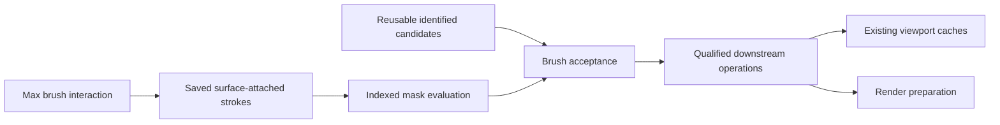

# Procedural Brush: recommended approach

3 October 2026 — design revision 3.1 with an implementation update. **An isolated M0/M1 prototype now exists and has Max 2027 fixture results. Production Brush integration and the full acceptance matrix remain open.** Read the [implementation report](IMPLEMENTATION_2026-10-03.md) and [lab instructions](../../tools/brush_lab/README.md) for the implemented scope, evidence and current limits. The product behavior below remains the integration specification.

**Artist-zone integration addendum, 3 October:** the [unified planting proposal](../Artist_Zones_Integration_2026-10-03/README.md) extends this specification with named spline/mesh zones, layer roles, separate boundary and plant-spacing rules, a black/white mask overlay, optional map reuse and MCP context. Editable surface strokes remain the first authoritative Brush input. The new [source audit](../Artist_Zones_Integration_2026-10-03/CODEBASE_AUDIT.md) confirms that existing area, density-map and Analyzer features can be reused, while stable candidate identities and real layer ownership remain prerequisites. The proposed final-placement priority mode is additional work; existing raw-blocker behavior is preserved for legacy scenes.

Build an editable **density mask attached to a scatter layer's surfaces**. Keep the strokes as saved user input, evaluate affected areas in C++, and filter a reusable population of identified candidates. Use Max's Painter Interface for interaction and the existing Mesh, Proxy and Point Cloud paths for display.

This is the best-supported next implementation, not a claim that one algorithm is optimal for every scene. The remaining uncertainty is concentrated in small experiments with explicit pass/fail criteria.

| Read | Purpose |
| --- | --- |
| This page | Product behavior, decisions and scope |
| [Implementation plan](IMPLEMENTATION_PLAN.md) | Technical contracts, integration order, milestones and acceptance tests |
| [Evidence and research](PROCEDURAL_RESEARCH.md) | Primary sources, code findings, corrections and limits |
| [Codebase integration audit](CODEBASE_INTEGRATION.md) | Nine concrete source findings, required changes and reusable infrastructure |
| [First implementation and evidence](IMPLEMENTATION_2026-10-03.md) | Native prototype, real painting/persistence tests, measured history costs and remaining gates |

## What the artist gets

1. Select an existing layer or create a painted layer.
2. Choose paint targets from the controller's scatter surfaces. This selection belongs to the layer.
3. Paint or erase an area with radius, strength and softness controls. A surface overlay explains the mask even when few plants are visible.
4. Change density, plants, scale and rotation while keeping the painted input. A compact history panel can adjust or disable an earlier stroke.
5. Undo a whole stroke in one step. Save, reopen or copy the layer without losing its paint.
6. Leave Brush mode and navigate using the completed viewport caches.

Enabling an empty mask gives an empty painted layer. Disabling the mask restores the ordinary unmasked layer. Existing scenes load with Brush disabled. Erasing reduces coverage; it must not cause replacement plants elsewhere to satisfy an exact visible count.

Use the existing density/count controls with clear semantics: count is the population before Brush thinning, not a promise of that many visible plants. Density remains subject to existing exclusions, spacing and capacity limits. Preview point limits are separate from render population.

Realtime mode may show a bounded plant preview during the stroke. Manual mode shows the cursor and mask immediately, records the stroke, and leaves normal regeneration to Update. A pending preview is visible as a status, never presented as the final result.

## What this final pass changed

| Earlier uncertainty | Revision 3 decision |
| --- | --- |
| Using the native brush might handle all heavy work efficiently. | Reuse interaction and picking. Start with native point gathering disabled; Cyrus owns indexed field evaluation. SDK sample code contains full-point bookkeeping even in its accelerated gather path. |
| Painter hits and our scatter mesh might use different triangulation. | Probe Painter V7's supplied ObjectState path using an owned triangulated snapshot shared with anchor extraction. Matching face identity is a first milestone, not a later repair. |
| Weak paint used a maximum against the existing mask. | Use stroke opacity: one stroke has bounded influence, while separate strokes can build coverage. Repeated mouse callbacks cannot repeatedly strengthen the same stroke. |
| Surface footprint was underspecified. | Start with a visible patch on the hit target, a world-distance radius and explicit self-occlusion checks. This is not an exact geodesic brush. Qualify folded geometry before general-object claims. |
| Post-filtering the final placement list appeared sufficient. | Filter the reusable base before inter-layer overlap and final operations. Feed Brush-filtered raw candidates to blocker consumers too, preventing invisible plants from blocking other layers. |
| Stable render candidates would also give stable previews and CS Edit. | These are three separate contracts. Preview sampling currently depends on list length/order; CS Edit currently receives ordinal base IDs. Both need explicit integration tests. |
| Topology checks alone might protect attachment. | The first static-surface version validates geometry as well as topology. Same-topology deformation is a later supported capability. |
| Each new research pass added more possibilities. | Keep one implementation path, a staged checklist and one evidence register. Advanced alternatives require a measured reason. |

The detailed local findings and vendor sources are in the [evidence register](PROCEDURAL_RESEARCH.md). These are source observations and design decisions, not new performance measurements.

The follow-up [codebase audit](CODEBASE_INTEGRATION.md) identifies additional work: split placement/source/display rebuilds, preserve metadata across two-field legacy rows, validate active paint targets in Manual mode, publish completed previews atomically, and give render/bake and Brush Undo explicit revision handling. The native core, threading helper, monitor and lifecycle fixtures can be reused. These changes are mapped into the existing milestones; a general plugin rewrite is unnecessary.

## Architecture

The mask exists independently of the plants. Painting a small spot on a four-vertex plane must work; raising plant density later must evaluate that same spot at new sample locations. Storing weights only on current plants or only on the original mesh vertices cannot satisfy this.

Use ordered surface-attached strokes first. A UV texture remains a useful future import/export path, but it requires mapping, resolution and seam rules. A world-XY bitmap is suitable for an explicitly limited terrain tool. An internal evaluation mesh or sparse surface atlas is a later acceleration if measurements justify it. Do not subdivide the artist's geometry secretly.

Keep a distinction between:

- **Paint document:** editable saved intent.
- **Derived mask/index cache:** rebuildable evaluation data.
- **Candidate population:** identified placements and their surface anchors.
- **Preview buffers:** a bounded visual representation of the accepted result.

This adopts the useful procedural separation demonstrated by other tools without introducing a node editor, a second scatter engine or a dependency on Houdini.

## Stability and performance promises

For a fixed candidate population and with downstream moving operations disabled, a Brush-only change must preserve unaffected candidates' identities, positions, sources and transforms. Increasing mask weight reveals a nested subset. Erasing does not relocate survivors.

Changing the seed, sampling definition, geometry, spacing or population capacity may rebuild the population. Changing source settings preserves the paint document, but can change source-dependent radii and downstream results. Relaxation and overlap dependencies can legitimately extend the affected region. These limits must be visible in the tests and documentation.

Normal navigation after leaving Brush must trigger **zero Brush evaluation or Brush-caused uploads**. Active painting necessarily does work. The objective is bounded input latency and local mask updates, followed by reusable viewport data. Local CPU updates do not prove partial GPU uploads; the current retained display can still replace a whole layer's buffers.

The already achieved [viewport improvements](../Retained_Point_Preview_2026-10-02/README.md) remain a separate result. They do not establish Brush latency or guarantee realtime navigation at unlimited scene size.

## First scope and deliberate deferrals

First prove a new painted layer on static mesh-convertible targets: a plane, curved terrain and a wall. Support object transforms only after the anchor/metric tests pass. No UV requirement.

A dab affects only its hit target. Other eligible targets participate in selecting the initial nearest hit; footprint visibility is initially tested against that target itself. Unrelated objects and vegetation do not block the brush. All-scene occlusion is a later explicit option. This bounded policy makes saved replay independent of unrelated scene edits.

The first probe excludes collision, relaxation, movement, Analyzer line patterns and CS Edit. That is an experimental boundary, not permission to silently turn off those settings in existing scenes. Product integration must qualify combinations or reject them visibly while preserving their data.

Defer animated deformation, automatic retopology transfer, smoothing, tablet tuning, shared masks, volumetric painting, exact geodesics, world partitioning and GPU compute. Introduce one only when a required workflow or a measured bottleneck supports it.

## What to implement next

Finish qualification of **M0 and M1** in the [implementation plan](IMPLEMENTATION_PLAN.md). The first implementation covers shared-snapshot picking, editable mask replay, persistence, Undo and deterministic filtering in an isolated lab. Its [report](IMPLEMENTATION_2026-10-03.md) identifies long-history replay and remaining host lifecycle/geometry cases as the next work.

The first demonstration should prove: paint a patch, adjust its recorded strength, erase part of it, change plant density, undo/redo, save/reopen, and leave unrelated plants unchanged. Only then integrate the full layer pipeline and heavy-scene preview scheduling.

No further broad research is needed before these experiments. The unanswered questions now need Cyrus prototypes and measurements.
