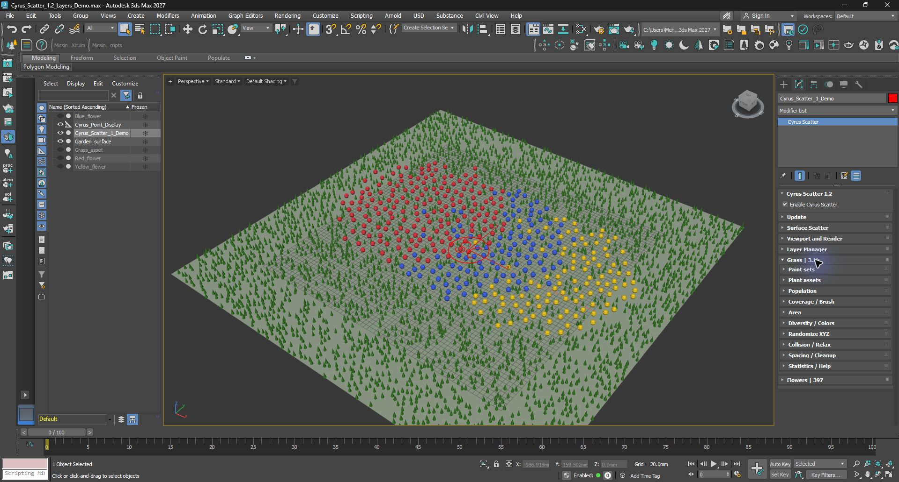
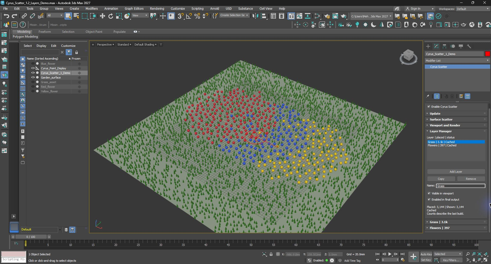

# Cyrus Scatter 1.2.2 — restore the 0.64 layout

**Follow-up:** [1.2.3 adds wheel and background-drag scrolling](SCROLLING_1.2.3.md). This report and its evidence retain the original 1.2.2 scope; use the current [artist guide](ARTIST_GUIDE.md) for installation and navigation.

The artist rejected the 1.2.1 width patch because its fixed Layers container still changed the workflow. This patch restores the structure inspected in the frozen 0.64 Max 2027 installer while retaining the current planting, Brush, Edit and retained-display engine.

## What changed

The Modify panel now has one flowing stack:

1. Cyrus Scatter and its master enable.
2. Update.
3. Surface Scatter.
4. Viewport and Render.
5. Layer Manager.
6. Each named layer, such as Grass and Flowers.

Layer Manager owns selection, add/copy/remove, naming, viewport visibility, final-output enable and cached counts. A single click on a layer header opens its own Paint sets, Plant assets, Population, Coverage / Brush, Area, Diversity / Colors, Randomize XYZ, Collision / Relax, Spacing / Cleanup and Statistics / Help. Double-clicking a manager list entry also opens that layer. Multiple layers can stay open.

Containers fit their open contents. Closing a section brings the following content up; the large fixed boxes and their separate inner scrollbars are gone. Max supplies the controls and command-panel scrolling. Width expressions follow the native parent width.

## Implementation

`AminScatter/tools/ui/layers-first.cjs` composes the existing feature editors with a new flowing host, Layer Manager and shared Surface Scatter section. Authoritative templates are beside that generator; `AminScatter/scripts/AminScatterObject.ms` is generated output.

Height changes run from rollout expansion and content changes. The host batches structural mounting, checks whether dimensions actually changed and guards reentry. It retains editor instances during normal expansion. There is no width polling, native-window resize hack or remove/re-add cycle when opening a feature.

Root callbacks capture their owning scatter explicitly. This avoids accessing inactive scripted-plugin locals from a dynamic child rollout or the test bridge. Rebuilding a structural layer list preserves the selected owner: restoring an older open header must not steal selection from a newly added layer. Programmatic restoration does not perform artist selection, and UI selection avoids new Undo records. The regression suite caught and prompted correction of an earlier restoration path that interfered with Redo. Open states, including sections inside a collapsed layer, are remembered when switching away and back in the same session. These are UI preferences, not new scene parameters.

The public patch version is **1.2.2**; persisted class version remains **51**. Native binaries and the 1.2 ownership/calculation model are unchanged. Restoring the layout does not restore 0.64's old width timer, resize/repaint workarounds, calculation code or missing features.

## Validation and scope

See `evidence/MANIFEST.json` for exact source/package identities and the separate Max 2027 test records. Historical 1.2.0 and 1.2.1 evidence is preserved in its original folders. Runtime qualification uses disposable Max profiles and synthetic scenes.

The relevant checks cover expansion/collapse, native control bounds, retained editor handles and calculation/display caches, parent/set ownership, layer management and current planting behavior. The original preview window remains available for artist review; automated checks use a separately named scene to avoid interference with that review.

| Check | Result |
| --- | --- |
| Native frame / main body / layer / section widths | 248 / 246 / 244 / 238 logical pixels at the tested default width |
| Control bounds | 618 native component bounds checked horizontally and vertically |
| Root, layer and feature expansion | 52 toggles; controls retained, no new placement generation, paint evaluation or retained-buffer upload |
| Flow | All ten feature sections move the following layer by their body height; collapse restores the previous position |
| Actual pointer input | One click opened Grass and mounted its ten sections; Flowers stayed closed and the generation/paint/upload counters stayed unchanged |
| Native scrolling | Dragging the outer command-panel scrollbar exposed both named layer headers beneath the expanded Layer Manager |
| Manager lifecycle | Selection, Add/Remove, and state restoration for both open and collapsed layers passed |
| Existing planting regression | Owner-bound reset, shared count/density, collisions, visibility/output enable, copy/remove, Undo/Redo and union cleanup passed |
| Areas and Brush | Parent include/exclude, independent set erase/history, compatibility guards and Manual/live updates passed |

Native HWND positions settle after the current MAXScript/Qt event. The flow fixture checks them on later timer ticks; it does not treat intermediate positions in a tight loop as final geometry. This fixture timer is development-only and is not shipped with the plugin. The test client's bounded waits sometimes expired while a recipe was still executing; completion was read from the matching recipe response before submitting another request. These test timings are not a responsiveness benchmark.

Max 2026 installers use the previously qualified SDK binaries but still need actual Max 2026 UI testing. Other DPI configurations and third-party renderers are outside this layout patch's new qualification. No new FPS improvement or universal flicker-free guarantee is claimed.

## Try it

Use the matching MZP in `dist/classic-layout-1.2.2`, then restart Max. Start with the [artist guide](ARTIST_GUIDE.md). The frozen 1.2 demo is compatible; a copy accompanies this package. Brush/Relax and MCP/ML limits remain those recorded in the [capability map](../Layers_First_2026-10-03/CAPABILITIES.md).

## Native API references

- Autodesk's [rollout properties and events](https://help.autodesk.com/cloudhelp/2027/ENU/MAXScript-Help/files/MAXScript-Tools-and-Interaction/Creating-MAXScript-Tools/Scripted-Utilities-and-Rollouts/GUID-DC435555-362D-4A03-BCF2-21179C5442F2.html) document native expansion, height and automatic layout properties.
- Autodesk's [SubRollout reference](https://help.autodesk.com/cloudhelp/2024/ENU/MAXScript-Help/files/MAXScript-Tools-and-Interaction/Creating-MAXScript-Tools/Scripted-Utilities-and-Rollouts/GUID-CDE5B06D-4BB4-4DEA-96C1-6BAB98709F09.html) documents nested rollout controls and scrollbar options. The actual Max 2027 host is the behavioral check; a documentation example alone is not runtime evidence.
