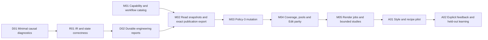

# Ordered roadmap and implementation guidelines

**Current acceptance loops:** [approved UI, real scenes, exact evidence and remaining limits](../Full_Qualification_0.73_2026-10-07/ROADMAP.md). The latest report supersedes older UI/runtime qualification claims; dated implementation and R&D evidence below remains historical. No artist installation or Git operations are part of this campaign.

**Superseded implementation queue:** the [0.73 roadmap](../Unified_System_0.73_2026-10-06/ROADMAP.md) now governs next work. Unified settings, labelled/linked/movable containers, catalog reconciliation and a closed MCP successor are implemented in that campaign. The dated queue below retains useful wider reporting/render/learning/release gates. Old-schema preservation and perpetual policy-3 read-only requirements no longer apply. Full causal archives and full recipe/Brush/Edit automation remain incomplete.

**Latest user direction, 6 October:** the next prepared slice is [unified procedural settings and source-container nodes](../Unified_Procedural_Settings_2026-10-06/README.md). Preserve useful old features by porting them, then remove unpublished legacy policies/settings/schema support; add container labels, linked Modify editing and transactional source movement. Its [checklist](../Unified_Procedural_Settings_2026-10-06/IMPLEMENTATION_CHECKLIST.md) supersedes this older queue's requirement to keep old schemas indefinitely. This is preparation, not delivered implementation or qualification.

**6 October status:** D01/D02's bounded recorder/export slice, M01 catalog, M02 cached publication pages and R01/R02's tested idle/Manual/IR cases now have [runtime evidence](../Live_Runtime_2026-10-06/RESULTS.md). Full causal archives, complete recipe export, policy-3 writes, renderer workers and artistic learning are not complete. Use [the updated ordered queue](../Live_Runtime_2026-10-06/NEXT_WORK.md) for the next implementation slice; retain the acceptance gates below.

5 October 2026. **Planning only.** The current task finishes with documentation. The unchecked items below are later implementation work, not actions being silently started. Preserve the native engine/UI, artist files, licensing work and historical evidence.

**Vendor recheck:** the [5 October follow-up](VENDOR_RECHECK.md) confirms the sequence and adds gates V01–V08 below. Its source research is not runtime acceptance. Diagnostics build/generator edits appeared independently during this pass; D01 remains unqualified until its own implementation and test receipts meet these gates.

## Delivery sequence

Catalog design and read-only inspection work can proceed independently of the renderer investigation. Automated studies that depend on rendering must wait for a qualified output path. Licensing, installation and host coverage remain release tracks, not prerequisites for writing these documents or an excuse to enlarge a debugging change.

## Work queue with exit gates

| ID / priority | Deliverable and scope | Acceptance evidence | Dependency |
| --- | --- | --- | --- |
| DOC-01 / now | Current system guide, all-control inventory, capability matrix, diagnostics/MCP proposals, authority map and source snapshot | Links/anchors and source references checked; proposed APIs clearly labelled; production hashes unchanged | This documentation pass |
| DOC-02 / follow-up | Reconcile official Houdini/Autodesk contracts and the specialist research into this product queue | Primary-source register, exact docs scope/link checks, snapshot changes explicitly attributed; no runtime certification | [Vendor recheck](VENDOR_RECHECK.md) |
| D01 / next | Small causal recorder slice using existing hooks; input/reason/revision/publication/IR events | Passive capture, loss counters, exact build manifest; no extra solve/upload or scene writes; a useful trace of IR-01 | Diagnostics specification |
| R01 / next | Reproduce IR-01 and fix only the demonstrated initiating cause | Stable-camera idle soak, real edits settle, camera/UI do not regenerate placements; production/IR separately pass; restore handlers in diagnostic fixtures | D01, pinned private script/native pair |
| R02 / next | Correct false Pending without forcing evaluation from UI reads | Update/redraw/orbit/all editor topics retain Cached when unchanged; real edits are Pending in Manual; Undo/Redo and exact epoch/rows checked | Existing pending receipt; correlate with R01 but do not assume same cause |
| D02 / high | Integrated Diagnostics panel, local reports and archive index | Recorder off/on overhead measured; bounded memory/disk; damaged/full/unwritable storage, overflow and shutdown tested; private fields excluded | D01, useful minimal trace |
| M01 / high | Feature catalog, workflow/error resources and registry conformance | Every capability/control family accounted for; supported/unavailable states match actual code; agents select valid operations and explain gaps | Capability matrix; no new scene mutation required |
| M02 / high | Read-only cached pool/pending/publication snapshots and complete policy-3 export | No reconciliation/solve from inspection; exact recipe/epoch/transform/radius/count parity; snapshot lifetime/size/expiry tests | M01, diagnostics; native publication contract |
| M03 / high | Versioned policy-3 validate/explain/apply for a narrow enrolled scope | UI/API parity, stable IDs and scopes, complete plan normalization, units, ownership, work limits, stale approval/idempotency/rollback; old schemas unchanged | M02; stable host result path |
| M04 / subsequent | Typed source-pool, Brush/Area and protected Edit/radius operations in separate slices | Drag out/back, flat/curved targets where supported, stale topology denial, capped stroke history, copy/order/removal dependencies, Undo/reopen and bindings | M03; separate capability gate per family |
| M05 / subsequent | Enrolled camera/profile render jobs, then explicitly bounded private studies | Success means an actual artifact for the requested generation; abort/timeout/restart recovery; attempts and failures consume budgets; one active scene mutation per host | R01, M03/M04 as needed, asset preflight and resource budget |
| A01 / later | Separate local Style Profile and Recipe Pilot, candidate gallery and explicit artist feedback | Useful with inference disabled; two reusable styles, supported drafts, actual-result references, apply/Undo and accepted/rejected/tie/neither distinctions | M02; current narrow plans may support an earlier restricted pilot |
| A02 / later | Eligible dataset, retrieval/ranking experiment and rollback | Grouped held-out projects; no seed/camera/lineage leakage; measured time-to-approved result and preference against strong recipe baseline | A01, explicit provenance/eligibility and enough independent tasks |
| A03 / conditional | Reference interpretation, active search or specialized learned fields/LoRA | Measured residual need and improvement, explicit uncertainty/mapping, valid layouts and bounded inference costs | A02 or a separately justified reference-assistance experiment |

No percentage-complete or delivery date is inferred from this queue. Increase complexity only when the preceding slice supplies evidence that it is needed.

### Required additions from the vendor recheck

These extend the acceptance column above; they do not create a second implementation sequence. Full assertions and source evidence are in [V01–V08](VENDOR_RECHECK.md#acceptance-additions-to-the-existing-queue).

| Existing tasks | Additional exit gates |
| --- | --- |
| D01 / R01 / R02 | V01/V05: distinguish action and callback-receipt times, batch/reentrancy and render phases; count owned handlers/timers through reload/reset. No observer-induced solve/upload. False Pending is separate from publication identity. |
| D02 / performance | V04/V05: self versus inclusive elapsed time, queue delay, CPU/draw/upload counters and unavailable GPU/presentation values; full source/Brush/staging resource envelope and safe cancellation boundaries. |
| M01 / M02 | V02/V03/V05: explicit identity lifetimes, native policy and host mode, passive cached membership, actual transforms/radii and immutable publication recipes. Describe source diversity separately from spatial clumping. |
| M03 / M04 | V02/V03/V07: container boundary/parent/overlap cases, nearby/folded Brush surfaces, unit and transform boundaries; Python indexing/wrapper identity and failure/Undo semantics. Preserve old plans and current verified recovery. |
| M05 | V04/V06/V07: total candidate × required-camera × attempt budgets, explicit worker mode, independently qualified Batch, actual decoded matching artifacts and complete-view joins. Interrupted/late output cannot impersonate the current attempt. |
| A01 / A02 / A03 | V05/V08: artifact-only gallery browsing, explicit apply, versioned feature preparation and training/inference parity. Taste ranking, technical prediction and inverse recipe proposals have separate labels and metrics. |

The research roadmap's P0–P7 phases map to this queue in its [coordination section](../AI_Design_Learning_Research_2026-10-05/10_ROADMAP.md#coordination-with-the-current-product-roadmap). Its E15–E18 fixtures are planned tests to reuse, not additional passing evidence.

## Cross-cutting product work

| Track | Required next evidence | Boundary |
| --- | --- | --- |
| Brush persistence | Signed zero/subnormal/ordinary-coordinate reopen fixture versus genuine topology edits | Preserve authored histories and reject unsupported changes; do not disable fingerprint checks globally |
| CPU/memory | Clean-host input/key/container/Brush/display profiling; long histories, dense sources, many populations and limited memory | Preserve 0.63/0.64 retained improvements; no unlimited-FPS, GPU-compute or asynchronous host claims |
| Assets/render fidelity | Audit copied-scene texture-map plugins and external paths; proxy/material parity | A render can complete with missing assets; completion alone is not a valid appearance sample |
| Licensing | Whole-recipe/source/container coverage, PFlow/Bake continuity, B07 dependency behavior and B08 offline transfer accounting | Follow [licensing roadmap](../licensing/ROADMAP.md); ordinary build remains default-off until separately qualified |
| Host/platform | Max 2026 runtime, renderer combinations, DPI/monitors, cold reopen and module provenance | SDK compile/native tests do not substitute for each host campaign |
| Packaging/installation | Matching script/native packages, upgrade from historical labels, recovery and artist-profile-safe delivery | No new installer is part of this documentation task; current source and old packages differ |
| Documentation | Regenerate coverage inventory and update authority/receipts for each accepted change | Keep dated evidence unchanged; do not describe a proposal or mock fixture as an implemented runtime feature |

## Next coding-loop brief

**Objective:** explain and eliminate the repeated IR refresh, with enough diagnostic evidence to distinguish genuine input changes from observer/display activity. Include false Pending only if a shared cause is demonstrated or as a separately tested small fix.

1. Freeze source/native identities and create a disposable reproduction from the delivered scene; leave the artist host/profile intact.
2. Instrument the smallest D01 event path. Record logging health, callback ownership/phase/batch identity and original failure before any fix. Observe cached values without invoking reconciliation.
3. Separate explicit PFlow bridge restarts from renderer reactions to host notifications; identify the first unwanted event.
4. Reduce to a small fixture, make one focused change, compare logging off/on and preserve expected Live/Manual behavior.
5. Validate idle and relevant edits, Undo/save/reopen, reload/reset/teardown, exact counts/IDs, retained builds/uploads and production/IR independently. Keep callback-receipt latency distinct from action and render-stage timings.
6. Save the failing and passing receipts, update current findings, then review whether packaging is warranted.

**Out of scope for that loop:** ML training, a new UI rewrite, expanded batch budgets, unrelated licensing enforcement, GPU placement or general-purpose remote scripting. Avoid using disabled notifications/Live updates as the final remedy unless the product explicitly changes those semantics.

## Standard loop for every subsequent feature

- State the user task, supported policies/hosts, owner and final acceptance result.
- Identify the smallest existing implementation path to reuse and the exact missing contract.
- Pin source/native/scene context; create an isolated positive and failure reproduction.
- Implement the smallest complete slice, including bounded work, Undo, persistence and failure reporting.
- Verify final state with independent geometry/digest/count checks where possible; test read-only paths for unchanged counters.
- Compare performance against the same workload and explain limits. Do not equate synchronous callback time with presented FPS.
- Update schema/help/capability inventory and source/evidence links together. Do not claim support before runtime proof for the promised environment.
- Preserve original failed receipts; stop expanding scope when the focused acceptance is met.

## Decisions to resolve before the relevant phase

These are future design decisions, not blockers to this documentation task: supported first policy-3 enrollment geometry/assets; exact Brush import/edit representation; stable publication artifact lifetime; basic logging retention defaults after overhead testing; artist/studio profile sharing and dataset eligibility; bounded batch authorization fields; and the existing licensing B07/B08 choices. Record the decision, reason and evidence in the owning specification rather than adding a competing roadmap.
