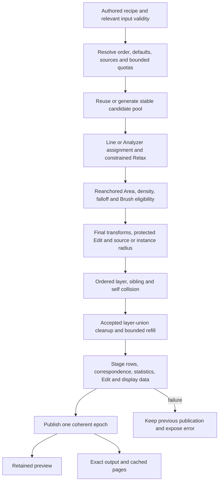

# Current system and workflow

7 October 2026: **Scatter 0.73 / `CyrusUnified1`**. Use the [current compact artist reference](../Artist_Reference_0.73_2026-10-07/README.md), [latest corrected delivery](../Layer_Actions_Fix_0.73_2026-10-07/README.md), and [current review and next work](../Status_0.73_And_Website_2026-10-07/README.md). The dated [unified implementation](../Unified_System_0.73_2026-10-06/IMPLEMENTATION.md) and [tests](../Unified_System_0.73_2026-10-06/RESULTS.md) retain their original evidence scope. Older scene formats and policies are intentionally retired; old dated reports describe their own builds. The [capability matrix](CAPABILITY_MATRIX.md) distinguishes native features, bounded MCP support and future work.

## Ownership and artist workflow

1. Create Scatter and choose receiving surfaces. Establish units before authored Brush/Edit data. A receiving surface is where instances grow; a source-container rectangle is a palette of models.
2. Create and order layers in **Modify > Layers & paint sets**. A layer owns population/seed, candidate assignment, Area, transforms, default spacing, Relax and accepted-union cleanup. Ten total populations include Base and additional paint sets.
3. Use the ten compact workflow sections; selected-layer sections edit that layer and its selected paint set, with less-used controls under Advanced. The optional **Edit layer in window...** popup binds the same records. Opening topics, expanding panels or selecting a different editor context does not calculate placements.
4. Choose sources manually or via own/inherited/global containers. Each source record keeps weight, color/group, scale, lift, forward axis, radius and follow-scale. A scene model can have different records in different sets. Parking outside a rectangle keeps its saved row and identity.
5. Paint sets share layer defaults and population through relative shares. Their sources, Brush histories, enabled/visible state, self-spacing override and earlier-sibling composition references remain independent.
6. Choose Whole or Paint/Erase coverage and combine with Area/density/falloff. **Outside Coverage**, **Between Plants**, and **accepted-target replacement** are different operations. Background changes retain their explicit Apply action; spacing values save automatically.
7. Set three spacing scopes: within a set, between sibling sets, and between layers. Layer within-set defaults are inherited until a set overrides them. Pair rules are explicit, with `factor × (rA+rB) + gap` and XY/3D metric. No rule implies universal collision elsewhere.
8. Manual preserves the last complete result until Update. Live coalesces relevant edits and stops its settled timers. Statistics distinguish recipe/pending state from the last published epoch, slots from renderable meshes, and full output from displayed samples.
9. Preview, exact output/PFlow and Bake consume the accepted publication. Test IR separately from production rendering. Diagnostics are directly in Scatter and need no MCP.

Enabled and visible are separate: a hidden enabled population can still participate in calculation/spacing. Radius describes a spacing footprint, not polygon intersection. Source diversity selects models; it does not spatially cluster positions by itself.

## Evaluation stages

Eligibility and transforms cooperate around the support anchor; this is a dependency explanation, not permission to reorder native operations. Point/boundary Relax now prepares ordinary candidates **before** final eligibility and protected Edit. It is deliberately not a late relaxation of already accepted plants. Protected edits reserve final positions and retain the documented eligibility/cleanup exception; conflicts are reported rather than secretly moving them.

Layer/set IDs, source-slot IDs, candidate ordinals, sampling salts, draw order and row indices are different concepts. Count growth preserves existing ordinary candidate anchors/IDs. Copies get new owner IDs and remapped internal relations. A protected clone can remain when an ordinary population quota reaches zero. Stale Edit/radius binding is an error, not an automatic index migration.

## Container relationships

Usage can be shared across layers/sets; movement has at most one owner per physical source. Membership tests pivot in container-local XY with one shared boundary tolerance, ignoring height. Width/Length resize the boundary without scaling sources. Translation follows a frozen set of eligible static movement units at gesture completion inside Max's Undo hold. Sources are not parented to the rectangle.

Wholly managed static groups/hierarchies move once. Partial hierarchies, unmanaged descendants, animation/constraints, locks and instanced helpers are excluded or explicitly refused. Overlap retains a valid owner; unowned ambiguous sources require **Follow this container**. Selection opens linked Scatter controls while retaining the rectangle selection. An inactive pool remains linked for editing but carries no sources. Global containers created before layers still expose setup controls.

Pure palette translation with unchanged membership/object-space geometry preserves placements and buffers. World-dependent source geometry is a real dependency change and may invalidate. Source motion while a boundary crosses another model does not sweep that model into the in-progress gesture. [Movement bounds, failure tests and gesture limitations](../Unified_System_0.73_2026-10-06/IMPLEMENTATION.md) are explicit.

## Invalidation and process boundaries

Base candidates, prepared coverage/Edit, ordered solve and display generations have separate keys/counters. Brush/rule/order/radius edits reuse unaffected preparation; display budgets/modes may rebuild presentation from the same accepted publication. UI/camera navigation reuses unchanged calculation and buffers. Passive reporting copies cached state and must never call key builders that reconcile containers or evaluate density.

Max node/mesh/controller reads and writes, UI, render calls and publication stay on the host thread. Numeric workers receive copied data; future inference belongs outside Max. MCP network handlers queue admitted work onto the host, with local approval and scene freshness. Static-input validity avoids unrelated timeline invalidation; actual animated receivers/parents/source geometry/parameters remain relevant.

Retained Point Cloud/Mesh uses cached buffers and GPU submission. It still draws geometry and consumes CPU/GPU/memory; it does not guarantee unlimited FPS. Synchronous redraw timing is not presented FPS. Proxy drawing, brute-force movement projection, extreme-radius neighbor work and derived Brush history memory remain measured follow-up subjects.

## Automation, reporting and future learning

MCP 0.73.0 offers twelve tools/seven resources and the closed Plan 0.73 subset. Old schemas 1/2 fail explicitly. Full Brush/container/Edit/recipe mutation, renderer execution and portable asset reconstruction remain unavailable. Inspection reads current recipe and last-complete publication separately. The narrower owned-plan mutation contract does not turn recipe inspection into arbitrary field writing.

The opt-in bounded recorder is directly in Scatter; Automation separately shares an exact process trace with MCP. It is operational evidence, not an inferred artist-preference dataset. A searchable causal archive remains planned. An offline experimental preference ranker exists; an integrated artist-trained/reference-image production learning system is not established. Licensing remains the preserved independent default-off foundation.

Use [the current staged roadmap](../Status_0.73_And_Website_2026-10-07/ROADMAP.md) for next work (with the [dated unified roadmap](../Unified_System_0.73_2026-10-06/ROADMAP.md) as supporting detail), and [the historical vendor research](VENDOR_RECHECK.md) for primary-source rationale. Preserve cache, identity, Undo, atomic publication and host-thread contracts in each further slice.
