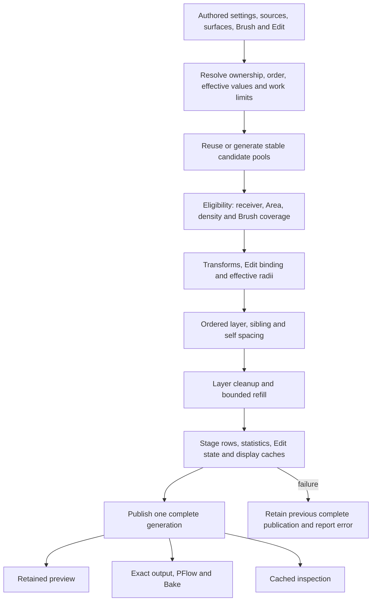

# System and workflow guide

This guide describes local 0.7.1 source. Detailed option contracts remain in [procedural requirements](../Procedural_Evaluation_2026-10-04/11_OPTION_CONTRACTS.md). Availability depends on evaluation policy; the native UI is broader than MCP.

## Artist workflow and ownership

1. **Set up the receiver.** Create/select Cyrus Scatter and choose the static receiving surfaces in Modify. Establish scene units before authoring Brush/Edit data. Receiver surfaces are where plants are placed; source-container rectangles organize the models used to place them.
2. **Create logical layers in order.** Use the compact Layer Manager. A layer owns its population, distribution/transform defaults, Area and cleanup. Top-to-bottom procedural order controls ordinary spacing winners. Enabled and visible have different meanings.
3. **Open Edit layer.** One floating editor identifies the setup, layer and paint set. Selecting an unrelated scene node does not retarget it. The six topics group tasks without introducing another calculation model.
4. **Choose assets and optional containers.** Pick models manually or use global, inherited or owned Rectangle pools. Membership uses each source pivot in rectangle-local XY, ignoring height. Dragging a registered source out parks it; returning it restores that owner's settings/identity. Removing a source row is a separate action. A model used by two owners can have different settings.
5. **Define population and coverage.** Select count/density and candidate budget versus accepted target. Paint sets share declared layer population/defaults with weights; they do not each receive an independent copy of the full layer count. Their assets and saved Brush histories can differ.
6. **Paint and compose.** Whole-surface or Paint/Erase coverage, include/exclude Area, density and supported falloff determine eligibility. Outside painted coverage excludes an authored field; Between plants depends on actual configured spacing. Replacement of rejected candidates is a third, bounded option.
7. **Set transforms and spacing.** Adjust source metadata and layer randomization; then self, sibling-set and layer-pair rules. Radius is spacing metadata, not mesh geometry collision. Supported CS Edit moves/clones can reserve final positions and own instance-radius overrides.
8. **Inspect and publish.** In Manual, changes can remain pending until Update; exact output must keep the last complete publication. Live evaluates relevant changes. Statistics describe cached results and shortfall. The known false Pending label is not reliable proof of a new calculation change.
9. **Review output.** Preview budgets only limit presentation. Automatic render output and Bake consume exact placements. Save/reopen and Undo must preserve authored data. Qualify Corona production and IR separately; IR-01 is currently open.

| Location | Common work | Less frequent work |
| --- | --- | --- |
| Modify | Enable, receiver, Manual/Live, Update, display/render, layer order | Global source rectangles and setup-wide administration |
| Assets | Source palette and weights, source transform/radius, pool selection | Point/Empty choices, source groups, paint-set administration |
| Population | Count/density, seed, target/work limits, Area | Density texture and Analyzer falloff |
| Paint | Start/Stop, Paint/Erase, radius/strength/softness, history | Fill/Empty resets, target rebinding, background composition |
| Transform | Random rotation, scale, projected movement | Legacy line/Analyzer assignment where supported |
| Spacing | Named collision scope, peer, radius factor, gap, metric | Per-instance radius overrides, union cleanup, legacy Relax |
| Statistics | Cached placed/shown/rejected/shortfall/errors | Workflow help and diagnostic interpretation |

Spacing fields save automatically through their handlers. Background mode plus selected references use an explicit atomic Apply. Start/Stop Brush and destructive history/source actions have different lifecycle/Undo semantics from ordinary field editing. See [UI workflow](../UI_0.7.1_2026-10-05/WORKFLOW.md) and [full control inventory](CONTROL_INVENTORY.md).

## Execution pipeline

This is the conceptual dependency order; transforms and eligibility cooperate around the resolved surface anchor. It is not permission to reorder native stages. [Source trace](../Independent_Review_0.7_2026-10-05/EVALUATION_TRACE.md) and `procedural-evaluation.ms` are the implementation references.

### Identities and rules

Layer/set IDs, source registrations, candidate ordinals, sampling salts, display order and output-row indices are different concepts. Removing a rejected candidate must not shift another candidate's random choices. A copy receives new owner identities. A parked source keeps registration; current parking does not redistribute its weight automatically.

A rule compares `factor × (radius A + radius B) + gap`, with its chosen XY/3D metric. Each ordinary pair belongs to one relevant scope. Missing layer-pair rules do not imply universal cross-layer collision. Protected Edit output reserves its final positions, survives applicable cleanup/spacing rejection and reports conflicts; it is not silently moved to satisfy every rule.

Accepted target adds bounded candidates when output falls short. It is not guaranteed maximum packing. Point placeholders can count as slots without rendered mesh geometry. Keep requested budget, attempted unique candidates, accepted slots, renderable instances and displayed samples separate.

### Geometry meanings to keep explicit

Container membership tests a model's pivot against the union of its selected rectangles in rectangle-local XY, with a boundary tolerance and no height test. It does not test mesh intersection or whole-object containment. Moving a rectangle or a source's parent can therefore change membership. Reentering a pool preserves registration/settings; it does not promise identical accepted placements after every intervening edit. The current [container source](../../AminScatter/tools/ui/templates/source-containers.ms) is authoritative for these semantics.

Brush uses surface connectivity, distance in its captured basis and visibility from the captured view. It is not a geodesic distance brush or general deformation tracking. The existing binding check rejects changed shape/topology when strokes exist. The [vendor follow-up](VENDOR_RECHECK.md) adds qualification cases for folded/nearby sheets, source/receiver transforms, identity lifetimes and save/reopen. Those tests do not expand the supported feature set.

Source diversity clusters change which asset is selected; they do not move candidate positions into spatial clumps. A requested flower ribbon or planted mass must be expressed through supported coverage/population controls. Keep geometry scale and spacing radius distinct in help, MCP records and later learning features.

### Invalidation and failure

The intended split is base candidates → prepared coverage/Edit → ordered solve → display generation. Rule/order/radius changes should reuse unaffected preparation; camera/UI browsing should reuse calculation and unchanged buffers. Display-mode/budget changes may rebuild presentation from the same publication. A new publication is visible only after all required staging succeeds.

Some source routines are not pure observations: `procInputKey()` calls container reconciliation and a density watcher. Future diagnostics and MCP snapshots must use stored revisions/results or explicitly classified refresh operations; repeatedly calling an evaluator/key builder to log state can change the behavior being measured.

On binding, capability, work-limit or staging failure, retain the previous complete result and expose the error/pending input. Cancellation must say whether a running native operation finished, rolled back or remains unknown. Undo is an authored transaction, not deletion of an arbitrary latest scene action.

## Components and boundaries

| Component | Owns | Does not imply |
| --- | --- | --- |
| `AminScatter/tools/ui/` | Authoritative generator/templates, native editor handlers and persisted model integration | Generated MAXScript is the only source to edit |
| Native Scatter/Brush/Edit | Sampling, coverage, ordered constraints, bounded numeric work, bindings | Arbitrary scene access from worker threads or GPU placement |
| Retained display | Cached Point Cloud/Mesh buffers and draw submission | Unlimited FPS, zero CPU work or exact presented-frame timing |
| Surface Analyzer | Supported analysis/Area/falloff/legacy assignment adapters | Every native mode supported by policy 3 or MCP |
| PFlow/output adapters | Renderer-facing groups and exact output transport | Production render success establishes IR correctness |
| MCP external process and Max host | Typed transport, capability/plan validation, scope, approval, queued host work and receipts | General MAXScript/Python execution, arbitrary file access or full native-feature automation |
| Diagnostics tools | Current manual recordings and proposed causal archive | An automatic artist preference dataset |
| Future design companion | Proposed references, profiles, recipes, comparisons and optional inference | An already implemented model, automatic training or new scene authority |
| Licensing experiment | Tested native/local authority slices | Ordinary-build enforcement or complete commercial licensing |

Host node/mesh reads, scene writes, UI, render interaction and publication stay on the appropriate Max host thread. Numeric work can use already qualified bounded workers. Future file serialization uses copied data; inference belongs outside the host. The current transport already drains queued work through the host, rather than letting its network handler mutate Max.

## Preserve while extending

Keep stable source/Edit identities, Manual/Live meaning, one coherent Undo, saved artist histories, scoped ownership, atomic publication and the measured retained-display behavior. Preserve policies 1/2 until explicit conversion is supported. Do not combine licensing enablement, a renderer rewrite and MCP expansion into one unreviewable change. The [roadmap](ROADMAP.md) gives smaller acceptance loops.
