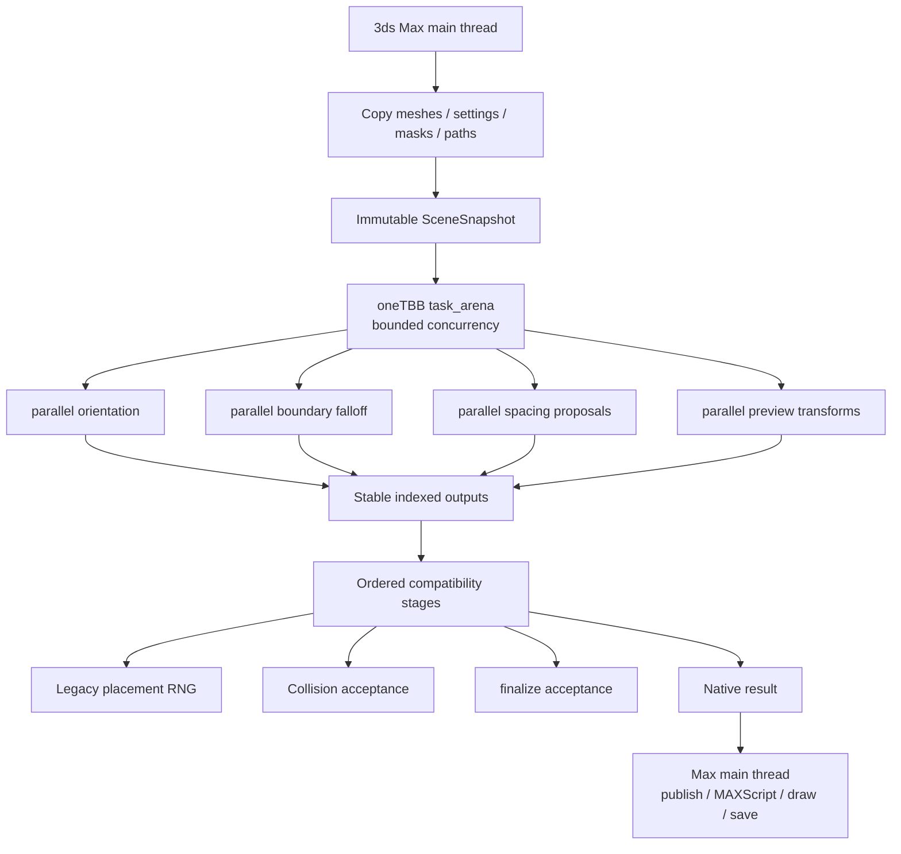
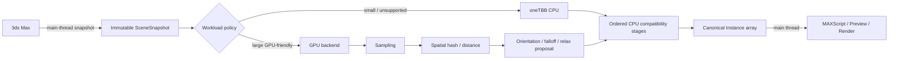

# Cyrus Scatter Performance Engineering Report

## Executive summary

Cyrus Scatter has a strong foundation for performance work because the expensive mathematical core is already separated from Autodesk/3ds Max. The current CMake structure builds `amin_scatter` as a standalone C++17 static library from `scatter.cpp`, then builds the Max-facing `AminScatter.dlx` from `max_bridge.cpp`, `preview.cpp`, and `cyrus_edit.cpp`. The standalone core also already has native tests for scatter, spacing, weighting, orientation, edge-border behavior, and boundary falloff. fileciteturn14file0

That separation determines the correct optimization strategy:

> **Keep 3ds Max scene access on the Max/main thread, copy the required data into Cyrus-owned structures, and parallelize only the pure C++ computation.**

Autodesk explicitly states that 3ds Max is not thread-safe and that its reference and node-evaluation systems are single-threaded. Autodesk's current rendering API likewise states that most SDK operations, including scene translation/update, need to execute on the main thread. citeturn18search0turn9search0turn9search4

My recommendation is therefore **not to start with CUDA/OpenCL or a GPU rewrite**. The order should be:

1. Instrument and profile the existing Release implementation.
2. Fix several algorithmic/data-structure bottlenecks already visible in the source.
3. Introduce **oneTBB** and parallelize the stages that are already independent.
4. Optimize allocation behavior, cache locality, and selected SIMD-friendly loops.
5. Preserve serial compatibility paths for order-dependent operations.
6. Measure the optimized CPU implementation again.
7. Only then approve a narrow GPU proof-of-concept if large production scenes still justify it.

The static audit found several particularly strong optimization candidates. The highest-leverage ones are likely to be `edgeBorderPoints()`, anchor-to-surface projection in the main placement loop, spacing relaxation, complex boundary orientation/falloff, preview construction, and repeated CS Edit visibility rebuilding. The current source also contains some operations that **should not simply be parallelized**, especially the stateful placement/rejection loop and `finalize()`'s sequential collision-safe acceptance logic. fileciteturn5file0 fileciteturn6file0 fileciteturn7file0 fileciteturn8file0 fileciteturn9file0 fileciteturn10file0

The full research package is ready:

**[Download CyrusScatter_Performance_Research_2026-09-27.zip](sandbox:/mnt/data/CyrusScatter_Performance_Research_2026-09-27.zip)**

It contains the complete Markdown report, benchmark matrix, source index, four standalone Mermaid diagrams, and a SHA-256 manifest.

The most important decision matrix is:

| Approach | Effort | Potential gain | Portability | Compatibility risk | Recommendation |
|---|---:|---:|---|---|---|
| Algorithm/data-structure optimization | Low–Medium | **High** for affected stages | Excellent | Low | **Do first** |
| Allocation/cache improvements | Low–Medium | Low–Medium overall | Excellent | Very low | **Do first** |
| oneTBB CPU parallelism | Medium | **Medium–High** | Excellent for target | Low–Medium | **Primary threading path** |
| Targeted SIMD/AVX2 | Low–Medium | Low–Medium | Good | Low–Medium FP risk | Profile first |
| Async background evaluation | Medium | High responsiveness benefit | Excellent | Medium | After CPU parallelism |
| CUDA | Medium POC / High production | High on large workloads | NVIDIA only | Medium–High | GPU POC candidate |
| OpenCL | Medium–High | High on large workloads | Multi-vendor | Medium–High | Cross-vendor candidate |
| DirectCompute/D3D12 | High | High | Windows | Medium–High | Strategic alternative |
| Vulkan compute | High | High | Multi-vendor | High | Not first choice |
| SYCL/oneAPI | Medium–High | Medium–High | Backend dependent | Medium | Evaluate later |
| ArrayFire | Low–Medium | Medium for dense operations | Multi-backend | Medium | Limited fit |
| Metal | N/A | N/A | Apple | N/A | Not relevant to current 3ds Max target |

The performance ranges in this report are **engineering targets and estimates, not measured Cyrus Scatter benchmark results**. I did not have a Windows/3ds Max runtime here to execute Visual Studio Profiler, VTune, or production `.max` scenes, so the first implementation milestone must establish those measurements.

## Where the current code is most likely spending time

The strongest finding from the code review is that not every current bottleneck is fundamentally a threading problem. Some are algorithmic, and fixing those first may yield more than adding threads around the existing loops.

### Placement and surface sampling

The main `scatter()` path in `scatter.cpp` reserves output for `s.count` and executes a candidate-placement loop. Under some density/mask configurations, the source can increase the candidate limit to approximately `s.count * 100`, meaning a request for 100,000 accepted instances can potentially examine a much larger candidate population before acceptance. Each candidate may perform sampling, area/mask checks, line-band logic, source choice, randomization, and related work. fileciteturn5file0

That is important because the current random streams use stateful `std::mt19937`. A rejected candidate can consume random values before the next accepted result. Therefore naïvely dividing candidate indices across threads would not merely execute the same algorithm faster—it could change which random sequence reaches each accepted instance and consequently move the entire scatter.

**Do not parallelize the legacy placement loop first.**

Instead:

- profile candidate-to-accepted ratios;
- optimize the tests performed for each candidate;
- cache or spatially accelerate mask/band checks;
- keep the existing RNG/acceptance sequence intact for legacy scenes.

`sampleSource()` is simpler: it constructs a sampler, reserves the result array, and performs sequential `sampler.sample(random)` calls. The sampler's weighted triangle choice uses cumulative triangle areas and binary search, followed by barycentric sampling. fileciteturn5file0

That can eventually be parallelized while preserving the current random sequence by generating the required random triples sequentially and parallelizing only the geometric sampling work. Replacing the CDF search with an alias table could reduce weighted selection to O(1) per sample after preprocessing, but that would change the mapping between seed/random values and selected triangles and should therefore be treated as an **algorithm-version change**, not an invisible optimization.

### A major algorithmic hotspot: edge-border generation

`edge_border.inc::edgeBorderPoints()` deserves very early profiling.

For generated edge samples, the current implementation determines inside/outside state and clearance by walking boundary loops and their segments. In a complex boundary this can approach:

\[
O(N_{\text{samples}} \times N_{\text{segments}})
\]

and the code permits very large generated edge populations. fileciteturn9file0

This is probably one of the best performance opportunities because the correct fix is algorithmic rather than merely parallel:

```text
Current

edge sample
    ↓
scan segment 0
scan segment 1
scan segment 2
...
scan segment N
    ↓
clearance / inside result
```

should become approximately:

```text
Boundary segments
      ↓
BVH / spatial grid
      ↓
edge sample
      ↓
query nearby candidates
      ↓
nearest / parity result
```

A segment BVH, sorted spatial grid, or hashed two-dimensional grid should be benchmarked. Spatial neighborhood structures are a standard way to avoid global proximity scans; related spatial-hashing work shows why regular-grid hashing is effective for local collision/neighborhood workloads. citeturn15search15

This should be addressed **before** trying to launch the existing all-edge scan on eight or sixteen CPU threads.

### Anchor projection currently has a similar asymptotic problem

The placement code's line-anchor path finds a closest surface point by scanning `sampler.indices`, evaluating `closest(target, surface[j])`, and tracking the minimum. fileciteturn5file0

That makes anchor projection approximately:

\[
O(N_{\text{anchors}} \times N_{\text{triangles}})
\]

Yet Cyrus already contains `SurfaceTree`, a BVH-like spatial tree used by spacing/projection code. fileciteturn6file0

A high-priority refactor should therefore expose a nearest-point query from that acceleration structure and reuse it for anchor projection.

For a million-triangle distribution surface, this can be far more valuable than adding threads around a full triangle scan.

### Spacing and relaxation

`spacing.inc` is particularly promising for multicore work because it explicitly operates on copied geometry rather than Max APIs. It contains:

- `PointGrid`, backed by a hashed cell structure;
- a `SurfaceTree` acceleration structure;
- relaxation iterations;
- surface projection;
- collision filtering. fileciteturn6file0

During relaxation, the algorithm conceptually follows:

```text
points[n]
   ↓
build neighbor grid
   ↓
for each point
    query neighbors
    calculate force
    project candidate to surface
    write next[i]
   ↓
points.swap(next)
```

The crucial property is that each iteration reads the old `points` array and writes each result to its own `next[i]`.

That makes the expensive per-point proposal phase an excellent `parallel_for` candidate.

The later collision filter is different: candidates are accepted into a growing set and future candidates query what has already been accepted. If the result is intended to preserve “earlier candidate wins” behavior, that part should remain ordered.

Other likely wins in spacing are memory related. `PointGrid` uses an `unordered_map<Cell, vector<size_t>>`; repeated rebuilds can mean hashing, bucket allocation, many small vectors, and pointer-heavy access. Profiling should compare:

- reusing existing map/vector capacity;
- compact 64-bit cell keys;
- block-owned scratch storage;
- a sorted `(cellKey, pointIndex)` array with range offsets;
- dense grids for sufficiently bounded workloads.

No one structure will necessarily win for both sparse 10,000-point scenes and dense 500,000-point scenes.

### Boundary orientation and falloff

`orientBoundary()` prepares loop information and then computes orientation per row. Each output row is independent after the immutable boundary preparation is complete. fileciteturn7file0

That makes it one of the safest first CPU-parallel stages:

```text
prepare boundary metadata
        │
        ├── row 0 → orientation 0
        ├── row 1 → orientation 1
        ├── row 2 → orientation 2
        ├── ...
        └── row N → orientation N
```

The bigger issue may again be the lookup algorithm: `outwardAt()` can traverse prepared loops/segments searching for the nearest orientation reference. If profiling shows that lookup dominates, a prepared segment spatial index should precede threading.

`boundaryFalloff()` already goes further by building a `FallTree` over boundary segments and querying the tree for each row. Its rows are also naturally independent, but the function may filter outputs, so the threaded implementation should preserve stable order using a pre-sized staging array plus keep flags rather than workers pushing into one shared vector. fileciteturn8file0

### Final processing must be handled differently

`final.inc::finalize()` contains one of the most important comments in the whole performance audit: sequential acceptance is deliberately used so already accepted moves remain collision-safe. The algorithm updates state as it progresses. fileciteturn10file0

That means:

> **Do not convert the existing final relaxation loop directly to `parallel_for`.**

It may be possible later to redesign it as:

```text
parallel proposals
       ↓
conflict graph / spatial cells
       ↓
deterministic conflict resolution
       ↓
commit
```

but that is a different algorithm and potentially changes placements.

Before considering that, optimize the existing serial path:

- reuse `SurfaceTree`;
- avoid rebuilding equivalent masks/boundary structures;
- order validation tests cheapest-first;
- precompute constant reach/radius data;
- reduce temporary allocation;
- accelerate line-band queries;
- profile the “up to several projection/validation attempts” path.

### Preview

`preview.cpp` already uses a good architecture: `AminPointCache` keeps preview geometry in native memory, so Cyrus does not need to recreate huge MAXScript point collections on every draw. fileciteturn11file0

However, `aminScatterBuildPreview` still has to unpack MAXScript data, copy source samples and placement transforms into C++, and build transformed preview groups. The pure transformation part can eventually run in parallel, but MAXScript value access belongs on the Max side of the boundary.

The preview optimization should therefore be:

```text
MAIN THREAD
MAXScript arrays
      ↓
copy into flat native arrays
      ↓
calculate per-source output counts
      ↓

WORKERS
pre-sized groups
      ↓
parallel transform points

MAIN / VIEWPORT THREAD
publish native cache
      ↓
GraphicsWindow draw
```

Autodesk's `GraphicsWindow` documentation warns that these APIs have their own threading behavior and need correct sequencing; they should not be treated as an ordinary thread-safe graphics interface. citeturn9search11

`pointCloud()` also presents a nice non-threaded optimization. It first builds cumulative instance end offsets, then performs `std::upper_bound()` for every preview output point to determine which instance owns that flattened point. fileciteturn5file0

Because the generated `flat` values are monotonically increasing, Cyrus can instead retain a monotonically advancing instance cursor:

```cpp
std::size_t instanceIndex = 0;

for (std::uint64_t i = 0; i < count; ++i) {
    const auto flat = sampledFlatIndex(i);

    while (instanceIndex < ends.size() &&
           flat >= ends[instanceIndex]) {
        ++instanceIndex;
    }

    // transform point using instanceIndex
}
```

That can reduce the lookup component from approximately:

\[
O(B \log I)
\]

to approximately:

\[
O(B + I)
\]

where `B` is preview budget and `I` is number of instances, while retaining exactly the same chosen flat indices.

### CS Edit and serialization

`cyrus_edit.cpp`'s `visible()` constructs a new `std::vector<Visible>` by scanning active layers/rows. Several viewport/edit paths—including display, hit testing and world-bounds-related logic—request visible rows. fileciteturn12file0

A revision-keyed cache is preferable:

```text
editRevision changed?
      │
     yes
      ↓
rebuild visible cache

editRevision unchanged?
      │
     no
      ↓
reuse visible cache
```

That could improve viewport responsiveness for very large edited scatters without adding any threading.

CS Edit serialization currently writes the `0x4001` chunk sequentially and deliberately retains a `0x3901` reader for old saved data. fileciteturn15file0

Do not redesign this persistence format for performance unless profiling proves save/load is a real user problem. `ISave`/`ILoad` access should remain within Max's supported context, and backward compatibility is more valuable than speculative multithreaded serialization.

A practical hotspot priority list is therefore:

| Priority | Location | Why |
|---|---|---|
| **Very high** | `edge_border.inc::edgeBorderPoints` | Global segment scan per generated point |
| **Very high** | `scatter.cpp` anchor projection | Full triangle scan per anchor |
| **Very high** | placement/rejection loop | Potentially many rejected candidates and repeated checks |
| **High** | `spacing.inc::spacePoints` | Iterative neighbor/projection work |
| **High** | `orientation.inc::orientBoundary` | Large independent row population |
| **High** | `boundary_falloff.inc::boundaryFalloff` | Large independent spatial-query population |
| **High when enabled** | `final.inc::finalize` | Complex validation/projection, but order-dependent |
| **Medium–High** | preview build | conversion + transform + allocation |
| **Medium** | `sampleSource` | repeated triangle CDF lookup |
| **Medium** | `pointCloud` | binary search per preview point |
| **Medium for huge edits** | `CSEdit::visible` | repeated complete row scan/allocation |
| **Profile first** | CS Edit Save/Load | potentially large but usually not interactive critical path |

## Profiling plan before optimization

The correct next development branch should begin with **measurement infrastructure**, not threads.

Visual Studio's Performance Profiler supports CPU, native memory, instrumentation and related profiling for C/C++ workloads, and Windows Performance Recorder/Analyzer provides ETW-based process/thread/system analysis. citeturn11search6turn11search2 Intel VTune's current profiler can identify hotspots, ineffective processor use, synchronization costs, thread activity, cache misses, branch misprediction, memory behavior, and GPU/offload characteristics. citeturn10search1turn10search0

### Benchmark scenes

Create a checked-in `performance/scenes/` or equivalent internal benchmark corpus with at least:

| Benchmark | Configuration | Main question |
|---|---|---|
| Basic small | 10k instances / 10k tris | What is fixed overhead? |
| Basic large | 100k / 100k tris | Basic scaling |
| Huge surface | 100k / ~1M tris | Surface lookup cost |
| Rejection stress | masks + density + 100k accepted | How expensive is rejection? |
| Relax stress | 100k × 10/30/100 iterations | Spacing scaling |
| Collision stress | dense 100k candidates | Ordered acceptance cost |
| Boundary stress | 100k rows, 1k/10k segments | Orientation/falloff |
| Edge-border stress | 50k/100k/500k edge points | Confirm all-segment scan |
| Preview point | 50k/500k preview budget | Build vs draw |
| CS Edit | 100k / 1M rows | visibility/edit UI scaling |
| Serialization | huge current + legacy layer data | Save/load relevance |
| Production mixed | actual artist scene | End-to-end reality |

Run each test warm and cold, with fixed seeds and settings.

For stable performance comparisons, record at least 15–30 post-warm-up measurements and report median and p90/p95, rather than comparing one fastest run.

### Add stage instrumentation

Instrument these regions:

```text
bridge.mesh_snapshot
bridge.settings_unpack

scatter.prepare
scatter.place
scatter.spacing.relax
scatter.spacing.collision
scatter.finalize.cleanup
scatter.finalize.relax
scatter.orientation
scatter.boundary_falloff
scatter.edge_border

preview.unpack
preview.build_points
preview.draw

csedit.visible
csedit.hit_test
csedit.save
csedit.load

bridge.result_pack
```

Then an end-to-end recompute can answer:

```text
Total = 420 ms

Max scene extraction      52 ms
Placement                104 ms
Spacing                   96 ms
Final                     41 ms
Orientation               63 ms
Preview build             39 ms
Result conversion         25 ms
```

rather than saying only “scatter is slow.”

### CPU, cache and allocation metrics

For every important benchmark collect:

- wall-clock latency;
- total CPU time;
- per-stage inclusive/exclusive time;
- placements or points per second;
- CPU utilization per thread;
- 1/2/4/8/N worker scaling;
- thread ready/wait time and context switches;
- branch mispredictions;
- L1/L2/LLC cache behavior;
- memory bandwidth;
- allocation count;
- total allocated bytes;
- peak live/native memory;
- private commit/working set;
- SIMD/vectorization status.

VTune's Memory Access/Microarchitecture analysis is appropriate for cache, bandwidth and branch investigations once top functions are identified. citeturn10search0turn10search2 Visual Studio's native memory profiling can be used for C++ allocation/memory snapshots. citeturn19search0turn19search1

For Cyrus's standalone benchmark executable, I would additionally add a counting `std::pmr::memory_resource` or equivalent benchmark-only allocator wrapper so reports can say:

```text
spacePoints iteration
  allocations:       1,428
  allocated bytes:   37.2 MB
  peak scratch:      16.8 MB
```

rather than only showing total `3dsmax.exe` memory.

### SIMD measurement

MSVC supports x64 architecture switches including `/arch:AVX2`, while default x64 code has a lower baseline ISA. citeturn12search5

Use:

```text
ReleaseBaseline
/O2
default x64 target

ReleaseAVX2
/O2
/arch:AVX2
/Qvec-report:2
```

and inspect actual generated assembly before claiming a SIMD optimization.

Likely SIMD candidates include:

- batches of point transforms;
- vector distances;
- barycentric reconstruction;
- normal/axis math;
- falloff mapping;
- repeated squared-distance checks.

Likely poor candidates are:

- `unordered_map` traversal;
- recursive irregular BVH traversal;
- strings/GUID serialization;
- MAXScript conversion.

Do not globally require AVX2 until Cyrus explicitly decides its minimum supported CPU level.

## CPU multithreading strategy

The strongest production option is **oneTBB**.

oneTBB's scheduler already provides a worker pool, dynamic task scheduling and work stealing. Its `task_arena` allows the application to limit the number of threads participating in Cyrus work. citeturn17search0turn10search12

That is especially useful inside 3ds Max because Cyrus does not own the whole machine. A renderer, Max itself, plugins, simulation tools, and Cyrus can all be active. oneTBB's current documentation even discusses limiting/controlling worker retention where other threading systems could otherwise cause oversubscription. citeturn10search13

### Safe threading model



The important point is that the threaded region contains **Cyrus data, not Max objects**.

`max_bridge.cpp` currently performs operations such as node evaluation, object conversion and mesh transformation before calling the native core. That remains the appropriate division. fileciteturn13file0

### Task executor abstraction

Do not scatter direct TBB calls through every algorithm. Introduce a tiny internal abstraction:

```cpp
class CyrusTaskExecutor final {
public:
    explicit CyrusTaskExecutor(int maxConcurrency)
        : arena_(std::max(1, maxConcurrency), 1) {}

    template<class Fn>
    void parallelFor(
        std::size_t count,
        std::size_t grain,
        Fn&& fn)
    {
        if (count == 0)
            return;

        arena_.execute([&] {
            oneapi::tbb::parallel_for(
                oneapi::tbb::blocked_range<std::size_t>(
                    0, count, grain),
                [&](const auto& range) {
                    for (std::size_t i = range.begin();
                         i != range.end(); ++i)
                    {
                        fn(i);
                    }
                },
                oneapi::tbb::auto_partitioner{}
            );
        });
    }

private:
    oneapi::tbb::task_arena arena_;
};
```

oneTBB's `parallel_for` splits ranges into chunks, while its automatic partitioning can create additional subdivisions when work stealing is needed. citeturn17search4turn17search10

Grain size must still be benchmarked: oneTBB documents that task/chunk overhead can make very short loops slower when parallelized. citeturn17search16

### First stages to parallelize

**Boundary orientation**

Prepare immutable loop/band state once, then:

```cpp
std::vector<Instance> output = rows;

executor.parallelFor(
    rows.size(),
    1024,
    [&](std::size_t i)
    {
        output[i] =
            orientOne(rows[i], preparedBands, axes, offsets);
    });
```

This retains one output index per input index.

**Boundary falloff**

Avoid a shared output vector:

```cpp
std::vector<Instance> staged(rows.size());
std::vector<std::uint8_t> keep(rows.size());

executor.parallelFor(
    rows.size(),
    1024,
    [&](std::size_t i)
    {
        auto result = evaluateFalloff(
            rows[i], i, tree, settings);

        staged[i] = result.instance;
        keep[i]   = result.keep;
    });

std::vector<Instance> output;
output.reserve(rows.size());

for (std::size_t i = 0; i < rows.size(); ++i)
    if (keep[i])
        output.push_back(staged[i]);
```

This is preferable to a “lock-free queue” because there is **no shared mutation at all**, and output ordering is deterministic.

**Spacing relaxation**

Use:

```text
build read-only PointGrid
build/read SurfaceTree

parallel_for(points)
    read points[]
    query grid/tree
    calculate force
    write next[i]
    write local maximum movement

reduce maximum movement

swap(points, next)
```

Do not parallelize the ordered acceptance pass afterward.

**Preview transforms**

Once MAXScript data has been copied into ordinary C++ arrays:

```text
parallel transform → pre-sized native groups
```

then hand the cache back to the Max/viewport side.

### Lock-free design guidance

For Cyrus, “lock-free” should mean **design away contention**, not implement clever custom queues.

Prefer:

```text
read-only shared inputs
+
one writer per output index
+
per-worker temporary memory
+
stable deterministic merge
+
atomic cancellation token
```

Avoid:

```text
many threads
   ↓
one shared unordered_map
   ↓
one shared output vector
   ↓
mutex on every point
```

Autodesk specifically warns that synchronization should surround only the state that actually requires it; large critical sections around computational work eliminate the benefit of threading. citeturn18search0

### OpenMP and raw `std::thread`

OpenMP is reasonable for quick experiments. Its `simd` construct is designed to execute loop iterations concurrently using SIMD instructions, while its parallel constructs use a fork/join model. citeturn16search7turn16search14

However, OpenMP explicitly leaves correctness of data dependencies, races and deadlocks to the developer. citeturn16search8

It also means introducing another independently managed thread runtime inside 3ds Max.

Raw `std::thread`/`std::jthread` gives complete control but requires Cyrus to own:

- queue implementation;
- worker sleep/wake behavior;
- shutdown;
- exception propagation;
- cancellation;
- load balancing;
- nested work;
- thread-count policy;
- renderer coexistence;
- lifetime management during plugin unload.

Unless TBB creates a measured integration issue, that is unnecessary maintenance.

### Async calculation comes later

There is an important distinction between:

**multithreaded synchronous execution**

```text
MAXScript call
  ↓
main thread snapshot
  ↓
many CPU workers
  ↓
main thread result
  ↓
call returns
```

and:

**fully asynchronous execution**

```text
snapshot
  ↓
background job
  ↓
artist keeps editing
  ↓
scene changes
  ↓
old result becomes invalid
```

The second model needs:

- immutable snapshots;
- generation IDs;
- cancellation;
- stale-result rejection;
- main-thread result publishing;
- safe scene reset/open handling;
- plugin unload synchronization.

It improves responsiveness but substantially increases lifecycle complexity. First get internal multicore computation working while retaining today's synchronous external behavior.

## GPU and hybrid options

GPU compute has genuine potential for Cyrus, but only for parts of Cyrus.

OpenCL's execution model is based on kernels executed by many work-items organized into work-groups. citeturn16search1turn16search0 CUDA similarly launches kernels over many threads organized into blocks/grids, with independent blocks permitting large-scale parallel scheduling. citeturn13search4

These models match Cyrus operations where tens or hundreds of thousands of points perform the same kind of independent calculation.

### Stage mapping

| Algorithm stage | GPU fit | Notes |
|---|---|---|
| Mass point sampling | **High** | One work-item/sample |
| Stateless RNG | **Very high** | Independent integer/hash work |
| Barycentric point construction | **Very high** | Simple vector math |
| CDF triangle lookup | Medium–High | Binary-search divergence |
| Alias-table triangle lookup | **Very high** | O(1), but changes legacy mapping |
| Spatial-grid key generation | **Very high** | Parallel key calculation |
| Spatial sort/prefix | High | Standard GPU primitive |
| Boundary nearest distance | High | Good after GPU-friendly BVH/grid flattening |
| Boundary falloff | **Very high** | Independent scalar mapping |
| Orientation | **High** | Per-instance vector work |
| Distance field evaluation | **High** | Large independent query population |
| Relaxation proposal | **High** | Per-point neighbors/projection |
| Parallel Poisson disk | High potential | Requires algorithm redesign |
| Current ordered collision | Low | Serial priority matters |
| Current `finalize()` acceptance | Low | State/order dependent |
| Mesh evaluation | **No** | Max SDK |
| MAXScript conversion | **No** | Max runtime |
| CS Edit save/load | **No** | Max persistence APIs |
| GraphicsWindow drawing | Not as compute | Different graphics/API problem |

Poisson-disk research shows that parallel implementations are algorithmically feasible. Bridson's classic algorithm uses spatial locality to achieve expected O(N) sampling behavior, while Wei's parallel Poisson-disk work partitions the domain so sufficiently separated cells can be processed concurrently; later work applied parallel GPU sampling to manifold surfaces. citeturn15search0turn15search8

That does **not** mean Cyrus's existing sequential placement semantics can simply be moved to a GPU. A GPU Poisson/scatter mode would likely become a versioned new algorithm.

### GPU backend comparison

**CUDA** is probably the quickest serious GPU POC when customer hardware is predominantly NVIDIA. NVIDIA's current Nsight Compute provides detailed kernel profiling, hardware metrics and source-level analysis on Windows x64. citeturn8search1turn8search2

Its major disadvantage is straightforward: an NVIDIA-only acceleration feature cannot be the mandatory execution path for a commercial 3ds Max plugin intended to run on arbitrary supported workstations.

**OpenCL 3.1** is the stronger standards-oriented cross-vendor compute candidate. Khronos released OpenCL 3.1 in 2026, promoting capabilities such as SPIR-V kernel ingestion and subgroups into the required specification. citeturn9search7turn9search12

The tradeoff is the driver/runtime matrix and more variable vendor behavior.

**DirectCompute/D3D12** fits Cyrus's actual operating system extremely well: Windows x64 only. Compute shaders expose dispatch/thread IDs directly, and Microsoft's PIX tooling can measure GPU execution and timing. citeturn16search10turn8search9

This becomes especially interesting if Cyrus eventually wants more direct GPU preview-resource integration. It is nevertheless a substantial low-level graphics/compute dependency.

**Vulkan compute** is highly portable across vendors but comes with explicit resource, memory and synchronization complexity. The current Vulkan specification remains an actively evolving low-level API. citeturn9search18 For a scatter plugin rather than an engine, I would not choose it first unless Vulkan becomes strategically important elsewhere in Cyrus.

**SYCL/oneAPI** is technically attractive because SYCL is a cross-platform, single-source C++ heterogeneous programming model with queues, reductions and explicit/shared memory models. citeturn13search1turn13search2 Intel's current oneAPI DPC++ compiler integrates with Visual Studio and supports CPU/GPU targets; Intel documents Visual Studio 2022 integration for its 2026 toolchain. citeturn14search0turn14search3

That is worth a future POC, but it adds a compiler/runtime/build dimension to a plugin that currently builds cleanly as MSVC C++17, so it should not be the first optimization step.

**ArrayFire** supports CPU, CUDA, oneAPI and OpenCL backends and can switch at runtime. citeturn13search0turn13search5 But Cyrus's hardest algorithms are irregular spatial queries and custom acceptance logic rather than dense linear algebra. ArrayFire's unified-backend documentation also advises against mixing custom CUDA/OpenCL kernels through that abstraction. citeturn13search0

So it is not an obvious primary architecture.

**Metal** is useful for Apple's GPU platforms and Metal Performance Shaders provides highly tuned compute primitives. citeturn16search2turn16search3 But current Cyrus/3ds Max is a Windows plugin, so Metal has no practical role in this project.

### Conservative first GPU kernel

The first sampling POC should **not change Cyrus RNG**.

Generate the exact random triples with the existing CPU `mt19937`, upload them, and execute only the geometry work:

```cpp
kernel void sampleSurface(
    const Triangle* triangles,
    const float* cumulativeArea,
    uint triangleCount,
    float totalArea,
    const float3* randomTriples,
    uint sampleCount,
    float3* outPoints,
    uint* outTriangle)
{
    uint i = global_id();
    if (i >= sampleCount)
        return;

    float3 r = randomTriples[i];

    float target = r.x * totalArea;

    uint lo = 0;
    uint hi = triangleCount;

    while (lo < hi) {
        uint mid = lo + ((hi - lo) >> 1);

        if (cumulativeArea[mid] < target)
            lo = mid + 1;
        else
            hi = mid;
    }

    uint triangle = min(lo, triangleCount - 1);

    float su = sqrt(r.y);

    float b0 = 1.0f - su;
    float b1 = su * (1.0f - r.z);
    float b2 = su * r.z;

    const Triangle t = triangles[triangle];

    outPoints[i] =
        b0 * t.a +
        b1 * t.b +
        b2 * t.c;

    outTriangle[i] = triangle;
}
```

This isolates GPU performance/numerical behavior from seeded-random compatibility.

Only after that succeeds should we test:

```text
CPU CDF + mt19937
        ↓
GPU legacy CDF + CPU RNG
        ↓
GPU alias table + stateless RNG
```

The final one is faster in principle but belongs to a new algorithm version.

### Recommended hybrid architecture



A GPU path should always have:

- CPU fallback;
- feature/device detection;
- workload crossover threshold;
- persistent/reused buffers;
- memory cap;
- clean driver failure handling;
- canonical CPU reference tests;
- no requirement for the GPU merely to open/render old scenes.

GPU productization should be rejected if it produces attractive kernel timing but weak **end-to-end** improvement after copy/dispatch/synchronization.

## Validation and scene compatibility

Performance work is unusually sensitive for a scatter system because a tiny implementation change can relocate thousands of instances.

The existing test architecture is valuable here. The current CMake config already defines separate native test executables for core scatter, spacing, weight, orientation, edge-border and boundary-falloff behavior. fileciteturn14file0

I recommend classifying every optimization as one of three compatibility levels.

| Class | Requirement | Suitable changes |
|---|---|---|
| **A — exact** | Same count, ordering, sources and scene-visible transform results | caching, allocations, acceleration structures, stable-index threading |
| **B — numerical equivalent** | Same semantic result but tiny FP differences allowed | selected SIMD/GPU math |
| **C — algorithm changed** | Different placements/order allowed | new RNG, alias sampling, parallel conflict algorithm, GPU Poisson |

The first production CPU performance release should aim for **Class A** for authored scatter results.

### Determinism hazards

The main placement loop is the largest risk because stateful RNG plus rejection creates a serial dependency.

Changing from:

```text
random 0
candidate → rejected

random 1
candidate → accepted

random 2
candidate → rejected
...
```

to independently generated parallel candidates changes the whole accepted stream.

Similarly:

- `sampleSource()` can preserve RNG by pre-generating values;
- orientation can preserve results because rows are independent;
- boundary falloff can preserve order through indexed staging;
- `spacePoints()` proposal calculation can parallelize while reading the prior iteration;
- collision acceptance should remain serial;
- `finalize()` sequential acceptance should remain serial;
- SIMD can change floating-point association/FMA use;
- GPU implementations can introduce small FP differences;
- parallel reductions must not feed scene-visible results nondeterministically.

oneTBB has support for carrying captured floating-point settings into task execution, which helps keep worker environments controlled. citeturn17search17

### Version a new scatter algorithm instead of breaking old scenes

If later performance requirements justify replacing the legacy placement algorithm, make it explicit:

```cpp
enum class ScatterAlgorithmVersion : std::uint32_t {
    Legacy = 1,
    ParallelV2 = 2
};
```

Then:

```text
existing .max scene
      ↓
Legacy
      ↓
exact old seeded behavior

new scene / explicit upgrade
      ↓
ParallelV2
      ↓
counter-based RNG
parallel candidate generation
new conflict-resolution strategy
GPU-compatible data path
```

That approach is much safer than silently changing how the same seed behaves.

CS Edit persistence must likewise remain compatible. The current storage code explicitly reads both `0x3901` and `0x4001`, while writing the modern `0x4001` format. fileciteturn15file0

Performance work should not casually change those IDs or persisted identity semantics.

### CPU test requirements

For every core optimization:

```text
serial baseline
vs
optimized serial
vs
1-thread TBB
vs
2 threads
vs
4 threads
vs
8 threads
vs
N threads
```

Compare:

- instance count;
- source index;
- ordering;
- position;
- orientation;
- scale;
- IDs/fingerprints where relevant;
- preview count;
- exception/error behavior.

Also test Cyrus while a CPU-heavy renderer is active. This is where `task_arena` limits matter: maximizing standalone benchmark throughput is not necessarily the best interactive behavior inside 3ds Max.

### GPU validation

Each GPU kernel must be compared to the canonical CPU implementation on:

- zero/small/large arrays;
- degenerate triangles;
- extreme coordinates;
- complex boundaries;
- very large surfaces;
- multiple seeds;
- NVIDIA/AMD/Intel where the backend claims support;
- low/high VRAM;
- driver failure;
- device lost/reset;
- out-of-memory;
- no compatible GPU.

For the initial GPU sampling POC, feed CPU-generated legacy random numbers to both paths. That allows exact triangle-selection/position comparison without conflating RNG and GPU differences.

## Recommended roadmap and deliverables

The implementation schedule I would use is:

| Milestone | Work | Effort |
|---|---|---:|
| Baseline profiling | benchmark target, stage timers, representative scenes, VS/WPA/VTune baseline | **1–1.5 person-weeks** |
| Algorithmic improvements | edge segment index, anchor BVH, boundary preparation, allocation/buffer reuse, preview lookup, CS Edit visibility cache | **1.5–3 pw** |
| oneTBB POC | executor, task arena, orientation/falloff/spacing-proposal/preview prototypes | **1–2 pw** |
| CPU production integration | deterministic merging, cancellation, concurrency policy, renderer coexistence | **2–3.5 pw** |
| SIMD/cache pass | vectorization reports, AVX2 benchmark, local SoA where justified | **0.5–1.5 pw** |
| CPU QA | regression scenes, old scenes, rendering, save/load, stress | **1.5–2.5 pw** |
| GPU feasibility | one GPU backend, sampling + one spatial stage, transfer/crossover testing | **2–4 pw** |
| GPU production path | abstraction, buffers, fallback, packaging, cross-vendor work if required | **4–8+ pw** |
| GPU QA | devices/drivers/failover/parity/render integration | **2–4 pw** |

So the recommended CPU program is roughly **7.5–14 person-weeks** for a thoroughly engineered version, although profiling may reveal that a smaller subset of changes delivers most of the benefit.

A serious productized GPU path would likely add another **8–16+ person-weeks**, depending heavily on whether the product supports only CUDA or multiple GPU vendors.

These are planning estimates, not measured project commitments.

### Performance go/no-go gates

I would establish these targets before accepting complexity:

| Work | Proposed acceptance target |
|---|---|
| Edge spatial index | ≥3× on complex edge-border stress case |
| Anchor BVH | ≥5× anchor projection on large surfaces |
| Orientation/falloff threading | ≥3× affected stage on an 8+ core CPU at large row counts |
| Spacing proposal threading | ≥2.5× proposal/relax stage on large cases |
| Preview point build | ≥2× pure build portion at 500k budget |
| Allocation optimization | ≥20% reduction in allocations/bytes **or** clear latency improvement |
| SIMD work | ≥10% real affected-stage gain or remove it |
| GPU kernel POC | ≥3× offloaded stage |
| GPU productization | preferably ≥1.5× **end-to-end** large-scene improvement after transfers/sync |

The GPU gate is particularly important. A kernel that runs ten times faster is commercially irrelevant if:

```text
CPU snapshot       80 ms
GPU upload         60 ms
kernel             10 ms
GPU download       50 ms
serial final       90 ms
Max conversion     70 ms
```

still leaves the artist waiting about as long as before.

### Executive checklist

**Do:**

- Profile Release builds before redesigning algorithms.
- Create repeatable benchmark scenes and a standalone core benchmark executable.
- Measure individual stages and end-to-end latency.
- Fix O(samples × segments) and O(anchors × triangles) behavior early.
- Reuse Cyrus's existing spatial acceleration structures.
- Keep Max scene extraction on the main thread.
- Pass immutable native snapshots into worker code.
- Use oneTBB `task_arena` to control CPU usage.
- Parallelize independent rows/points with one output owner per index.
- Preserve stable ordering.
- Use block-local/per-thread temporary memory.
- Cache reusable structures with correct invalidation.
- Preserve the legacy seeded algorithm for old scenes.
- Require CPU fallback for every future GPU feature.
- Benchmark Cyrus together with production renderers.
- Profile allocations, caches, branches and SIMD—not only elapsed time.

**Do not:**

- Call `EvalWorldState()` from arbitrary Cyrus workers. Autodesk says node evaluation is not thread-safe. citeturn18search0
- Call MAXScript APIs from worker threads.
- Perform GraphicsWindow drawing from general-purpose compute workers.
- Thread `ISave`/`ILoad` just because edit data is large.
- Create a thread pool per Cyrus Scatter object.
- Make many workers append to one locked output vector.
- Wrap hot algorithms in broad critical sections.
- Parallelize the current stateful RNG/rejection placement path blindly.
- Parallelize `finalize()`'s ordered acceptance and assume the result is equivalent.
- Replace seeded triangle sampling with alias sampling invisibly.
- Make AVX2 the minimum CPU requirement without an explicit support decision.
- Make CUDA/OpenCL/Vulkan mandatory for loading existing scenes.
- Assume “GPU” automatically means faster.
- Productize a GPU backend unless it wins end-to-end on representative customer scenes.

### Final recommendation

The clear path is:

```text
PROFILE
  ↓
ALGORITHMIC FIXES
  ↓
CACHE / ALLOCATION FIXES
  ↓
oneTBB CPU PARALLELISM
  ↓
SIMD WHERE MEASURED
  ↓
CPU RELEASE + REAL PRODUCTION BENCHMARKS
  ↓
Is a major pure-compute bottleneck still present?
  │
  ├── No  → stop; keep simpler CPU architecture
  │
  └── Yes
       ↓
     GPU POC
       ↓
Does it deliver meaningful end-to-end improvement?
  │
  ├── No  → do not productize
  │
  └── Yes → hybrid GPU backend + CPU fallback
```

This recommendation follows the architecture Cyrus already has rather than fighting it. The pure core is exactly where safe task parallelism belongs; the Max bridge is exactly where scene access should stop before workers begin. Autodesk's threading restrictions make that separation important, while oneTBB provides the work-stealing scheduler and controllable task arena needed for irregular workloads inside a heavily threaded DCC host. citeturn9search0turn17search0turn10search12

The GPU remains a promising **second-stage accelerator**, particularly for bulk sampling, boundary distance work, orientation, spatial hashing, reductions, and a future versioned parallel scatter algorithm. CUDA has the strongest first-POC story on NVIDIA hardware, while OpenCL/SYCL are more appropriate if multi-vendor portability is mandatory. Vulkan and DirectCompute are technically capable but represent substantially larger infrastructure decisions. citeturn13search4turn9search12turn13search2turn9search18

Most importantly, we should not sacrifice one of Cyrus Scatter's strongest existing characteristics—**deterministic, persistent scene behavior**—for benchmark numbers. The safest commercial optimization is to make today's algorithm dramatically faster first, then introduce any truly different parallel/GPU placement algorithm as an explicit version rather than silently changing existing scenes.

## Deliverable package

The completed package contains:

```text
CyrusScatter_Performance_Research_2026-09-27/
│
├── README.md
├── CyrusScatter_Performance_Technical_Report.md
├── SOURCES.md
├── benchmark_plan.csv
├── manifest.json
│
└── diagrams/
    ├── dataflow.mmd
    ├── threading-model.mmd
    ├── gpu-hybrid.mmd
    └── roadmap.mmd
```

The ZIP was created and integrity-tested successfully; the manifest contains a SHA-256 hash and byte count for every packaged file.

**[Download the complete Cyrus Scatter performance research ZIP](sandbox:/mnt/data/CyrusScatter_Performance_Research_2026-09-27.zip)**