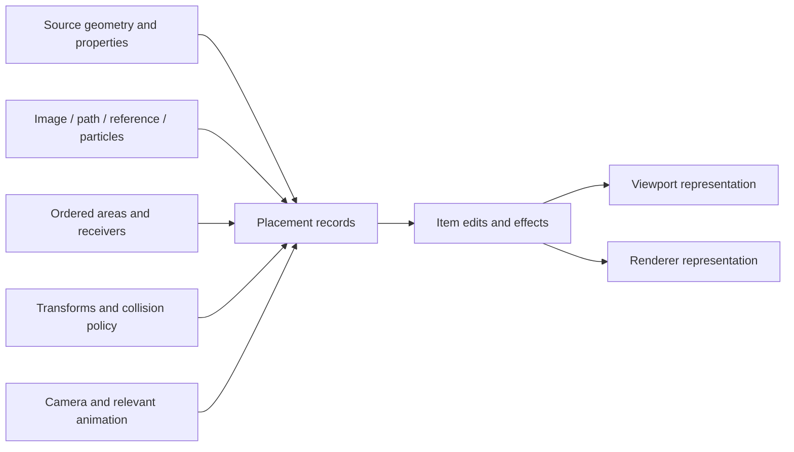

# What the controls tell us about the system

The supplied screenshot shows a configurable pipeline with independent setting domains. It does not show every option: Geometry properties, Items Editor and General are closed, several lists are empty, and Particle Flow is the active distribution mode. Grey controls reflect both context and edition restrictions.

The following is a **conceptual model from public behavior**, not a recovered native call graph:

Exact ordering between projection, transforms, effects and collision must be tested mode by mode. The diagram expresses responsibilities and dependencies only.

| Domain | Logic documented by iToo | What is useful for Cyrus |
|---|---|---|
| [Geometry](https://docs.itoosoft.com/forestpack/forest-plugin/add-geometry) | Source objects have per-source properties, including probability, size and collision-related controls. | Keep source properties separate from whole-population and display settings. |
| [Distribution](https://docs.itoosoft.com/forestpack/forest-plugin/distribution) | Several position generators feed the population. [Path](https://docs.itoosoft.com/forestpack/forest-plugin/distribution/path-mode), [reference](https://docs.itoosoft.com/forestpack/forest-plugin/distribution/reference-mode) and [Particle Flow](https://docs.itoosoft.com/forestpack/forest-plugin/distribution/particle-flow-mode) use different input contracts. | Add individual adapters when demanded; expose only relevant controls and dependencies. Imported particles need no duplicate physics engine. |
| [Areas](https://docs.itoosoft.com/forestpack/forest-plugin/areas) | Ordered include/exclude masks, multiple shapes and boundary falloffs. Object masks can use projected images. | Preserve order and identity; make approximate raster masks an explicit accuracy choice if introduced. |
| [Surfaces](https://docs.itoosoft.com/forestpack/forest-plugin/surfaces) | XY/UV placement, normal direction, altitude/slope filters and reusable terrain preparation. | Receiver preparation and per-layer eligibility are different responsibilities. Shared data needs explicit invalidation ownership. |
| [Transform](https://docs.itoosoft.com/forestpack/forest-plugin/transform) | Random ranges, maps, aspect locks and probability curves influence separate axes. Translation can move items outside the original area. | Specify when boundary checks apply and distinguish probability shaping from map-driven amplitude. |
| [Item Editor](https://docs.itoosoft.com/forestpack/forest-plugin/item-editor) | Generated placement can transition to custom editing with per-item transforms and attach/detach operations. | Stable IDs and explicit regeneration rules matter more than matching the toolbar. Forest's internal identity policy was not recovered. |
| [Camera](https://docs.itoosoft.com/forestpack/forest-plugin/camera) | Expanded clipping bounds, back offset, distance falloff and LOD-related controls. | Culling needs shadow/reflection and animation acceptance tests before becoming a performance feature. |
| [Effects](https://docs.itoosoft.com/forestpack/forest-plugin/effects) | An expression system exposes [syntax](https://docs.itoosoft.com/forestpack/forest-plugin/effects/creating-and-editing-effects/effects-syntax) and [attributes](https://docs.itoosoft.com/forestpack/forest-plugin/effects/creating-and-editing-effects/attributes). | The documented contract is accessible. A binary expression-VM name alone does not reveal compiler implementation, scheduling or safety limits. |
| [Animation](https://docs.itoosoft.com/forestpack/forest-plugin/animation) | Source following and random/map sampling are distinct strategies. | Separate changes to placement from changes to source geometry/frame samples. |
| [Display](https://docs.itoosoft.com/forestpack/forest-plugin/display) | Adaptive mesh/proxy/point-cloud options, separate render limits and manual/freeze policies. | Placement count, shown count, drawn faces and point budget need separate reporting. |
| [General](https://docs.itoosoft.com/forestpack/forest-plugin/general) and [UI](https://docs.itoosoft.com/forestpack/forest-plugin/ui) | Configurable rollouts, grouping and different preset/library responsibilities. | Scale the artist workflow with contextual views of one model, rather than adding independent setting copies. |

## What Lite can actually expose

The [official Lite/Pro matrix](https://docs.itoosoft.com/forestpack/lite-and-pro) lists limits of three plant types, four areas and flat surfaces for Lite. It also marks features such as custom editing, point-cloud display, animation and collision as available in both editions. Built-in effects availability is different from creating, sharing or loading third-party effects. The matrix's graphical checkmarks were checked in the retrieved HTML; a text-only extraction loses that information.

Consequently, disabled Areas in this screenshot's Particle Flow mode are not proof that ordered areas are absent from Lite. Conversely, the installed Lite native module cannot certify Pro's uneven-surface or other exclusive paths. This report does not treat the large number of controls as evidence that Cyrus needs all of them.
