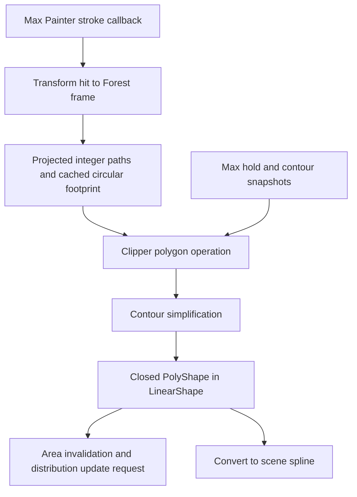

# Forest brush research — 8 October 2026

For the subsequent design decision and fresh Cyrus CPU measurements, read [Painted regions and boundary fading](REGION_DESIGN.md). It recommends a region-based primary workflow and separates that proposal from the native findings below.

The installed Forest Lite **9.4.3 / 9,4,3,766 for Max 2027** exposes a concrete design: its main area brush edits **polygon contours**, stores them in a Max shape object, and lets the normal scatter distribution use that region. This pass traced stroke input, contour construction, publication, Undo/Redo and spline conversion. It does not recover every brush path or prove comparative speed.

[Native evidence and remaining uncertainties](NATIVE_FINDINGS.md) · [Comparison with Cyrus and next acceptance](CYRUS_COMPARISON.md) · [Identity and verification receipt](EVIDENCE.json) · [Earlier Forest architecture research](../README.md)

## What we learned

| Question | Answer and evidence level |
|---|---|
| Does brushing directly create permanent plant positions? | The studied area brush edits a region shape; distribution remains a separate responsibility. This is supported by native shape publication and iToo's documented painting workflow. Custom Edit is a separate item-authoring workflow. |
| Does Forest build its own mouse/tablet system? | It implements Max's `IPainterCanvasInterface_V5` and uses the host Painter interface. Callback identity and virtual calls were verified through RTTI and four fresh SDK layout compiles. |
| What is the brush footprint? | The selected native helper builds a cached 24-vertex circular polygon, translated into the selected projection plane. Integer-coordinate paths feed a `clipper::Clipper` implementation. |
| How does painting change a region? | Each selected callback adds the current region and brush footprint to the clipping engine, chooses one of two operations, simplifies contours, then republishes closed polylines. Documented Paint/Erase behavior adds/subtracts coverage. Exact private enum/key-to-operation mapping remains a host-test question. |
| How is Undo handled? | Start creates a Max hold and captures contour state; End accepts it, Cancel cancels it. `AreaPaintRestore` supplies Restore/Redo paths with before/after contour snapshots and an area identity check. |
| Can the region be reused? | Native conversion creates a scene `SplineShape`; reverse conversion creates a `LinearShape` in Forest-local space. Public tutorials show using the converted spline in another Forest object. |
| Does it accumulate a soft density value like Cyrus? | The studied path edits contours. No per-dab strength accumulation was observed there. Boundary falloff is a separate area setting; this does not rule out other painting systems. |

The public [Lite painting tutorial](https://www.itoosoft.com/tutorials/getting-started-with-forest-pack-lite) explains the artist workflow: assign a receiving surface, disable its full-area inclusion, add a Paint area, then paint or erase. Distribution density and source transforms remain editable independently of that region. Paint regions can also exclude coverage or be converted into reusable splines.

## The main pipeline

This is the traced responsibility chain. The exact scheduling/cost of the downstream population rebuild was not qualified.

## Brush settings and restrictions

iToo documents size range, tablet pressure affecting brush size, Paint/Erase controls, falloff preview and area Include/Exclude settings. Include/Exclude chooses the area's effect on the population; Paint/Erase edits that area's own region. These are separate operations. See the [Areas reference](https://docs.itoosoft.com/forestpack/forest-plugin/areas).

The [8.0.4 changelog](https://docs.itoosoft.com/changelog/2022/11/02/forestpack-8_0_4) ties the quick Brush Size control to Painter Max Size and describes projected areas in UV mode. Native code contains X/Y/Z projection branches, while the studied session launcher can still display an XY-surface requirement warning. Applying a projected area to UV distribution and authoring a fresh stroke on a receiver are different cases; both need runtime tests before declaring universal support.

## Scope and preservation

Fresh raw run: `build/forest-brush-research-20261008-01/`. Main module hash remains `23b25adf28954a4cd6c3d7fe5f7ea90b6a6e9be480f8a422fa7ef8b99c9a325d`. Captured starting branch/HEAD: `codex/unified-0.73` / `d55dfa88cbeda7af366e4510ac3119a749368958`. Concurrent repository work moved the final state to `codex/ui-0.74` / `221e9f42bc65d1ad63f4f9b201efeb9ac589d5bb` and changed the unified UI template/generated script. Six of the eight originally hashed source files remained identical; the three additionally inspected native Brush files match the captured starting commit. The receipt preserves both states. Brush-native conclusions do not qualify the evolving 0.74 UI.

Twenty-seven selected records decompiled successfully, representing **25 unique discovered entry points**; decoded byte coverage matched their analysis-defined bodies. Two selections were duplicate/incorrectly assumed targets, documented in the native findings. Four compile-only Painter/Restore SDK probes passed. Six official pages were retrieved successfully. Initial headless project-opening errors are retained; the fresh owned import/analysis then succeeded and reported 8,732 discovered functions. None of these counts is a completeness percentage.

This research preserved vendor files, product source, normal Max profile and scenes; concurrent source work was retained. Raw binaries/listings/full pages remain ignored. The research database was saved/closed and the verified owned backend stopped. This research performed no Max painting session, scene save/reopen, pressure measurement, comparative latency test, product implementation, installation, commit or branch change.
