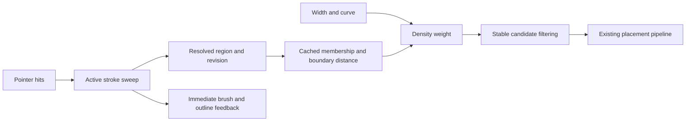

# Painted regions and boundary fading for Cyrus Scatter

8 October 2026. Recommend a contour-based Paint Area as the primary authoring model for terrain and other explicitly projected receiving surfaces. Painting should edit solid coverage; an optional boundary-distance curve should control density fading afterward. Default fading to Off. This better matches the task of selecting where to scatter than retaining editable soft influence for every historical stroke.

This recommendation supersedes the earlier comparison's conservative suggestion to keep the current model unchanged. It does not mean an arbitrary surface field is inherently wrong: it solves a broader problem. The new evidence below shows a concrete cost of carrying that broader model into simple region selection. No production implementation or installed plugin was changed for this design investigation.

## Evidence behind the recommendation

The [native Forest findings](NATIVE_FINDINGS.md) identify an area brush that transforms hits into a projected frame, performs polygon operations, simplifies contours and publishes closed polylines. Forest still uses a receiving surface for painting. It is the persistent representation that differs from Cyrus. The findings do not recover the complete product or prove its latency.

iToo documents paint areas, conversion to splines, and separate area-boundary density and scale falloff with adjustable curves. That supports separating region authoring from boundary appearance. Its Include and Exclude falloff ranges refer to area types; they are not evidence that Forest has precisely the inside/outside/centered control proposed here. [Forest Areas reference](https://docs.itoosoft.com/forestpack/forest-plugin/areas).

Current Cyrus is not simply painting a bitmap. In [brush.cpp](../../../AminScatter/src/brush.cpp), it stores a procedural surface field derived from ordered strokes. A field rebuild resamples stroke paths, builds per-dab connected-face patches and reverse links, then evaluates accumulated influences. Disabled strokes are resampled before being skipped. Aggregate derived-memory admission remains unresolved.

The host [fieldForRevision and evaluate path](../../../AminScatter/src/brush_host.cpp) rebuilds the field when revision changes and evaluates all preview anchors. Tint preview can also run adaptive surface coverage tessellation. Each accepted pointer sample increments revision. The [UI template](../../../AminScatter/tools/ui/templates/unified-core.ms), in `CyrusBrushTick`, requests changed feedback on a 150 ms timer, approximately 6.7 scheduled refreshes per second before work or host delays. This is the painted feedback cadence, not a measured cursor or viewport frame rate. Drawing consumes the completed overlay; it does not itself replay the field. During a gesture, the timer normally redraws the mask; the `checkPaintRevision` path defers placement invalidation until the gesture ends. Thus a full scatter solve on every mouse move is not the source finding.

An isolated MSVC Release experiment evaluated the current native field at 10,000 fixed positions on a two-triangle plane. All strokes were identical hard disks with strength 1, softness 0 and no erasing. Each case therefore had exactly the same coverage: 316 accepted positions, zero discrepancy from an analytic disk. One initial repetition was excluded; the table reports three subsequent repetitions' medians.

| Identical strokes | Field construction ms | Query ms | Serialized document bytes |
| --- | ---: | ---: | ---: |
| 1 | 0.0032 | 0.7415 | 284 |
| 10 | 0.0074 | 4.8508 | 2,624 |
| 100 | 0.0646 | 44.6295 | 26,024 |
| 1,000 | 0.6222 | 449.0441 | 260,024 |

The cost grows despite unchanged coverage. This fixture intentionally exposes redundant history on coarse receiving geometry; it is not representative of every mesh. It excludes Max, drawing, path interpolation, complex meshes, Undo memory and Forest. No new contour implementation was timed, so these numbers establish a Cyrus history cost, not a claimed speedup. Reducing the timer interval alone would schedule this work more often.

## The authoring and fading model

A Paint Area owns a stable identity, receiver scope, a fixed projection frame, closed contours with holes and multiple islands, and its boundary settings. It stores the final region. Stroke data needed for an active gesture or Undo does not become mandatory playback history for every placement query. A single outline is insufficient for holes, disconnected patches and nested contours.

Paint adds a swept brush footprint to the region; Erase subtracts it. The sweep connects sampled positions without gaps, with explicit breaks when the cursor leaves an eligible surface. Variable brush size needs a corresponding variable-width sweep. Repainting the same region at full strength should leave its semantic shape and distribution unchanged. Shape changes are the reason to invalidate its geometry cache.

The brush controls should initially be Paint, Erase and Size, with optional pressure affecting size. Ordinary Undo/Redo, clear area and spline interchange provide editing without an exposed editable history of all strokes. Losing retrospective radius/strength edits on old strokes is a deliberate product tradeoff. Changing the brush size affects subsequent painting.

| Boundary setting | Intended result |
| --- | --- |
| Off, the default | Full density inside the region, zero outside |
| Inside | Fade from full density to zero while approaching the painted border from inside |
| Outside | Keep full density to the painted border, then fade beyond it |
| Centered | Place a transition band on both sides of the border |
| Width | Transition distance in scene units, independent of brush size |
| Curve | Control how density changes through that distance; offer linear and smooth presets |

Start with one density curve. Separate scale fading can be an advanced option when needed; it should default off so sparse vegetation does not automatically become miniature vegetation. Fading controls placement probability, not material transparency.

For example, with a linear inside fade of 2 metres: density is zero at the boundary, half at 1 metre inward, and full at 2 metres inward. Changing those 2 metres to 5 metres changes the transition without repainting. A narrow strip may then never reach full density; that is the geometric result, and the preview should make it visible. Hard borders are appropriate for flower beds, paving exclusions and precise planting limits; optional density fading is useful for natural vegetation transitions.

Use signed distance `d` to the area's final boundary, positive inside and negative outside. Let `a` be the inward width and `b` the outward width. When `a+b>0`, use `w = C(clamp((d+b)/(a+b), 0, 1))`, with `C(0)=0` and `C(1)=1`. Inside uses `a=Width,b=0`; Outside uses `a=0,b=Width`; Centered divides the total Width equally. Both widths zero use a hard membership test, including a documented boundary tie rule. The first curve editor should enforce values in 0–1 and a monotone transition; arbitrary banding is a separate feature.

Compute distance to the resolved boundary, including holes, after union/subtraction within that Paint Area. Measuring distance to every historical brush circle would create seams inside overlaps and restore the very history cost being removed. Different named areas can retain different settings and ownership; do not flatten all layers and paint sets into one polygon.

Outside fading must expand the candidate query domain. Applying it after discarding every outside candidate cannot produce an outside transition. Its expanded footprint remains restricted to assigned receivers and applicable exclusions. Erasing an internal hole changes the region; an outside fade can enter that hole. Artists who require a strict no-scatter zone should use an explicit exclusion whose scope remains enforced. Preserve ordered paint-set and collision rules; do not silently introduce a different global exclusion policy.

For density, compare weight against a deterministic random value keyed by population and candidate identity. Reuse the same value across curve edits so unchanged candidates retain their transforms and identity. Do not normalize the surviving population back to an exact count in a way that cancels the fade. Generation, refill and collision policy must explicitly support a spatial density weight; downstream collision changes can still affect neighbors. Boundary containment based on a plant's footprint is separate from density falloff: a pivot inside a hard region does not guarantee its branches remain inside.

## Geometry and performance design

The recommended default is a projected region on terrain: the region chooses coordinates in its plane, and the receiver supplies actual surface position and normal. Sloped terrain is supported conceptually, but fade width is measured in that plane, not along the terrain's geodesic distance. A rotated frame can support a wall. Stacked floors, a folded mesh, a sphere or an overhang cannot be represented unambiguously by the same 2D coordinates alone. Receiver identity handles separate objects; overlapping sheets in the same object require an explicit component, depth or surface-domain policy. Do not claim universal surface painting from a planar prototype.

For the first implementation, fix the projection frame before painting and support terrain plus explicitly selected planar orientations. Preserve receiver membership and test transforms, nonuniform scale, mirroring and units. Express widths in an explicit metric and maintain that metric when transforming geometry. A projected region can survive receiver retessellation geometrically, but cached surface projection still needs invalidation. Freeform surface painting should only become a separate product mode if actual workflows require it.

| Approach | Good fit | Principal cost or limitation |
| --- | --- | --- |
| Current editable stroke field | Surface-aware paint, accumulated opacity, retrospective stroke edits | History replay, visibility queries, derived data growth |
| Final contours plus boundary curves | Terrain regions, holes, spline interchange, editable edge transitions | Polygon complexity and explicit projection semantics |
| Raster or tiled mask | Detailed internal density painting | Resolution, filtering and texture memory management |

A raster cache is not inherently inefficient. It can eventually accelerate queries, while contours remain authoritative. It should be introduced only if profiling justifies it. Interior variation also still has a place: a distribution map or procedural density modulation can multiply the area weight. A single boundary curve cannot describe arbitrary sparse and dense patches throughout an interior.

[Clipper2](https://angusj.com/clipper2/Docs/Overview.htm) is a suitable candidate for independently sourced polygon Boolean operations, under its published [Boost Software License](https://github.com/AngusJohnson/Clipper2/blob/main/LICENSE). It is not established as Forest's exact embedded library version. Pin and test the chosen version. Use explicit coordinate scaling and overflow checks; the author's [robustness guidance](https://angusj.com/clipper2/Docs/Robustness.htm) explains why rounding can remove very small features. Neither integer arithmetic nor the word vector guarantees unlimited precision.

Use a brush approximation derived from geometric error tolerance, not a blind copy of Forest's observed 24 vertices. Simplification must respect an error budget and preserve accepted topology. Bound contours, intersections, queued work, temporary allocation and Undo storage. Many tiny islands and repeated serrated erasures can make Boolean operations expensive even when old stroke history is gone.

Maintain cached membership and nearest-segment indexes for each region revision. Curve edits reuse geometry and cached distances where valid; width changes additionally invalidate the expanded candidate domain when required. Color and selection changes affect display only. Start with a correct bounded implementation and profile whole-region clipping; component indexing and local updates should follow measured needs, with full-result equivalence tests. Dirty-region hints alone are not proof that a Boolean edit is local.

Cyrus already has a nearest-segment tree, sampled curve evaluation and stable candidate thinning in [boundary_falloff.inc](../../../AminScatter/src/boundary_falloff.inc), plus an existing curve UI. Reuse the tested arithmetic and artist controls where compatible. The current function rebuilds the tree on each call, scans contour edges for inside/outside membership, and is invoked through an area bridge based on scene splines. Its parity test also assumes appropriate loop composition. It is groundwork, not a ready cached signed-distance region service.

Capture host data and publish on the Max thread. Any worker consumes copied numeric data. Keep brush ring and active outline feedback independent of a full scatter solve. Preview may coalesce work to the latest revision, but it must preserve every portion of the stroke path. Begin with bounded draft coverage feedback during dragging and full final evaluation at stroke end. A throttled plant preview can be added when measured budgets allow it. Manual mode continues to wait for explicit Update for placement changes. Live can publish a completed successor after a relevant edit. Failed or stale work must retain the previous complete result, never a partially rebuilt population.

## Implementation scope and acceptance

This is a meaningful native authoring and persistence change, not a softness slider adjustment. Reuse the Max Painter adapter, receiver picking, stable identities, existing distribution pipeline and retained display where suitable. Replace the area's persistent stroke-field dependency, add robust polygon editing and distance caching, and adapt Undo/save/load and preview scheduling.

Build a standalone region core first, then a disposable Max integration. The initial acceptance needs paint/erase, holes, disconnected islands, fast drags, spline interchange, curves, Undo/Redo/cancel, save/reopen and bounded failure behavior. Stress repeated identical painting, 1,000 complex edits, increasing contour sizes, dense receivers, thin strips, unit extremes and rotated/nonuniform transforms. Compare equal visible populations and record input-to-feedback latency distributions, Boolean work, distance-query cost, scatter solve time and peak memory separately. A proposed responsiveness target is under 33 ms p95 for brush feedback on a declared representative scene; that is an acceptance target, not a measured result or a universal promise.

The experiment below justifies developing this model, but a measured prototype must establish its own cost and show no growth with redundant history when final geometric complexity is unchanged. A host comparison against the installed Forest build remains necessary before claiming equal or better responsiveness.

Existing authored documents must remain intact while the new format is evaluated. A soft field does not convert exactly into a solid region plus one edge curve; threshold conversion would discard information and requires explicit artist intent. That preservation requirement does not justify maintaining two permanent authoring engines. Decide migration or archival treatment after the new model passes its tests and the required freeform workflows are known. The [models and painting proposal](../../Product_Discussion_2026-10-08/MODELS_AND_PAINTING.md) separately addresses source ownership; do not disguise current multi-set behavior by only renaming it.

Reproduce the cost experiment with `python docs/ForestPack_Research_2026-10-08/brush/reproduce/region_history_cost.py --output build/region-design-research-NEW`. The output directory must be unused. The helper freezes source files, compiles the core and analytic witness, writes raw repetitions and a source-hashed receipt, and never launches Max or installs anything. This run used `build/region-design-research-20261008-02`; the earlier `-01` attempt stopped before compilation because Windows did not resolve `cl.exe` from the supplied environment. The corrected helper resolves its absolute path. [Evidence receipt](REGION_COST_EVIDENCE.json).

Inspected workspace: `codex/ui-0.74`, HEAD `221e9f42bc65d1ad63f4f9b201efeb9ac589d5bb`, with pre-existing UI/source/document changes preserved. The experiment's copied source hashes remained unchanged during the run. This investigation added this proposal, its reproducible CPU witness and evidence; it did not modify production source, certify 0.74, or test the artist's active Max session.
