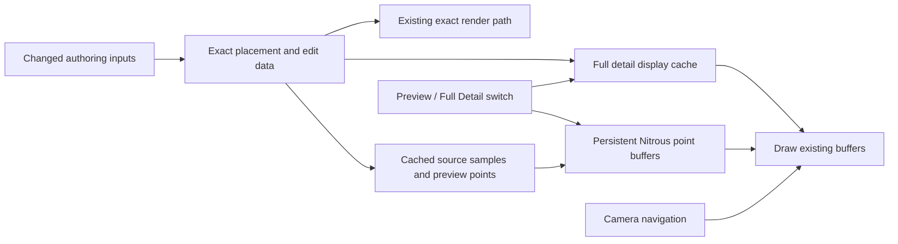

# Smooth navigation in heavy scatter scenes

**First engineering loop completed 2 October 2026.** The product goal is an explicit **Fast Preview / Full Detail switch**, with exact placement and final-render output preserved. A private native experiment successfully tested retained point buffers through Autodesk's Nitrous API. This directory extends the existing performance roadmap and preserves the improvements in Scatter 0.62.

At one million displayed preview points, median synchronous camera-step time was **73.194 ms with current drawing, 3.813 ms retained, and 3.305 ms with drawing disabled**. Across 11,880 accepted camera steps, unchanged navigation caused no extra explicit buffer initialization/realization requests. These are redraw timings, not completed-frame FPS. The new points have a finer pixel footprint; appearance and production integration remain open. Read the [results and limits](RESULTS.md) before using these numbers.

## Start here

| Document | What it answers |
| --- | --- |
| [Knowledge and decisions](KNOWLEDGE.md) | What the supplied research establishes, what remains uncertain, and which ideas deserve coding |
| [Roadmap and to-do list](ROADMAP.md) | The ordered work, acceptance gates and current completion state |
| [Implementation plan](IMPLEMENTATION_PLAN.md) | The concrete architecture, files, experiment and verification procedure |
| [First-loop results](RESULTS.md) | Actual execution, measurements, visual checks and remaining limits |

## What “calculate once” can mean

We can calculate a scatter when its inputs change, build a compact preview once, and let the GPU reuse it as the camera moves. That removes repeated CPU calculation and point submission from navigation. Drawing still consumes GPU time and memory bandwidth. The practical goal is a small, bounded display cost that stays close to the same scene with scatter hidden.

A bird's-eye view cannot show every leaf individually: many leaves project to the same pixels. A bounded point preview can preserve the composition, distribution and recognizable vegetation shapes without asking the viewport to draw every leaf. Full Detail provides a deliberate inspection mode. It must state when instance or triangle limits reduce what is shown.

The switch and persistent production display owner are planned integration work. The test-only native probe proves or rejects the core drawing mechanism before that integration is attempted. A successful private experiment is not a new installer.

The mechanism passed its first loop. The next implementation is owner/lifetime integration and the switch, followed by source coverage and visual-quality checks. [Reproduction scripts](../../tools/performance/native_point_probe/README.md) and a [hashed evidence archive](evidence/manifest.json) make the result inspectable.

## Why this order

Forest Pack documents a fixed point budget and GPU caching between object edits. Autodesk exposes persistent render items and vertex buffers. These provide a simpler, directly relevant starting point than a new CUDA/OpenCL placement engine. FStorm's public point-cloud preview is a useful visual reference, but does not disclose its implementation. [Forest Pack](https://docs.itoosoft.com/forestpack/forest-plugin/display), [Autodesk custom render items](https://help.autodesk.com/cloudhelp/2027/ENU/MAXDEV-CPP-API-REF/class_max_s_d_k_1_1_graphics_1_1_i_custom_render_item.html), [FStorm reference](https://www.youtube.com/watch?v=BgroiM6Mexo).

First make the existing points inexpensive to draw. Then measure visual quality at different budgets. Add spatial detail levels only if that simpler design is insufficient. The evidence needed to move between these steps is in the implementation plan and roadmap.
