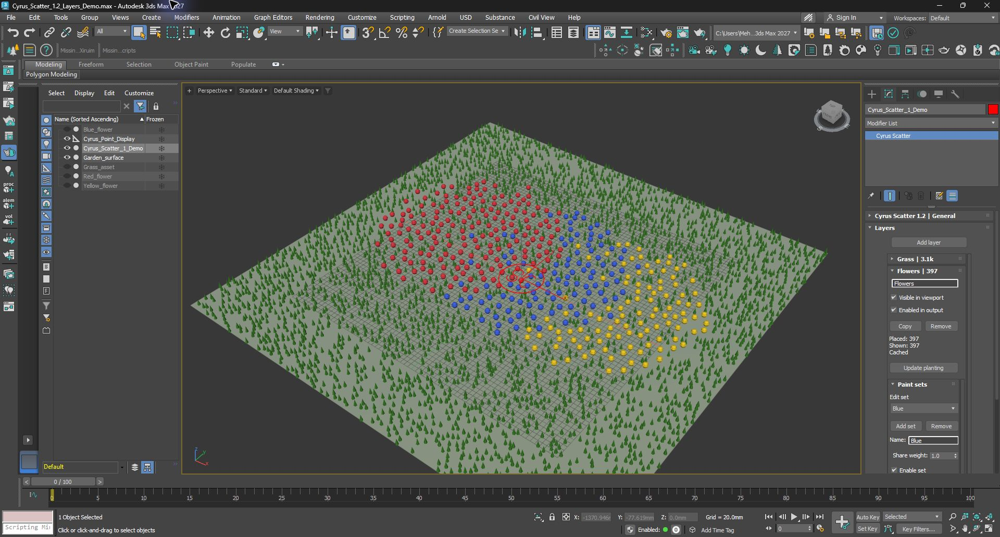

# Cyrus Scatter 1.2: native layers, paint sets and MCP qualification

**4 October 2026 — local test release.** Scatter 1.2.0 and MCP 1.1.0 implement the layers-first workflow and the bounded automation expansion described below. The test matrix passed in private Max 2027.1 profiles. This is readiness for artist testing within the stated boundaries, not certification of every Max/renderer/DPI combination or a completed ML system.

Start with the [artist guide](ARTIST_GUIDE.md), [completed work and next gates](CHECKLIST.md), and [native/MCP capability map](CAPABILITIES.md). The [original implementation contract](PLAN.md) preserves the design intent. Exact source and package hashes are in [the evidence manifest](evidence/MANIFEST.json).

## Delivered behavior

Grass and Flowers are independent expandable layers. Each opens its complete settings. Flowers can contain Red, Blue and Yellow paint sets, each with separate plant assets and editable paint/erase history. Population, areas, transforms, collision and cleanup belong to Flowers and apply to all its sets. General receiver, update and display settings remain outside individual layers.

The UI uses native Max rollouts, buttons, spinners, lists and subrollouts. It embeds no HTML, CSS or custom Qt theme. The HTML prototype remains in `mockups/layers-first/index.html` as a review artifact; it does not drive the engine.

## UI architecture and ownership

`AminScatter/tools/ui/layers-first.cjs` is a new final transformation after `planting-groups.cjs`. Existing feature bodies remain authoritative and are generated into uniquely named per-slot factories. Max rollout declarations otherwise reuse identities; ten factories keep simultaneously open layers independent. The generated script is intentionally larger, while maintained control bodies remain shared.

The root Layers host has a bounded native scrolling area. Each layer mounts its internal editors on first expansion, retains them when collapsed, and captures its owner reference. Ordinary section toggles do not recreate controls or change the root rollout height. Top-level structural changes rebuild the parent list; adding a child set preserves the existing parent panels. No width polling or Win32 resize repair was added.

Source and Brush editors follow the selected set within their parent. Population, area, diversity, transforms, spacing and statistics stay bound to that parent, regardless of another open layer or the old `activeLayer` value. Programmatic binding is guarded to avoid unintended writes. The existing cached-statistics timer is reused and observes interaction guards; opening a section is not a geometry-generation request.

Actual clicks verified single-click expansion, editing Grass without modifying Flowers, pending Manual status, and choosing Blue without redirecting common controls. Sixty section toggles retained control handles and the outer frame dimensions; the final run took 2,795 ms in aggregate, including Max message processing. This is an interaction check, not an input-latency distribution or a universal flicker guarantee. Arbitrary DPI and window arrangements still need artist QA. Fixed-height containment also leaves blank space when all layers are collapsed; this tradeoff is documented rather than hidden by another resizing layer.

## Persisted layers and deterministic population

The existing evaluator population objects remain the execution units. The first/base object is the parent; additional objects store its persistent `logicalParentID`. Every set has its own stable `layerID`, name, weight, enable/visibility and paint document. Old independent populations load with an empty parent ID and remain independent. The internal legacy class identity stays compatible; the script class version is now 51 and the public version is 1.2.0.

Common settings have one authority: the parent. Before evaluation, the adapter copies changed effective values to child execution units. It compares scalars and tab elements before assignment, avoiding an always-dirty loop. Asset arrays, paint history and set-local settings are excluded from inheritance. Configuration inspection reads the effective parent values without synchronizing or generating anything.

For count mode, a parent budget is divided among enabled positive-weight sets using floor allocation plus largest remainders, with stable creation order for ties. A 91-candidate budget splits into 31/30/30 with equal weights. Density mode first computes and caps the **parent** total, then divides it; it does not round each set independently or multiply the cap by the number of children. Child seed streams include their stable Edit key. Effective allocation and seed participate in generation cache identity; choosing a different set for editing does not.

The capacity is ten total execution populations per controller. A parent plus three additional sets consumes four slots. Copy creates new IDs and independent paint documents; deleting a parent removes its sets in one undoable action. Baked output guards remain. Hidden sets/layers affect viewport visibility only, while disabled ones stop contributing to final output and spacing.

Changing base generation, seed or set allocation can invalidate an existing CS Edit generation binding. Existing override safety rules are preserved; this implementation does not infer a remapping or silently reset edits. That is a meaningful limit on the original plan's identity ambition.

## Collision, areas, Brush and cleanup

Parent include/exclude shapes are inherited by every set. Native areas retain XY projection and exclude precedence. The new fixture checks every accepted position against an included square and excluded central square, and confirms Grass remains unchanged. Allowed areas can refill the requested candidate count; coverage and collision may reduce it later.

Sibling sets participate in within-layer 3D centre spacing, with minimum distance twice the layer collision radius. Inter-layer pair rules resolve parent relationships, so one rule covers every child. Stable ordering keeps a parent's sets contiguous. Cleanup runs over their final accepted union before later parents consume that union as blockers. A two-set, one-candidate-each fixture confirms the candidates can qualify as each other's neighbors; cleaning each leaf separately would remove both.

Manual overrides retain their existing protected/conflict behavior. During implementation, the cleanup adapter was corrected to recognize protection only in its explicit four-field override representation. Five-field canonical candidates contain face identity; interpreting that field as a boolean would misclassify some candidates.

Paint documents stay independent. Erasing Blue leaves Red unchanged, disabling an erase restores its previous coverage, and copied histories do not share mutable documents. A real native mouse drag added one two-sample stroke to Blue, preserved the other sets, stopped with right-click and waited for Manual Update. Existing curved-surface, topology-restoration, retained overlay and Edit fixtures also passed.

Point Relax is paused across the whole parent if an enabled set has an active Brush mask. Shared Boundary Relax remains paused. Stored values survive and the UI explains availability. Random and Clusters support multiple sets. Line Pattern/Analyzer source assignment remains available on independent layers and rejects an incompatible added set before mutation. These guards prevent unsupported combinations from appearing functional; they are not new constrained solvers.

## Performance and output evidence

The native C++ engine, retained buffers, GPU-instanced Mesh path and bounded CPU algorithms were not changed in this pass. No CUDA/OpenCL computation, camera LOD or new threading model was introduced. This work checks that ownership/UI changes preserve the previous display paths.

| Navigation fixture | Accepted preview plants | Displayed representation | Result over 30 camera steps per mode |
| --- | ---: | ---: | --- |
| Point Cloud | 20,000 | 500,000 samples | No placement generation, Brush queries or retained-buffer uploads |
| Proxy | 20,000 | 20,000 proxies | Same work-counter checks passed |
| Mesh | 20,000 | 20,000 instances | Same work-counter checks passed |
| Plant centres | 20,000 | 20,000 points | Same work-counter checks passed |

A separate 45-step Mesh run measured synchronous camera/redraw work from 3–12 ms while keeping generation, Brush queries and uploads unchanged. These are **not presented-frame FPS measurements**, and concurrent private processes make them unsuitable for a new speedup ratio. Hiding the layer kept placement caches intact. See [navigation evidence](evidence/navigation-acceptance.json) and [all modes](evidence/navigation-all-modes.json).

The synthetic demo publishes 3,144 Grass plants and 180/109/108 Red/Blue/Yellow plants: 3,541 total after coverage and spacing. A real 128×128 Scanline render consumed exactly that final population, including the viewport-hidden layer, then cleaned up transient output. Existing fixtures also verified point-only/empty-source policy, exact hidden-layer Bake, stacked Edit moves/clones, density texture dispatch, copy, Undo and topology/history behavior. Other renderers remain unqualified in this campaign.

## MCP 1.1

The host previously risked measuring a detached layer before its actual controller policy and shared relationships were established. It now chooses policy explicitly, sets stable identities/settings, attaches the complete layer graph, evaluates it, and derives validation, underfill, receipts, counts and digest from the same final published rows. Rollback restores recorded layouts as well as controller/mask state.

Schema 1.0 preserves its legacy policy. Schema 2.0 adds typed layer/source/display settings and pair rules through one closed registry used by validators, tool schemas and host adaptation. It supports enrolled include/exclude/protected regions, axis scale, XY tilt/projected movement, source offset/radius, collision, cleanup, priority, visibility/enable and display/update modes. Unknown fields, invalid enums, reversed ranges, non-finite numbers and unsupported combinations are rejected. Units cross the metres/Max boundary once. Conservative margins account for source scale, tilt, clearance and movement; constrained layouts can legitimately underfill.

Nine MCP tools are shipped. New configuration inspection reports effective ownership/settings/assets, source weights, stored whole-scale/Z rotation and legacy variation ranges without rebuilding. A dedicated multi-set test deliberately left a child with an old stored scale of 1.0 while its Manual parent was 1.5; inspection correctly reported 1.5 and a 50-of-100 allocation, with identical scene snapshots before/after. Export returns a matching published layout record and recomputes its transform digest/count. Schema v2's four display-mode runs each published 159 plants with verified exclusions, pair gaps, matrices, digests, visibility/disable and Undo.

The offline-installed package passed legacy generation cycles, injected rollback/refinement failures, stale input rejection, nine-tool official SDK stdio interaction, bounded capture, modal/render/Undo admission guards, retained diagnostics, read-only inspection and the 2,000-instance/9,000-source-triangle boundary. Local approval in the shipped panel remains required; privileged test-only approval controls are not included in the package.

MCP is intentionally bounded: it does not automate native Brush-set/history mutations, maps/falloff, Relax, complex terrain, Bake/render/Edit or arbitrary Max properties. All gaps and units are listed in [CAPABILITIES.md](CAPABILITIES.md). Its contract is more complete; it is not an unrestricted remote version of every native button.

## ML preparation

Execution records contain a versioned enrolled context, normalized plan, receipt, actual transforms/source IDs, units, provenance and generation lineage. Correction records validate explicit mappings; parameter edits and layout replacement cannot invent per-instance labels. Training eligibility is false. No implicit consent, telemetry, provider upload, dataset collection, trained model or inference is implemented. This gives a future collector reproducible evidence without pretending that a successful scatter is an artistic training label.

## Qualification and package identity

| Check | Result |
| --- | --- |
| Max 2026 native SDK build/suites | 12/12 passed; no 2026 runtime available |
| Max 2027 native SDK build/suites | 12/12 passed |
| Python contracts/transport/settings/tools | 75 passed, zero failures/errors/skips |
| Installed Max 2027.1 product campaign | Layers, areas, erase, Manual/live, navigation, output/Edit, demo and render passed |
| New scene in a fresh installed process | Parent/set IDs, settings, paint membership and placement fingerprints preserved |
| Frozen 1.0.1 scene under 1.2 | Original policy, IDs, history and output fingerprints preserved |
| Real UI interaction | Single-click layer expansion, owner-specific spinner, native set picker and Brush drag passed |
| MCP installed package | Eight main campaigns plus effective multi-set inspection passed |
| Installer/uninstaller | Private paths, matching modules/startup, unrelated registration and five scene controllers preserved |

The uninstaller fixture initially looked nodes up by name; the frozen legacy scene contains duplicate names. The fixture was corrected to verify saved animation handles, then passed after a private reinstall. Another fixture initially assumed Manual mode without setting it, and the area test incorrectly assumed constraints must underfill. These test assumptions were corrected against observed semantics; no failure was silently relabeled as a pass. Original local run outputs remain under `build/`.

`collect_layers_evidence.py` verifies source hashes, both MZP payloads, loaded native paths/hashes, the installed script and installed MCP host files. The final MZPs differ from the runtime-tested installer only in updated `INSTALL.txt` wording; all executable payloads match. The installed MCP build is **1.1.0-07ab9dc2b424**. [MANIFEST.json](evidence/MANIFEST.json) records the exact working tree on base commit `fb01a12` and links 39 curated evidence files. Scenes, binaries, connection secrets and private journals are excluded from this evidence directory.

## Handoff and remaining gates

The local handoff is `dist/layers-first-1.2.0`: Max 2026/2027 installers and checksums, Max 2027 demo, artist guide and optional offline MCP package. The artist's existing Max process, scene and installed profile were preserved. All installation, uninstallation, mutations and painting above occurred in private test profiles. The packaged demo is left open in a separate Max instance for review.

Code, generated script, reproduction fixtures and documentation are updated locally; this turn did not commit or push them. The package is ready for the artist's bounded test pass. Remaining gates are explicit in [CHECKLIST.md](CHECKLIST.md): Max 2026 host testing, additional renderers/DPI/long sessions, advanced dialog permutations, richer MCP enrollment, constrained Relax and future ML collection. There is no claim that every possible scene is glitch-free or that no further improvements exist.

## Native design references

The chosen bounded host follows Autodesk's [SubRollout API](https://help.autodesk.com/cloudhelp/2024/ENU/MAXScript-Help/files/MAXScript-Tools-and-Interaction/Creating-MAXScript-Tools/Scripted-Utilities-and-Rollouts/GUID-CDE5B06D-4BB4-4DEA-96C1-6BAB98709F09.html). The design accounts for documented [rollout property limitations](https://help.autodesk.com/cloudhelp/2021/ENU/3DSMax-MAXScript/files/GUID-DC435555-362D-4A03-BCF2-21179C5442F2.htm) and [scripted-plugin initial rollout state](https://help.autodesk.com/cloudhelp/2024/ENU/MAXScript-Help/files/MAXScript-Tools-and-Interaction/Creating-MAXScript-Tools/Scripted-Plug-ins/GUID-B0B9C1BF-168C-47D2-A4BE-12D93116FE79.html). Documentation established feasibility; the local native experiments established the behavior reported here.
