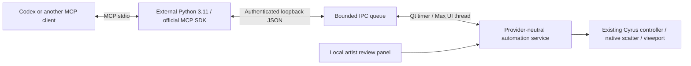

# Cyrus Automation / MCP 1.0 architecture

This is the implemented contract for the first local MCP release. The 30 September roadmap remains the broader AI/ML strategy; its synthetic schema 0.1 examples are not requests for this server. The executable contract is [schema 1.0](../../CyrusMCP/cyrus_mcp/plan.schema.json).

## Process and thread ownership

Only the adapter imports the MCP SDK and Pydantic. Max uses its bundled Python, pymxs and PySide6. Network handlers validate/authenticate and queue immutable JSON; they never access Max objects. A 100 ms UI timer dispatches at most one request per tick. An admitted apply is journaled and receives its queued response before execution on a later tick. Max never waits for a model answer.

This follows Autodesk's main-thread restriction for pymxs; its former worker-token mechanism is not a threading solution. [Autodesk threading guidance](https://help.autodesk.com/cloudhelp/2027/ENU/MAXDEV-Python/files/MAXDEV_Python_threading_html.html). The external adapter uses the [official MCP Python SDK](https://github.com/modelcontextprotocol/python-sdk) and [Codex's documented stdio integration](https://learn.chatgpt.com/docs/extend/mcp).

## Two authority scopes

**Inspection:** the artist selects one existing Cyrus controller locally. Up to 32 layers are summarized through cached getters, without synchronizing layers or generating placements. No mutation tool can turn this scope into ownership. Status is an inspection snapshot; diagnostics are current cached counters. Manual caches are explicitly described as potentially older than their source geometry. Camera redraws can do work, so capture is separately permissioned and checked for a changed preview.

**Design:** the artist enrolls a static, horizontal, convex mesh site, one to three supported source meshes, one to three straight convex planting splines, and optional protected splines. Inputs are read-only. One new controller and derived masks are owned by this enrollment. One approved refinement may replace only those owned layers/masks. Re-enrollment does not silently reclaim a prior result.

No arbitrary MAXScript, Python, property setters, filesystem paths, shell commands, network URLs, renderer execution or enrollment/approval endpoints are exposed. Object labels are data, not instructions. The privileged scripts under `tools/mcp` are test harnesses and are excluded from the product package.

## Identity, validity and recovery

- Random scene epochs and opaque scope/context/controller/generation IDs prevent node-handle or index reuse from authorizing work.
- Read/validate/apply use bounded fingerprints of approved design inputs and owned state. Relevant external edits invalidate the enrollment. Context and validation expire after five minutes.
- Local approval is tied to a validated proposal, digest and revision. Image sharing can be revoked immediately. Picking a different scope disconnects the old one.
- The operation journal is written before admission and before generation. An identical retry returns its recorded outcome. Reusing a key with different arguments fails. No transport error automatically creates another operation.
- On restart, incomplete operations are `outcome_unknown`. Corrupt journals fail closed. Old operation outcomes can be queried with their original epoch; a fresh scene never replays them.
- Generation publishes one Max Undo entry. Native errors are caught inside all pymxs Undo/redraw/animate contexts; after they close normally, recovery checks the exact top Undo label and invokes Undo explicitly. This avoids a reproduced Max 2027 exception-unwind crash and a separately reproduced redraw-disable leak. Recovery verifies input/controller fingerprints and removal of created nodes; host tests also verify redraw and Auto Key restoration.
- Local Undo refuses to step over a subsequent artist edit. Cancelling queued work prevents generation; synchronous native generation cannot be interrupted midway. Scene reset/open/new invalidates scope. Closing the panel closes IPC.

The Qt panel uses Autodesk's focus-scoped accelerator suppression, so its Escape and text input reach the dialog while Max shortcuts resume on focus-out. Closing destroys the dialog and its child timers. See [Autodesk's Python UI guidance](https://help.autodesk.com/cloudhelp/2026/ENU/MAXDEV-Python/files/MAXDEV_Python_creating_python_uis_html.html).

Undo can reconstruct a native cache. Its timing counter may change while its placements, counts and validity remain the same. Tests distinguish semantic recovery from preservation of a timing sample. Autodesk documents automatic exception rollback in [pymxs Undo](https://help.autodesk.com/cloudhelp/2027/ENU/MAXDEV-Python/files/using_pymxs/MAXDEV_Python_using_pymxs_pymxs_module_html.html); the checked explicit path here addresses the observed scripted-layer failure.

## Geometry and publication

World lengths are metres, angles degrees, with right-handed Z-up coordinates. Matrix export converts Max's row-vector Matrix3 to a column-vector 4×4 matrix and converts translation units. `snapshotAsMesh` is already world-space: source extraction removes only the node transform, preserving object offsets used by the native engine.

A site must have one manifold boundary, upward triangles, horizontal geometry and triangle area matching its convex boundary. The boundary hull tolerates float32 roundoff on rotated, subdivided straight edges; the topology and coverage checks still reject holes and concavity. Planting splines remain explicitly convex and straight.

Source footprint uses the furthest XY vertex from its pivot, maximum requested uniform scale, clearance and a small numerical guard. Each planting region is inset by that margin. The resulting persistent spline feeds the ordinary Cyrus area path, and every emitted footprint is checked before publication. Protected regions must be disjoint from authored planting regions. This is conservative containment, not inter-plant packing or exact silhouette collision.

Design enrollment rejects keyed geometry/parent transforms, procedural or constrained controllers, modifier stacks and unqualified procedural/proxy source classes. A bounded sub-animation traversal is necessary: a node's own animation flag did not detect an animated primitive height in the real-host test. The relevant API distinctions are documented under [controller properties](https://help.autodesk.com/cloudhelp/2024/ENU/MAXScript-Help/files/3ds-Max-Objects-and-Interfaces/Animation-Controllers/Controller-Common-Properties/GUID-B0AE3E3F-140A-49A2-844B-3C398BA97569.html).

The application sets matching source arrays, explicit count/seed/weights/scale/yaw, Manual mode and proxy-box preview. It validates actual counts, underfill policy, preview errors and the final footprints. Saved results use ordinary Cyrus controller/layer parameters and splines; the MCP process is not needed to reopen or render that result.

## Budgets and transport

Three design layers, 2,000 aggregate requested plants, two successful candidates, two captures and 24 normal tool calls per enrollment. Outcome reads and exact retries remain available after the call budget. Context/validation stores each retain at most eight entries; the journal retains 128 outcomes. Captures are capped at a 1,536-pixel long edge and 2 MiB of base64 data.

The site and sources together are limited to 10,000 evaluated triangles and 12,000 vertices. This is an automation inspection budget, not a limit of Cyrus's native scatter or existing-layout diagnostics. The rejected 100k-triangle experiment took about 25 seconds to enroll; a 9k-triangle source took about 2.4 seconds to enroll and 1.47 seconds for a guarded context read on this machine. Large-input support needs faster extraction before a larger budget is honest.

The loopback bridge binds to `127.0.0.1` on an ephemeral port, signs requests with a per-session HMAC secret, checks timestamps/nonces, rejects browser Origin/incorrect Host/chunked bodies, caps requests at 64 KiB and queues at 16, and uses eight worker slots with timeouts. Expired queued requests are not admitted. One Max process leases a connection directory at a time. User-profile paths avoid MSIX LocalAppData redirection; connection files have a current-user ACL. Same-user malicious code is outside this local trust boundary.

The journal contains operational IDs, layer labels and results. It is not training data. There is no telemetry, model API, credential copying or provider authentication in the host/server. Codex owns its model connection and allowance; an embedded assistant or commercial direct sign-in remains a separate project.

## Performance interpretation

Ordinary viewport movement does not call a model or rebuild this service's geometry fingerprint. Fingerprinting occurs on explicit guarded automation operations. Status/diagnostics read cached state. Retained owner counters and shared process totals are named separately; upload bytes, draw callbacks and reserved memory are not claimed as presented-frame FPS or measured VRAM. No viewport speedup is attributed to MCP itself.
