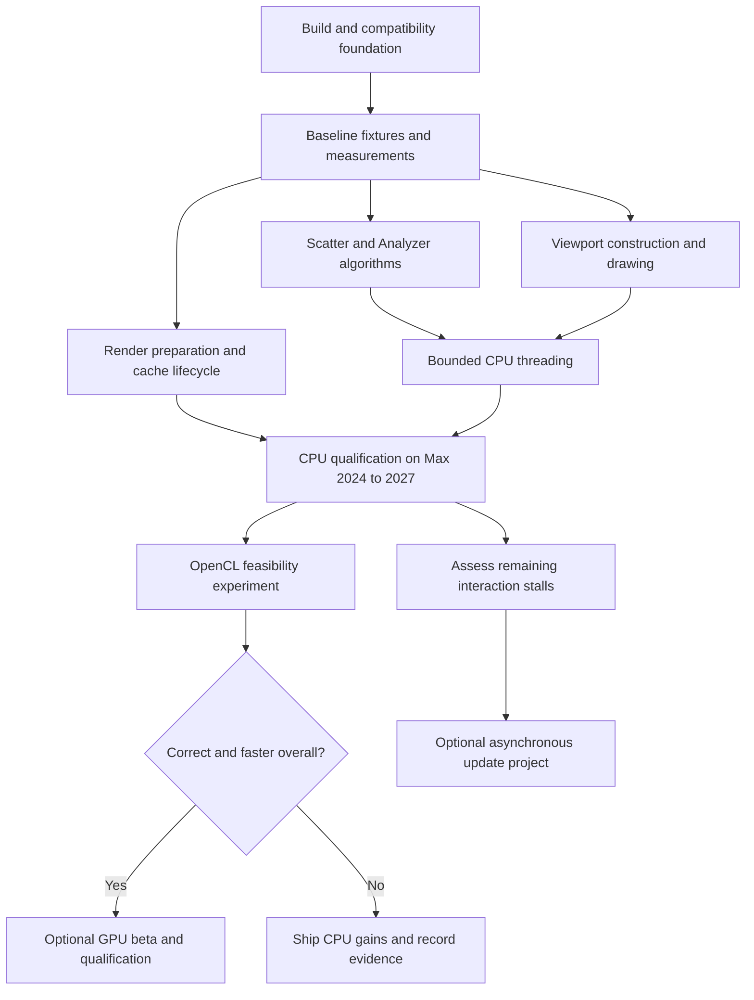

# Cyrus Scatter performance roadmap

**Date:** 2026-09-28 · **Original status:** implementation plan, application code unchanged. **October 1 update:** the first measured Max 2027 CPU candidate is implemented. Read the [implementation report](../Performance_Implementation_2026-10-01.md), [upgrade test](../Performance_Upgrade_Test_2026-10-01.md) and [results ledger](09_Results_and_Decisions.md). Remaining task descriptions retain their planning role.

## What we are building toward

Improve scatter updates and editing, viewport navigation, Surface Analyzer, and render preparation. Support 3ds Max **2024, 2025, 2026, and 2027** with **32 GB RAM minimum**, as requested. CPU execution remains available on every supported configuration. GPU acceleration is an optional, measured capability.

The current source explicitly targets Max 2026. The other versions are required work in this roadmap, not existing compatibility claims. “Through the current release” means 2027 at this document's date; a future Max release requires another qualification pass.

## Recommended sequence

1. Establish reproducible builds, output fixtures, and stage timings. Start on 2026, while preparing separate builds for all four host versions.
2. Improve the algorithms and caches that measurements identify. Treat scatter computation, preview construction/drawing, and PFlow preparation as separate workloads.
3. Add bounded CPU multithreading to independent native loops, preserving output order and saved edits.
4. Deliver a CPU test build and compare it against the original on the same scenes and hardware.
5. Run a narrow OpenCL experiment against the improved CPU implementation. Include upload, download, driver startup, and renderer contention in its results.
6. Enable GPU execution only for workloads and devices that pass correctness and total-time gates. Consider asynchronous updates later if measured UI stalls remain.

## Document map

| Document | Purpose |
|---|---|
| [01 — Current code audit](01_Current_Code_Audit.md) | Source evidence, likely costs, and corrections to the research report |
| [02 — Baseline and benchmarks](02_Baseline_and_Benchmarks.md) | Instrumentation, scenes, sampling, and acceptance metrics |
| [03 — Compatibility and regression](03_Compatibility_and_Regression.md) | Determinism, saved scenes, CS Edit identities, and correctness fixtures |
| [04 — CPU optimization](04_CPU_Optimization_Plan.md) | Algorithm, allocation, and Analyzer work |
| [05 — Multithreading](05_Multithreading_Architecture.md) | Worker boundaries, scheduling, deterministic publication, and lifecycle |
| [06 — GPU and OpenCL](06_GPU_OpenCL_Feasibility.md) | A concrete optional experiment, requirements, and fallback |
| [07 — Backlog and gates](07_Implementation_Backlog_and_Gates.md) | Coding sequence, dependencies, deliverables, and stop conditions |
| [08 — Manual test runbook](08_Manual_Test_Runbook.md) | How to compare each test build in Max |
| [09 — Results and decisions](09_Results_and_Decisions.md) | Blank result sheets and the ongoing decision record |
| [10 — Sources and open questions](10_Sources_and_Open_Questions.md) | Official references, evidence limits, and unresolved inputs |
| [11 — Platforms and minimum requirements](11_Platforms_and_Minimum_Requirements.md) | Max 2024–2027, compiler/SDK matrix, 32 GB baseline, and GPU policy |
| [12 — Viewport workstream](12_Viewport_Implementation_Plan.md) | Point and geometry previews, redraw cost, and CS Edit interaction |
| [13 — Render preparation workstream](13_Render_Preparation_Plan.md) | PFlow, interactive rendering, scene lifecycle, and large-scene memory |
| [Source snapshot](source_snapshot.json) | SHA-256 fingerprints for the 97 locally inventoried project files |

Read this page, 07, and 08 first. Use the other documents when implementing their workstream. Keep measurements in 09 rather than creating another overlapping roadmap.

## Decisions already made

- Cover all performance areas; select the first optimization from baseline evidence.
- Keep existing placements, seeds, source order, saved parameters, class IDs, and edit identities compatible.
- Keep host scene access, MAXScript/GC objects, drawing, and PFlow changes on the host thread.
- Evaluate oneTBB behind an optional executor boundary; retain a serial path.
- Evaluate OpenCL with runtime capability checks; no required CUDA, OpenCL runtime, or special compute GPU for CPU operation.
- Keep licensing implementation separate from performance experiments so before/after measurements have a clear cause.
- Use filesystem snapshots and copies for these tasks; the user requested no Git and no subagents.

## First coding milestone

Implement **F01–F04 and B01–B03** in [07](07_Implementation_Backlog_and_Gates.md): build prerequisites, host-version configuration, Analyzer core-only builds, generator reproducibility, deterministic fixtures, and diagnostic timers. Produce a baseline build and test scene kit before changing placement algorithms. SDK/runtime acquisition may delay host testing; the native harness and fixtures can proceed once a compiler is available.

## Evidence boundary

This package reconciles the [original performance research](../Cyrus%20Scatter%20Performance%20Engineering%20Report.md), the existing [codebase reference](../CyrusScatter_Complete_Codebase_Documentation_2026-09-27/README.md), and a fresh inspection of the local implementation. It provides the implementation guidance for performance work. The older report remains background research.

No CTest suite, Max scene, renderer, threading experiment, or GPU kernel was successfully executed during this documentation pass. A previous core configure attempt could not locate a Visual Studio installation. The default 2026 SDK header was absent. Speedups, limits, and support status must be established by the planned tests.
