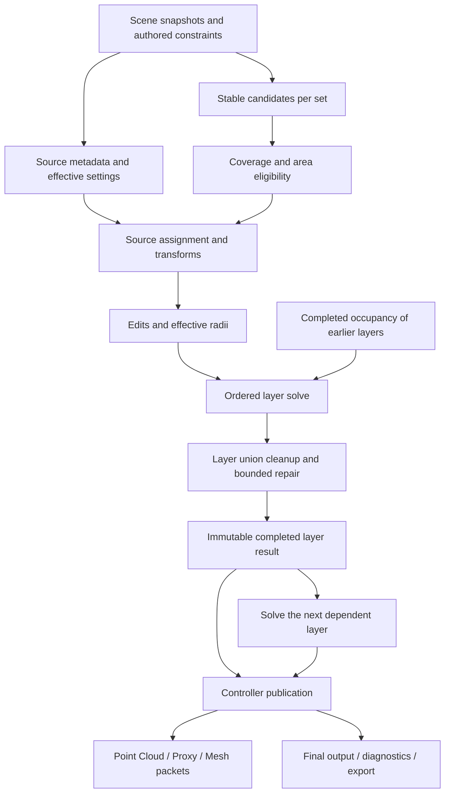

# 02 — Procedural ownership, execution and publication

Status: proposed next evaluation policy. Preserve existing policies for existing scenes.

## A small dependency system, not a new general-purpose application

Use a fixed set of typed stages and revisioned outputs. A visual node editor is unnecessary. The artist sees ordinary native layers and Paint Sets; internally the evaluator knows which outputs each stage consumes.



Each logical layer is a distinct node in a finite ordered sequence; only relevant earlier results feed it. Cleanup repair is a bounded internal operation, not an unrestricted graph cycle. Publication waits for all required changed layers.

## Ownership

| Owner | Owns |
| --- | --- |
| Controller | Receiver references, units, policy/schema versions, ordered layer IDs, update/display defaults and publication |
| Layer | Ordered set IDs, population allocation, shared area/transform defaults, inter-layer rules, shared cleanup |
| Paint Set | Stable identity, source entries, coverage document, set weight, effective self-spacing rule and set-pair references |
| Source entry | Stable asset identity/reference, weight, artistic radius, follows-scale setting and source transform settings |
| Candidate/instance | Stable procedural key, surface anchor, selected source, transform, effective radius, edit flags |
| Rule | Scope, stable endpoints, metric, radius coefficient, extra gap and enabled state |

Adapt existing parent/base-set storage into this normalized read-only view. Do not initially recreate scene objects merely to obtain cleaner C++ structs. A copied layer/set must receive new identity namespaces while retaining the intended settings and copied Brush data.

## Ordinary order and dependencies

1. Persist explicit `layerOrder` and a `setOrder` inside each layer. These are IDs, not names or current UI selection.
2. Earlier items win ordinary collision conflicts; later items adapt to completed earlier results.
3. A relationship's distance can be symmetric while its winner is determined by order. Two-way distance checking does not imply two-way procedural recomputation.
4. Skip occupancy dependencies for unrelated pairs. A later layer with no relevant rule or fill relationship need not depend on all earlier layers.
5. Shared population allocation is an upstream dependency of siblings. Changing one weight can change several sets' candidate budgets.
6. Shared layer cleanup depends on the accepted sibling union. Initial selective caching may therefore invalidate the whole layer solve while still reusing each set's prepared candidates.

Show the effective sequence in the UI. An explicit reorder is one Undo transaction and invalidates the affected relationship consumers. Import old scenes using the **current effective priority/Edit-key order**, not an assumed visible order.

## Stage contracts

| Stage | Input → output | Required behavior |
| --- | --- | --- |
| Snapshot | Max references + validity → owned receiver/source data | Host-safe capture, explicit units and geometry/topology identities |
| Candidate generation | Surface sampler + set namespace + seed + ordinal range → anchors | Stable keys before filtering; no display budget in this stage |
| Eligibility | Anchors + area + Brush/density fields → weights/accepted candidate view | Paint/erase and include/exclude precede occupancy; report reasons |
| Assignment/transforms | Candidate identity + effective source/settings → instance proposals | Deterministic attributes; final positional changes precede radius/spacing |
| Authored edits | Proposals + bound edit records → edited proposals and reservations | Deletes never reserve space; protected overrides are explicit |
| Radius | Source metadata + final transform + override → metric radius | Never scale the object as a side effect of a spacing edit |
| Layer solve | Prepared sets + relevant upstream occupancy + rules → accepted views | Three scopes, stable order, protected-first, insert only accepted ordinary proposals |
| Cleanup/repair | Accepted sibling union + cleanup/fill policy → completed layer | Removal-only cleanup; bounded reconsideration; no transient blockers leave this boundary |
| Publish | Consistent set of completed layers → controller generation | One coherent revision, statistics and output digest |
| Display | Published placements + source display data + display settings → packets | Camera changes consume packets without placement generation |

The exact mathematical order is part of the versioned policy. For example, testing coverage at an anchor before movement and testing it at a moved position can give different results. The new policy should require final ordinary positions to remain within the allowed surface/coverage domain; preserve a sampled coverage threshold per candidate so revalidation does not draw fresh random numbers. Existing policy results must not silently change.

## Cleanup and the released-space problem

Suppose an early flower candidate blocks a later grass candidate. Union cleanup then removes the flower. The cleaned flower must not block the next layer, and the grass candidate should be eligible for reconsideration when gap filling is enabled.

A single pass cannot both know the final union cleanup and use that future result during every earlier sibling decision. The recommended first implementation is a **bounded layer transaction**:

```text
capture fixed external occupancy, prepared candidates and authored reservations
cleanupSuppressed = empty set of candidate IDs
for a bounded number of repair rounds:
    resolve sets in order from their cached candidate pools
        skip candidates suppressed by cleanup in this transaction
        use only accepted ordinary candidates and explicit reservations as blockers
    run the existing removal-only cleanup on the sibling union
    keep protected edits; record conflicts and cleanup diagnostics
    remember newly cleanup-removed ordinary IDs in cleanupSuppressed
    if targets and repair conditions are satisfied: finish
    if budget permits: append deterministic candidate batches for underfilled sets
    if neither suppression nor candidate pool changed: finish
publish the last cleaned result, with underfill/repair-limit diagnostics
```

Rebuild scratch occupancy on replay, rather than retaining removed blockers. Previously collision-rejected candidates stay available and may succeed after cleanup releases space. Future logical layers consume only the last cleaned layer result. After a replay limit, do not claim every newly freed location has been reconsidered.

The temporary suppression policy avoids repeatedly accepting the same cleanup-rejected point forever. It also biases the result: a suppressed point might have gained neighbors from a later batch. This is a deliberately bounded, deterministic heuristic, **not maximal packing or an optimal density solver**. Suppression is scoped to one transaction, not persisted as an artist deletion. Record its count and policy version. Qualify this choice against the no-refill baseline before enabling it by default.

Cleanup retains its current single-pass neighbor/component semantics. It does not assert every survivor still has the requested neighbor count after other points disappear. Iterative graph pruning would be a different feature and algorithm version.

Removal cannot introduce a distance collision. Consequently the final cleaned subset remains collision-valid, except declared protected conflicts, even when a work limit stops further filling. A work limit may cause underfill; it must never justify publishing intersecting ordinary proposals.

## Protected artist edits

Capture protected edits as a separate authored-input dependency before solving. This explains the current exception where a manually positioned plant in a later layer can reserve its location against an earlier procedural layer. It is not a backward dependency on a later computed result.

- Disabled owners contribute neither ordinary proposals nor protected reservations.
- Viewport-hidden owners retain their evaluation/output participation.
- Deleted instances contribute no reservation.
- Conflicting protected instances survive and receive diagnostics; do not call the result entirely collision-free.
- Unresolved source/anchor/edit bindings receive an explicit error or conflict state, not silent rebinding to another plant.
- A protected plant outside its coverage remains an authored exception with a visible diagnostic, according to the selected edit policy.

## Update, cancellation and error behavior

Manual mode retains the last completed generation and labels it pending. Live mode coalesces changes and computes a new result; it must not restart generation on each redraw. New input cancels or supersedes a pending job. Verify the captured input revision before publication and discard obsolete results.

Use immutable stage outputs and build temporary replacements. Publish a new controller generation only when all required changed layers succeed. Reuse unchanged layer outputs by reference. Errors retain the previous good result and identify the failed owner/stage; they do not combine new layer A with stale dependent layer B while claiming a complete generation.

The initial implementation can remain synchronous at the current safe execution boundary. Asynchronous workers are a later scheduling change, with cancellation and lifecycle tests, rather than a prerequisite for correct dependencies.

## Relax and future procedural effects

The existing painted/shared-policy Relax restrictions remain visible until explicitly replaced. Do not remove a guard just because the collision solver improved.

A future Relax stage must propose moves, project them to the correct receiver, revalidate area/coverage and all applicable spacing rules, then update its spatial index. Moving points after collision without those checks invalidates the result. It needs independent curved-surface, boundary-crossing and identity tests.

Every later effect should declare: input attributes, produced/modified attributes, identity behavior, affected revisions, CPU/host requirements and whether it can add, remove or move points. A small common stage contract is enough to support future modifiers.
