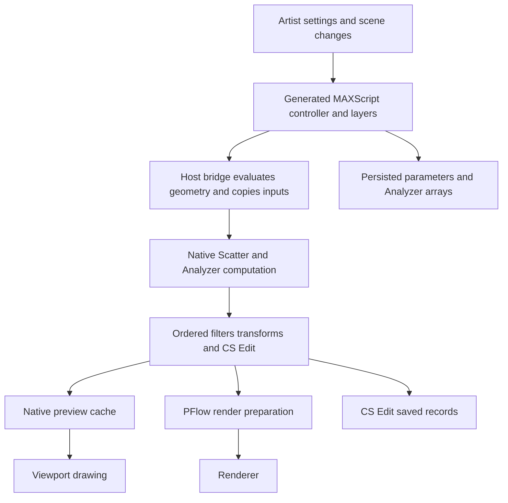

# 02 — Current system and evidence

## How the plugin works

The pure Scatter API is in [scatter.h](../../AminScatter/include/scatter.h). The Max bridge performs evaluated-mesh conversion and MAXScript marshaling. The generated [controller](../../AminScatter/scripts/AminScatterObject.ms) composes operations; it is maintained through [generator inputs](../../AminScatter/tools/ui/generate.cjs). Surface Analyzer has a separate [native core](../../CyrusSurfaceAnalyzer/src/analyzer.cpp) and [script controller](../../CyrusSurfaceAnalyzer/scripts/CyrusSurfaceAnalyzer.ms).

Placement is followed by whole scale, Analyzer-area/falloff filtering, source transforms, cross-layer blockers, optional final cleanup, boundary orientation, CS Edit, and render-only point-placeholder exclusion. Special modes alter this sequence through explicit branches. Changing this order can change existing scenes.

Rendering currently uses [PFlow construction](../../AminScatter/tools/ui/templates/pflow.ms), including source grouping and a Corona proxy workaround. It is not a proven renderer-native procedural integration. Mesh preview uses evaluated viewport geometry and simple shading; it does not promise final-material appearance.

## Verification ledger

| Evidence | Status and exact limit |
|---|---|
| Seven native suites | Existing Release executables rerun on 2026-09-29: all exit 0. [Raw results](evidence/native_test_rerun.json). No rebuild in this review |
| Max 2027.1 batch smoke | Prior 2026-09-28 log and smoke script reviewed and [archived with hashes](evidence/prior_runtime_evidence.json): native/script loading, 200 placements, preview construction, empty CS Edit stack evaluation, Analyzer invocation, save/reopen. [Current script](../../tools/tests/max2027_smoke.ms) |
| CS Edit coverage in smoke | Modifier persistence and evaluation checked; move/clone/delete/undo and legacy migration are not established by this test |
| Analyzer coverage in smoke | Analysis-run counter advances; quality of complex paths and rendered integration are not established |
| Generator | Two runs in a copied workspace exactly match production bytes; [evidence](evidence/generator_check.json). Continuous build enforcement is still pending |
| Installers | ZIP and manifest verification passed for both 2027 MZPs; [evidence](evidence/package_check.json). Normal-profile install/upgrade/uninstall not verified here |
| Renderers, IR, farms, animation | Pending actual qualification |
| Performance, concurrency, GPU, 32 GB | No comparative results or qualified workload envelope |

Native spacing tests print incidental timings. These are not a benchmark campaign or before/after speedup evidence.

## Fresh source findings to act on

The findings below distinguish visible behavior from possible consequences. Reproduce risks with isolated fixtures before changing algorithms.

| ID | Evidence and finding | Priority / next test |
|---|---|---|
| C-01 | Controller `placements`, lines 11075–11094: density texture is rasterized, but the fast-path condition does not check `distributionMode` or `projectMove`; the simple primitive lacks those inputs. `advancedAxes=false` can reach this branch | High: legacy/basic-state fixture with a zero density map and projection disabled; verify feature intent versus branch output |
| C-02 | `refreshPreview`, lines 11151–11164, clears the old cache before attempting generation and clears it again on error | High UX/recovery: valid preview → invalid input/resource failure. Proposed last-valid display must be clearly marked stale and never used silently for final render |
| C-03 | PFlow ownership is computed as every node absent from the pre-build scene array, including in the catch path | High scene safety: callback creates unrelated sentinel node during build/failure; cleanup must preserve it. Potential over-ownership, not an observed user-scene deletion |
| C-04 | CS Edit stack base IDs are row indices and signatures hash positions/source; layer key and signature include a slot index | High compatibility: remove an earlier layer, change base population, toggle lower edits, clone/merge. Existing identity is conditional on stable base generation; it is not arbitrary topology tracking |
| C-05 | `cyrus_edit_storage.inc` has per-field guards but large allowed row/string counts; loading writes layers as chunks are read | Release hardening: truncated/oversized/duplicate-key/nonfinite-state fixtures; bounded aggregate allocation and atomic acceptance deserve review |
| C-06 | Analyzer publishes boundary/path fields before optional Street Side calculation completes, then publishes remaining fields | Medium/high: injected failure after native analysis should not leave mixed generations. Prior-cache retention is not a proven all-stage transaction |
| C-07 | `max_bridge.cpp::meshOf` fixes density UVs to channel 1; controller rasterizes maps at 128×128 | Product limitation: expose/document sampling resolution and channel semantics before promising general texture/field control |
| C-08 | Full scans for anchor/projected movement; per-query `LineBand` copy in `outwardAt`; per-face shading on redraw | Performance hypotheses: stage profile before selecting an optimization |
| C-09 | Layer factory/storage limit is 10; proxy/mesh budgets are per layer; density mode caps requested population at 100,000 | Show limits clearly. A UI maximum is not a performance guarantee or global memory budget |
| C-10 | Existing feature `activation.cjs` only controls enable/disable | Licensing is not implemented; avoid mistaking that file for a commercial gate |

Source references: [controller](../../AminScatter/scripts/AminScatterObject.ms), [bridge](../../AminScatter/src/max_bridge.cpp), [edit stack](../../AminScatter/src/cyrus_edit_stack.inc), [storage](../../AminScatter/src/cyrus_edit_storage.inc), [preview](../../AminScatter/src/preview.cpp), [orientation](../../AminScatter/src/orientation.inc), [layer storage template](../../AminScatter/tools/ui/templates/storage.ms).

## Important semantic distinctions

- Requested count, emitted placements, preview points, shown instances, and rendered particles are different quantities.
- Core deterministic RNG does not prove equivalent output across compilers, hosts, or GPU arithmetic.
- Analyzer requires suitable planar connected elements. World-XY masks and loop-local analysis are different coordinate contracts.
- Collision currently uses configured radii/ordered filtering, not arbitrary mesh-to-mesh clearance.
- Edge offsets and CS Edit happen late; they can move instances beyond earlier masks or spacing constraints. Make this visible rather than silently changing established behavior.
- Realtime mode uses coalesced synchronous evaluation. Timers do not imply background computation.

## Corrections to dated documents

The 2026-only build statements are historical. Shared CMake now accepts 2026/2027; 2027 was built and smoke-tested. Analyzer has a core-only option. The old package versions are corrected in staged MZPs, but version metadata remains fragmented elsewhere. The Analyzer README's “no scatter integration” statement is stale relative to the current integration. Existing build-provider prices, repository visibility, and schedule estimates are historical statements, not verified current business facts.

Review coverage: all document families and implementation families were considered; the 198-file inventory records inputs. This is a subsystem-level review with targeted source tracing, not a formal line-by-line security audit or a certification of every feature combination.
