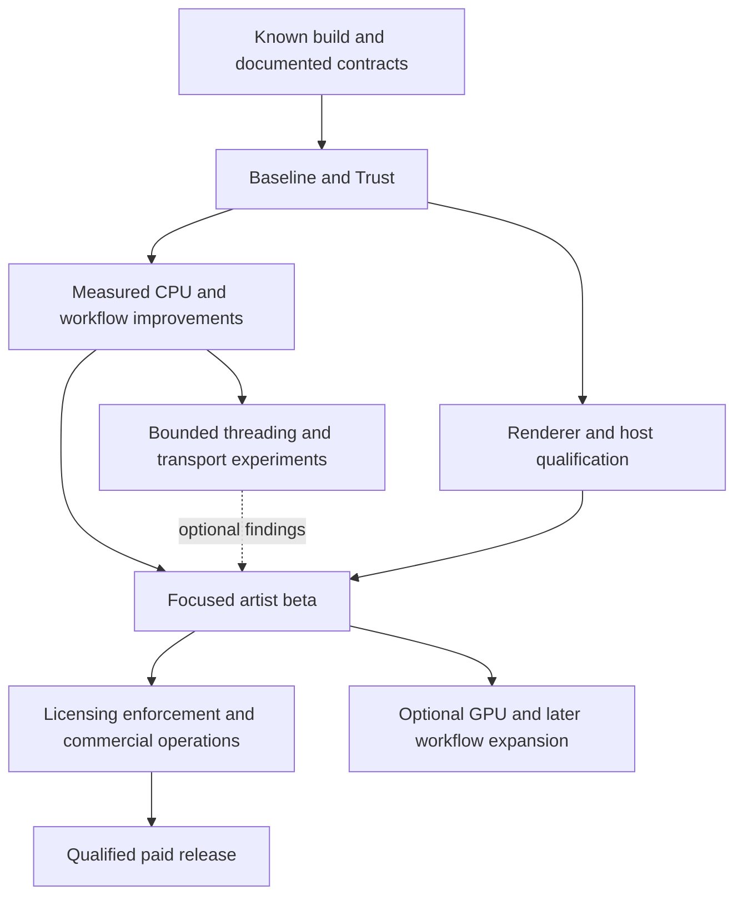

# 11 — Master roadmap and backlog

**This is the governing work order as of 2026-09-29. Task IDs below are planning identifiers. No dates or effort ranges are commitments.**

## Evidence-based sequence

Parallel workstreams describe independent planning or implementation possibilities, not permission to use subagents. Maintain a small work-in-progress limit and isolate risky changes. Optional threading/transport experiments do not block a beta whose declared workflows already pass using the baseline implementation.

## M0 — Current foundation

| Item | Status |
|---|---|
| 2027 SDK/toolchain and native packages | Completed in the previous compatibility task |
| Seven native test executables | Passed again in this review; no rebuild here |
| 2027.1 batch smoke | Previous result reviewed; broader host tests pending |
| Analyzer core-only CMake option | Implemented; standalone mode still needs its own recorded build check |
| Generator reproducibility | Two isolated runs pass; automation gate pending |
| Version metadata, golden fixtures, diagnostics | Pending |
| 2024/2025 ports, 2026 qualification, 2027.2 experiment | Pending |

Mapping to older performance IDs: F01 progressed for 2027; F02 is partially complete; F03 option exists; F04 manual verification now passes. B01–B04 and optimization tasks remain pending. Do not rerun installation/provisioning work merely because an old checklist says “not started.”

## M1 — Baseline and Trust

| ID | Deliverable | Depends on | Acceptance |
|---|---|---|---|
| BT-01 | Single release identity and archived baseline manifest | Existing build | Native/scripts/package/About/diagnostics agree; scene schemas unchanged |
| BT-02 | Repeatable generator/schema check | Observed generator pass | Missing anchors or unexpected schema changes fail the build check |
| BT-03 | Bounded stage diagnostics and local export | BT-01/02 | Timings reconcile; counts/reasons recorded; overhead measured |
| BT-04 | Golden native outputs and Max scene builders | BT-01 | Exact reference outputs, explicit failures, units/seeds/source hashes |
| BT-05 | Reproduce C-01..C-06 risks and classify defects | BT-04 | Each case has a result; confirmed defects get isolated fixes and regression coverage |
| BT-06 | Initial host/renderer baseline | BT-03/04 | Preview, edited-stack save/reopen, a small actual render and cleanup evidence |
| BT-07 | First profile and ranked bottlenecks | BT-03/04/06 | Whole-operation report plus memory; first optimization chosen from data |

**Gate:** baseline can be rebuilt and understood; no open critical defect in the measured path; useful comparison artifacts exist. See [first milestone](12_First_Implementation_Milestone.md).

## M2 — Faster, clearer current workflows

| ID | Deliverable | Depends on | Acceptance |
|---|---|---|---|
| PF-01 | First measured CPU/index/cache improvement | BT-07 | Exact legacy parity; meaningful full-operation gain; bounded memory |
| PF-02 | Bounded executor and one independent hot stage | PF-01 or justified profile | Stable runtime loading; deterministic outputs; contention/crossover evidence |
| UX-01 | Freshness, population explanation and actionable errors | BT-03/05 | Zero/underfilled/stale cases understandable; no extra evaluation from status |
| UX-02 | First-scatter flow and three recipes | BT-06, UX-01 | Pilot completes task from documentation without developer rescue |
| RX-01 | PFlow lifecycle/ownership hardening | BT-05/06 | Success/abort/error preserves unrelated scene nodes and flags |
| HX-01 | Per-year builds and host qualification | BT-01/04 | 2024/25/26/27 rows completed with exact tested versions |
| QX-01 | 32 GB workload envelope | BT-03, PF-01 | Actual hardware evidence; resource failures recover predictably |

CPU tasks map to C01–C04/A01/V01/V02/E01/R01 in the performance package. Choose a few measured tasks; that list is not a demand to implement every optimization before beta.

## M3 — Focused artist beta

| ID | Deliverable | Depends on | Acceptance |
|---|---|---|---|
| PV-01 | Freelancer/studio pilot cohort and task records | M2 selected workflows | Repeated independent use and actionable adoption blockers |
| FT-01 | First requested workflow enhancement | PV-01, scene contract | Default-off backward parity and demonstrated task value |
| ID-01 | Stable layer/source identity design and migration | BT-04/05 | Clone/merge/remove/reorder fixtures pass before exposing new reorder features |
| RT-01 | Bounded 2027.2 transport prototype | BT-07, available matching runtime/API | Correct and materially better, or closed with evidence |
| DP-01 | Commercial bundle and upgrade/rollback path | BT-01, HX-01 | Clean-user installs, no duplicate modules, tested rollback |
| API-01 | Read-only studio preflight and documented automation entry | RX-01, PV-01 | Unattended structured result without dialogs |

**Gate:** artists finish the selected tasks; supported renderer/host paths are reliable; largest remaining problems are ranked using observed use. The beta can be explicitly limited while full qualification continues.

## M4 — Commercial release

| ID | Deliverable | Depends on | Acceptance |
|---|---|---|---|
| LC-01 | Native boundary and capability/continuity contract (L0) | Current source and scene/render fixtures | Authoring versus saved evaluation proved or limits recorded; relevant policy fixed before enforcement |
| LC-02 | Standalone policy/signature core and fake backend (L1) | BT-01, LC-01 experiment contract | Fact combinations, negative verification and feature-extension tests outside Max |
| LC-04 | Owned licensing service (L2) | LC-02, pilot policy | Individual/assigned studio flows, tenant isolation, issuance and recovery pass; replaces provider selection |
| LC-03 | Native enforcement + UI in isolated builds (L3) | LC-02, LC-04, RX-01 for promised render paths | Saved scenes preserved; direct mutations gated; multi-process and performance evidence |
| LC-05 | Optional floating/borrowing (L4) | LC-03, approved studio policy | Capacity, offline overlap, crash/partition and restore tests pass |
| CO-01 | Provisioning, recovery and support operations (L5) | Qualified offered seat models and commercial rules | Duplicate/out-of-order/retry/refund/renewal events reconcile safely |
| RL-01 | Signed, immutable release and rollback (L6) | DP-01, qualified scope | Final signatures/hashes/evidence verified; prior installers retained |
| RL-02 | Paid launch decision (L6) | All advertised gates | Product, licensing, operations and support ready for stated scope |

The [current licensing roadmap](../licensing/ROADMAP.md) supplies the detailed L0–L6 sequence and E01–E17 tests. Pure policy tests can use explicit synthetic terms before business choices are final. Enforcement and launch require the applicable fixed policy and evidence. Floating is optional for an assigned-seat launch; customer-hosted servers require demonstrated need.

## M5 — Expansion only after evidence

| Candidate | Entry condition | Stop rule |
|---|---|---|
| OpenCL preview/query acceleration | Accepted CPU baseline and dominant transferable workload | No useful transfer-inclusive gain or inadequate fallback |
| Retained viewport adapter | Submission dominates navigation cost | Picking/device lifetime/parity cannot be made reliable |
| Async preview | Synchronous waits remain an adoption blocker | Stale publication, reentrancy or shutdown safety unresolved |
| Field Helper adapter | Artist demand and supported sampling interface | Cannot preserve semantics or portable fallback |
| Brush tools / temporal attachment | Editing/identity foundation qualified | Ambiguous persistence/topology handling |
| USD exchange / studio library integration | Named downstream pipeline and fixtures | Unsupported transforms/assets/materials silently lose fidelity |
| Higher layer limits / richer graph | Repeated measured need | UI/memory/dependency complexity outweighs task benefit |

## Priority rules

1. Scene loss, wrong-instance edits, destructive cleanup and crashes outrank speed.
2. Correct final rendering and recoverable installation outrank feature breadth.
3. Measure complete task time before selecting a performance backend.
4. Every accepted feature needs a user, fixture, failure behavior, owner and support boundary.
5. Preserve a reference package and exact outputs at every experiment boundary.
6. Close losing experiments with evidence; do not keep them alive because they sound advanced.

Estimate an implementation only after a short spike resolves its main API/compatibility uncertainty. Report effort as a range with assumptions and exclude hardware/SDK/customer access delays explicitly. The older 6–10 week licensing estimate does not cover this entire product program.
