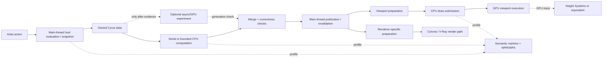
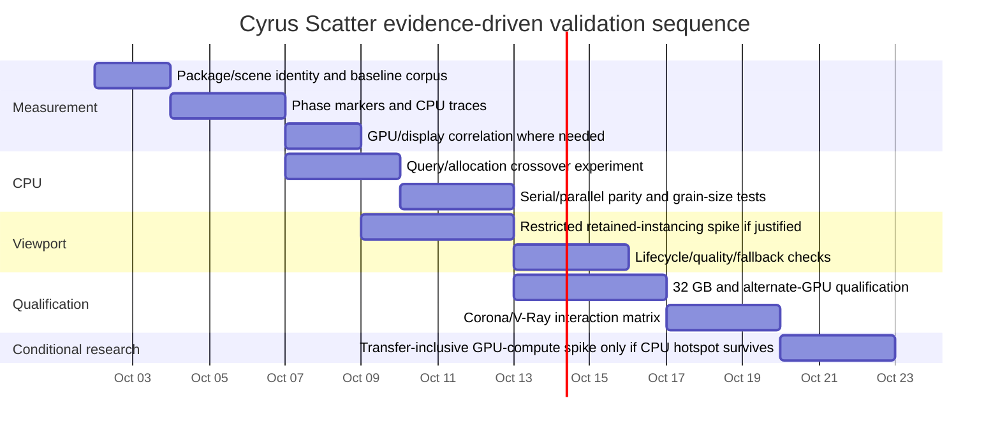

# Cyrus Scatter Independent Engineering Research Report

**Research date:** October 1, 2026  
**Target environment:** Autodesk 3ds Max 2026 and 2027 on Windows  
**Research mode:** independent external engineering assessment; no repository access and no running 3ds Max/Cyrus Scatter instance  
**Evidence policy:** primary vendor documentation, specifications, original research, and explicitly labeled user-supplied project context

## Executive summary

The premise in the conversational instruction that “no documents were provided” was superseded by three uploaded documents. The controlling document is the independent-research brief, which asks for a source-backed assessment of Cyrus Scatter across measurement, scattering mathematics, CPU concurrency, Nitrous viewport design, GPU computation, and production qualification without inventing the implementation. fileciteturn0file0 The project-context document provides dated historical orientation and measurements but explicitly warns that those records are not substitutes for reading current source or running current builds. fileciteturn0file1 The “START HERE” document further requires the external investigation and the Codex/codebase investigation to remain independent initially and says that agreement between models is not proof. fileciteturn0file2

### Decision brief

| Consequential finding | Independent assessment | Project action |
|---|---|---|
| **Measurement comes before another architecture change.** | Viewport FPS, synchronous callback time, CPU kernel time, GPU execution, render translation, and edit-to-visible latency answer different questions. Windows Performance Recorder/WPA can capture ETW CPU/system timelines, while current Nsight Systems can trace D3D11 API activity and frame durations on Windows/NVIDIA systems. citeturn20search18turn18view7 | Instrument phase boundaries first. Do not choose threads, retained drawing, or GPU compute from the reported 23→150 FPS observation. |
| **The safest CPU parallelism boundary is owned numerical data, not the Max scene.** | Autodesk says the SDK is generally not thread-safe; scene translation/update generally must occur on the main thread, and its thread-safety guidance identifies reference/node evaluation as single-threaded. citeturn17view0turn19search0 | Keep host extraction/evaluation on the permitted thread; parallelize only independent owned data where profiling justifies it. Prefer bounded synchronous work before a persistent asynchronous subsystem. |
| **Nitrous retained data / viewport instancing is real and supported in both target SDK generations, but it is a hypothesis, not an automatic upgrade.** | Autodesk exposes `IObjectDisplay2`, retained RenderItems, and `InstanceDisplayGeometry`; the latter uploads/updates per-instance GPU data and can fail when GPU-memory needs are too large. citeturn18view4turn15view2turn18view3 | Prototype one deliberately narrow repeated-mesh case only if profiling says CPU display preparation/submission remains important. Preserve the existing path as fallback and correctness oracle. |
| **GPU computation should not be a production project yet.** | CUDA's own current best-practices guide makes transfer minimization a high-priority rule and requires additional conditions for useful copy/compute overlap. OpenCL, SYCL, and DirectCompute remain technically available alternatives, but that does not remove extraction, synchronization, interoperability, precision, deployment, or maintenance costs. citeturn18view10turn17view12turn17view13turn17view14 | Reject a GPU backend unless a post-CPU-optimization kernel still dominates the end-to-end operation and a transfer-inclusive spike wins materially. Do not build a multi-backend abstraction speculatively. |
| **Reliability and workload equivalence are now more valuable than another isolated FPS headline.** | Chaos and tyFlow both expose aggressive viewport preview/instancing mechanisms while also documenting important quality or compatibility limits; Chaos explicitly separates viewport display limits from rendering and warns that render-side camera clipping can lose reflections/shadows. tyFlow documents cases where UV overrides defeat efficient instancing and where GPU-instanced display no longer represents modifier output. citeturn22search0turn18view14turn18view12 | Build the qualification matrix around like-for-like counts, modes, cold/warm state, memory, Undo/Redo, invalidation, multiple viewports, renderer interaction, and failure/fallback—not just best-case navigation. |

**Overall recommendation:** keep the design conservative. The evidence strongly supports better instrumentation, retention of a serial correctness path, prepared/reused data, spatial acceleration selected by query/update ratio, bounded owned-data parallelism, and a small retained-Nitrous experiment *only if* the trace points there. It does **not** currently support a generic job system, asynchronous scatter architecture, CUDA/OpenCL layer, or broad rewrite.

This conclusion is independently compatible with—but was not derived from—the supplied context stating that Cyrus already uses a narrow synchronous parallel path, prepared caches, and GraphicsWindow batching and has not shipped retained Nitrous instancing, CUDA/OpenCL computation, or asynchronous editing. Those are user-supplied project claims and must be checked by Codex against real source. fileciteturn0file1

### Largest unknowns

The decisive unknown is not which technology is fastest in the abstract; it is **where current end-to-end time goes** in each artist workflow. Repository/runtime evidence is still needed for current call structure, invalidation frequency, host/native marshalling, actual source-selection and spacing algorithms, allocation patterns, draw submission, rendered-scatter interfaces, and current dependency ownership. The external pass has no basis to label any of those “direct project-source observation” or “local measured run.” fileciteturn0file0

The target-host state also has an important documentation gap. Autodesk's 2026 SDK requirements explicitly specify Windows 10/11, Visual Studio 2022 17.8.3 with v143, Windows SDK 10.0.19041, .NET Core 8, Qt 6.5.3, and state that Max itself uses TBB 2021.12. citeturn18view1turn18view0 Autodesk's 2027 product documentation confirms C++20, .NET Core 10, Qt 6.8, and removal of DirectX 9. citeturn15view1 However, the current 2027 Developer Help portal's SDK-requirements and SDK-What's-New links returned 404 during this research, so I did **not** verify an authoritative 2027 compiler/toolset/TBB table and will not extrapolate the 2026 values. citeturn15view0turn16view0turn16view1

The supplied context says Max 2026 has not actually been installed/tested locally; successful 2026 compilation and native tests therefore do not establish 2026 runtime support. fileciteturn0file1

## Evidence model and performance measurement

### What must be timed separately

For Cyrus Scatter, a single number called “performance” is too coarse. At minimum, measurement should distinguish:

| Boundary | Start → stop | What it can establish | What it cannot establish |
|---|---|---|---|
| **Navigation frame/step** | camera/input event → corresponding visible frame or a clearly defined navigation step | Artist-visible interactive latency | Whether Cyrus CPU, Max, draw submission, or GPU execution caused it |
| **Edit-to-visible result** | parameter/input change → intended preview is visibly current | Responsiveness of real editing | Pure compute throughput |
| **Scatter rebuild** | validated input snapshot → completed placement output | Algorithm/placement cost | Viewport presentation or renderer translation |
| **Host extraction** | start/end of Max/MAXScript/native scene-data acquisition | Host/API/marshalling contribution | Owned-data compute |
| **Owned CPU kernel** | after host snapshot → numerical result before host publication | Candidate for optimization/parallelization | Overall benefit |
| **Viewport preparation** | Cyrus display-cache/render-item preparation | CPU display work | GPU completion |
| **Draw submission** | CPU calls preparing/submitting graphics work | Submission overhead | Full GPU cost after submission |
| **GPU frame work** | trace/timestamps covering relevant GPU queues | Device-side rendering workload | Host callback and scene-evaluation latency |
| **Render preparation/translation** | renderer-facing preparation start → renderer-ready scene | Final/interactive renderer overhead | Viewport behavior |
| **End-to-end operation** | artist action → operation-specific completion | The metric that decides whether an optimization matters | Which internal phase is responsible without sub-timers |

Autodesk's Rendering API itself makes an analogous distinction between scene translation and rendering, with separate lifecycle/timing concepts; interactive rendering also has a different concurrency contract from an offline render. citeturn17view0turn17view1 That is a useful reminder not to use a viewport optimization as evidence about Corona/V-Ray render preparation.

The current context records several genuinely useful but differently bounded observations: historical full-controller refresh results around 3.98–4.05 s before versus 1.01–1.17 s after; a viewport navigation-step median of 88.10→30.16 ms in one controlled comparison; a held-input matrix reducing callback time by 33.1% and complete step wall time by 9.1%; and uncontrolled artist observations around 20→80 FPS and, in a synthetic demo with a discovered 0.60/0.62 version mismatch, about 23→150 FPS. fileciteturn0file1 These are not interchangeable measurements.

For intuition only, 23 FPS is approximately 43.5 ms/frame and 150 FPS about 6.7 ms/frame; 20 FPS is 50 ms/frame and 80 FPS 12.5 ms/frame. The conversion makes clear why reporting frame **time distributions** is preferable to comparing FPS ratios: FPS is reciprocal and exaggerates-looking ratios at small frame times. The original numbers remain uncontrolled user observations, not benchmark evidence. fileciteturn0file1

### Amdahl's law as a guardrail

Amdahl's original 1967 argument establishes the fundamental limit imposed by the portion of a workload that is not accelerated. citeturn20search0 For a component fraction \(p\) accelerated by \(s\),

\[
S_{\text{whole}}=\frac{1}{(1-p)+p/s}
\]

This should be applied to the **complete operation**, not just the convenient kernel. As illustrations, not Cyrus measurements:

* if a kernel is 80% of an operation and becomes 10× faster, the complete operation is bounded at about **3.57×**;
* if it is only 30%, the same 10× kernel improvement produces only about **1.37×** overall.

This is particularly important for GPU proposals. A 20× device kernel can still be a poor product optimization if Max extraction, data packing, upload/readback, synchronization, redraw, or renderer work dominates the actual interaction.

For overlapping CPU/GPU work, the answer is **not** the arithmetic sum of every timer. The operation's critical path is what determines wall latency. CUDA documentation explicitly describes cases where transfers, GPU execution, and host work can overlap, but only under specified memory/device/stream conditions. citeturn18view10 The test harness should therefore preserve both per-phase intervals and a single wall-clock interval.

### Recommended profiling stack

**First choice: application markers plus WPR/WPA.** Microsoft describes WPR as an ETW recorder with built-in/custom profiles and WPA as the analysis side of the Windows Performance Toolkit. citeturn20search18 This is the least vendor-specific way to answer questions such as: Which thread ran? Was the main thread runnable or blocked? How much CPU did Cyrus consume? Did work migrate? Did renderer processes/threads overlap? Were there long scheduling gaps?

Add low-overhead Cyrus markers around the semantic phases above, counters for candidate/generated/displayed/render counts, generation ID, cache hit/rebuild status, callback reason, and loaded package identity. A trace without semantic markers can show that a thread is busy while still failing to tell whether the expensive work was placement, invalidation, cache generation, or drawing.

**Second choice on the RTX 3090 development machine: Nsight Systems.** Current Nsight Systems documentation says its Windows D3D11 tracing captures D3D11 calls, execution times, performance markers, and frame durations. citeturn18view7 It is therefore useful for correlating CPU-side submission with graphics activity. It is NVIDIA tooling, so conclusions that are backend/vendor sensitive must subsequently be checked on the non-NVIDIA configurations Cyrus claims to support.

**Profiler overhead must itself be measured.** Compare a paired untraced run, marker-only run, ETW run, and GPU-instrumented run. If the trace changes scheduling or frame-time distribution materially, use it for causal structure rather than headline timing.

### Reproducible trial design

Each performance record should capture build/package hash, loaded DLL/script paths, Max build, renderer build if active, GPU/driver, CPU, RAM, scene hash, viewport dimensions and style, selected object, seed, generated count, displayed count, adaptive degradation state, and operation definition. This directly addresses the version-mismatch problem already documented in the supplied synthetic demo. fileciteturn0file1

Use paired trials: A/B under the same state, warmup before measured steady-state runs, reverse or randomize A/B order, retain raw samples, and report median plus tail distribution and dispersion. Do not average small scenes into large ones. A regression that makes a common 500-instance edit worse should remain visible even if a million-instance benchmark improves dramatically.



The dashed optional path is deliberately not the default architecture.

## Scatter mathematics and CPU concurrency

### Algorithm selection should follow workload shape

The most useful distinction is not “simple versus advanced algorithm” but **construction/update cost versus number and type of queries**.

| Problem | Simplest credible method | When acceleration is justified | When it loses |
|---|---|---|---|
| Surface sampling | Precompute valid triangle weights; choose a face according to the intended weight; sample within the triangle | Many samples from unchanged topology/weights | Tiny or constantly changing meshes where preparation dominates |
| Fixed-radius spacing/proximity | Direct comparisons for very small sets; prepared uniform grid/spatial hash as count rises | Many radius-neighbor checks with reasonably bounded spatial density | Extreme clustering, pathological cell occupancy, huge sparse coordinates, or tiny workloads |
| Ray/closest-point against mesh | Direct face loop at tiny sizes; static AABB/BVH-style structure for repeated queries | Many queries per unchanged or infrequently changed triangle set | Frequent topology rebuilds, tiny meshes, degeneracy without explicit handling |
| Nearest point among scatter points | Small-array linear scan; grid for fixed-radius queries; k-d/BVH-type structure for more general nearest queries | Sufficient repeated queries to amortize build | High edit churn or a narrowly fixed radius where a grid is simpler |
| Boundary containment | Bounding-box reject + prepared polygon/ring data + existing exact semantic predicate | Repeated tests against the same boundary | Constant boundary edits or when “optimization” changes tolerance/winding/hole semantics |
| Source selection | Simple cumulative weights and deterministic draw | Optimize lookup only when selection itself measures significant | Small source lists; alias/precomputed tables can cost more to rebuild than they save |
| Density masks/rejection | Existing exact rejection rule | Precompute stable lookup/prepared data if sampling it dominates | Biased proposal distributions that unintentionally alter density semantics |

PBRT's triangle implementation documents uniform area sampling inside a triangle by mapping random samples to barycentric coordinates and returning an area PDF. citeturn23view3 That establishes a reliable reference mechanism for the *within-face* problem. A scatterer over a whole mesh must additionally choose faces in accordance with the declared target measure—normally geometric area before any intentionally applied density/mask/falloff weighting. Whether Cyrus currently does so is an **unknown** until source inspection.

For fixed-radius exclusion, Bridson's Poisson-disk work is a useful foundational example of coupling minimum-distance sampling with a spatial grid rather than repeatedly comparing every sample against every prior sample; the author's page also publishes related code. citeturn23view1 But replacing an established Cyrus placement process with Bridson sampling would likely change distribution, output count, acceptance order, and perhaps source identities. Therefore the transferable idea is **spatially accelerate the existing spacing predicate first**, not “replace Cyrus with Poisson disk.”

For mesh intersection/closest-point work, CGAL's current AABB-tree manual describes a static hierarchy for repeated intersection and distance queries over triangles/other primitives and explicitly distinguishes query forms that avoid constructing intersection objects. citeturn23view2 It also explicitly warns that degenerate triangles/segments can produce undefined behavior or crashes under its standard traits. citeturn18view8 This makes two points relevant to Cyrus: a BVH is attractive only where the query/build ratio justifies it, and degeneracy policy is part of the design—not a cleanup detail.

This does **not** recommend adding CGAL. The documentation is evidence about the algorithmic class and its edge cases; a custom narrow structure or existing Max-supported structure may be much cheaper to deploy.

### Decision rules for likely geometry structures

**Keep a simple loop** while \(N\) is small enough that structure construction, allocation, and indirection outweigh rejected comparisons. Find the crossover empirically rather than hard-coding a folklore threshold.

**Prefer a uniform grid/spatial hash** when the dominant question is “which accepted points lie within this fixed radius?” and the scatter has tolerable local density. Its strongest advantage is simplicity: the existing exact distance test remains the oracle; the structure merely reduces the candidate set. Test extreme coordinates, boundary cells, dense piles, radius changes, and memory growth.

**Prefer an AABB/BVH-like structure** when a relatively stable surface receives many ray, closest-point, or intersection queries. Rebuild/refit cost must be charged to edits that invalidate geometry. CGAL's documentation explicitly characterizes its AABB tree as static and query-oriented, reinforcing that it is not automatically the right structure for continuously changing topology. citeturn23view2

**Treat a k-d tree as a specialist option**, not a default. For general point-nearest queries it can be appropriate; for a known fixed spacing radius, a grid is often simpler and offers clearer update semantics. This is an engineering inference to test, not a product measurement.

### Robustness and transformed normals

Near polygon boundaries, naïve floating-point orientation tests can become numerically uncertain. Shewchuk's original robust-predicate research provides adaptive-precision orientation/incircle techniques specifically for geometric decisions sensitive to floating-point roundoff. citeturn20search6turn20search4 Cyrus should not import heavyweight exact arithmetic everywhere. First build an adversarial corpus around edges, almost-collinear boundary segments, holes, huge coordinates, tiny triangles, and points within the existing tolerance. Use robust predicates only where an observed failure justifies them.

Normals need similarly explicit treatment. Autodesk's 2026 `MNNormalSpec::Transform()` documentation states that when a transform is a geometry transform, normals are multiplied by the transpose of its inverse and renormalized. citeturn19search11 Consequently, any independent Cyrus normal/orientation optimization must test nonuniform scale, mirrored transforms, negative determinants, and near-singular transforms. A shortcut that merely transforms a normal like a point/vector is not generally equivalent.

### Determinism contract

Parallelism or GPU execution becomes much easier to assess if Cyrus first defines what “same result” means.

A strict path could require identical generated count, accepted candidate IDs, source identity, ordering, seed behavior, transforms, masks, and all boundary decisions. If that is the contract, random draws should not silently become schedule-dependent, and reductions/merges need stable order.

A deliberately looser path could permit bounded floating error in continuous transforms while still requiring identical topology-level choices such as accepted/rejected candidate and selected source. That narrower contract should be an explicit product decision, not something introduced accidentally by SIMD, reassociation, or GPU migration. The robust-predicate literature demonstrates why apparently small numerical changes can flip discrete geometry decisions near degeneracies. citeturn20search6

Exact CPU/GPU bitwise parity should therefore **not be presumed as a free property**. Before GPU or aggressive vectorization work, identify which outputs must be bit-identical and which are tolerance-based.

### CPU data layout and allocation

Before explicit SIMD, look for work that can be removed:

1. repeated conversion between host `Matrix3`/MAXScript objects and numerical representations;
2. rebuilding weights, boundaries, or surface structures whose inputs have not changed;
3. per-candidate dynamic allocation;
4. scattered pointer chasing where compact arrays could be used;
5. repeated geometry transforms that can be factored into shared source data plus instance data;
6. rejection paths that compute expensive properties before a cheap reject can decide.

These are conditional engineering hypotheses until Codex reads the implementation.

Structure-of-arrays or compact arrays become attractive when a measured hot loop repeatedly consumes only positions/radii/masks rather than complete heavyweight placement records. Explicit SIMD should come after the compiler's optimized output and memory behavior are examined. A 4× vectorized computation that consumes only 5% of edit latency cannot matter much under Amdahl's law. citeturn20search0

### Safe CPU concurrency

Autodesk's current 2026 Rendering API says that the SDK is generally not thread safe and most scene translation/update operations need the main thread; its mechanism for worker-side render sessions to ask for main-thread work is explicitly synchronous. citeturn17view0 Autodesk's broader thread-safety guidance says the reference and node-evaluation systems are single-threaded. citeturn19search0 Renderer-facing methods form a distinct case: for example, current Max documentation says texmap evaluation methods are expected to be thread-safe and should not touch scene data while rendering. citeturn19search1 That is exactly why “Max is single threaded” and “everything may be called concurrently” are both oversimplifications.

The preferred architecture for Cyrus numerical work is consequently:

**host thread:** evaluate nodes/references/MAXScript as allowed → copy a compact immutable snapshot →  
**workers:** operate only on Cyrus-owned POD/numeric storage →  
**join:** deterministic merge →  
**host thread:** publish/invalidate/update host-owned state.

This closely resembles the narrow architecture described in the supplied context—workers on owned numeric ranges, no Max node/MAXScript/viewport access, synchronous join, limited participation—but that context remains a project claim for Codex to verify. fileciteturn0file1

A bounded parallel range is preferable to a persistent executor until profiling proves thread startup/scheduling is itself significant. A persistent executor adds lifetime issues: scene reset, file load, node deletion, plugin unload, Max shutdown, renderer contention, exception propagation, generation cancellation, and potentially dependencies.

For Max 2026 specifically, Autodesk says Max itself uses TBB 2021.12. citeturn18view0 That does **not** mean Cyrus should automatically adopt oneTBB. It means any bundled TBB/runtime choice must consider Max's own runtime and verify coexistence. Because the equivalent authoritative 2027 TBB requirement could not be retrieved in this pass, adding or redistributing a TBB runtime before checking the 2027 SDK package would be premature. citeturn16view0

### Synchronous coalescing before asynchronous editing

Asynchronous interaction can be safe in principle if the architecture is:

main-thread snapshot → owned background computation → main-thread publication **only if generation is still current**.

A generation should become stale on any relevant source/mask/boundary/parameter/time change; publication must also survive Undo/Redo, node deletion, scene reset/load, plugin shutdown, and cancellation.

That is considerably more infrastructure than event coalescing. Therefore the order should be:

**first:** avoid duplicate invalidations and redundant work;  
**second:** optimize/reuse the synchronous numerical path;  
**third:** bounded parallel ranges;  
**only then:** asynchronous snapshot/compute/publish if interaction is still demonstrably blocked.

Autodesk's interactive-render documentation itself warns that concurrent scene changes require care with threading and re-entrant notifications and says its separately polled interactive-update thread should avoid accessing Max directly. citeturn17view1 This does not prescribe Cyrus architecture, but it is strong evidence against casually importing a game-engine job model.

## Viewport, renderer, and documented production mechanisms

### Nitrous architecture

Autodesk's plugin-display documentation identifies `IObjectDisplay2` as the Nitrous plugin interface and gives `PrepareDisplay()`, `UpdatePerNodeItems()`, and `UpdatePerViewItems()` as its central hooks. It specifically says `PrepareDisplay()` allows an object shared by multiple nodes to prepare display data once rather than regenerating it per node or per view. citeturn18view4 RenderItems are exposed through smart handles in the Nitrous SDK. citeturn18view5

This makes **retained prepared data** an officially supported design, not a speculative graphics hack.

Autodesk also exposes `MaxSDK::Graphics::ViewportInstancing::InstanceDisplayGeometry` in 3ds Max 2027, with `CreateInstanceData()` and `UpdateInstanceData()`; the latter updates internal instance data on the GPU. citeturn15view2turn18view2 The API can fail when an instance allocation is too large for available GPU memory. citeturn18view3 The corresponding API was also found in 2026 documentation during this research, so a narrow viewport-instancing prototype is plausible for both target generations. citeturn1search3

The 2027 `InstanceData` API exposes per-instance data including UV-map overrides and colors. citeturn19search8 Autodesk's viewport-instancing namespace documentation additionally warns that High Quality viewport operation has a richer required vertex-stream set than a simplistic position-only implementation. citeturn19search13 This is why a prototype must test Standard and High Quality viewport modes rather than extrapolating from one mode.

### Shared mesh plus transforms versus expanded triangles

For \(N\) repetitions of the same source mesh:

* **expanded geometry** conceptually stores/prepares transformed vertices/triangles for each visible instance;
* **instanced geometry** retains the source mesh once and supplies per-instance transforms and supported overrides.

The latter can greatly reduce duplicated geometry preparation/submission when geometry is genuinely shared. That is precisely the mechanism documented by Autodesk's instancing interface. citeturn15view2

However, this does **not** imply that every Cyrus preview should become an instance renderer.

A box/pyramid proxy contains little geometry. If an existing CPU batching path already amortizes calls effectively, migration to retained RenderItems may save little while adding bounds, lifecycle, material/style, selection, multiple-view, device-resource, and invalidation complexity. Conversely, a “Full Mesh” display of thousands of repeated detailed source meshes is a much stronger instancing candidate.

That leads to a concrete selection rule:

> Prototype retained instancing first on the mode with the highest measured repeated-geometry preparation/submission cost per visible instance—not on whichever mode is easiest to demo.

The user-supplied context says current 0.62 proxy work prepares world-space proxy triangles, batches GraphicsWindow submissions, and leaves Full Mesh on a source-geometry/instance-transform path; it also says no retained Nitrous renderer has shipped. fileciteturn0file1 Codex should verify that architecture before selecting the prototype target.

### Necessary viewport feature matrix

A retained implementation is not finished when it can draw an array of trees. It needs explicit answers for:

| Concern | Required validation |
|---|---|
| Source topology change | source buffer recreated exactly when necessary |
| Transform-only edit | instance data updated without unnecessarily rebuilding source geometry |
| Instance-count change | creation/update path handles growth/shrink and allocation failure |
| Deforming source | correct invalidation/rebuild frequency; fallback if retention stops being beneficial |
| Object bounds | Max sees bounds consistent with displayed population and selection behavior |
| Hit testing/selection | correct object/subobject behavior for the product's actual interaction contract |
| Visibility/hide/freeze | per-node and per-view state correctly represented |
| Multiple viewports | no stale data when two views/styles/cameras differ |
| Standard/HQ styles | streams/material behavior correct under both |
| Per-instance color/material/UV | only supported features use instancing; unsupported overrides have an explicit fallback |
| Adaptive degradation / LOD | count/quality changes recorded and never hidden in performance comparisons |
| Device/resource failure | graceful fallback rather than missing objects or crash |
| Shutdown/reset/load | handles/resources released without stale callbacks |
| 2026/2027 | compiled and runtime-tested independently |

### Case studies without proprietary inference

**Autodesk's own model:** `IObjectDisplay2` + RenderItems + viewport-instancing data provides the strongest evidence that retained viewport representations and shared geometry are supported plugin mechanisms. citeturn18view4turn15view2 What it does **not** establish is that the mechanism will outperform Cyrus's current batching for its actual proxy workload.

**tyFlow:** tyFlow's public `tyCache` documentation says its Nitrous GPU-instancing option avoids producing/combining a mesh for each particle and can materially improve compatible viewport workloads. The same documentation states that modifiers applied to the tyCache object are then not represented by the instanced display, and that GPU instancing is Nitrous-only. citeturn18view12 Its Display documentation further says mapping overrides can disable instancing for some modes, while other modes deliberately ignore or constrain the override to retain instancing. citeturn18view13 This is valuable precisely because it demonstrates that a production instancing path needs a **semantic compatibility policy**, not because it reveals anything about tyFlow's private renderer or scheduler.

**Chaos Scatter:** Chaos publicly exposes separate viewport representations—None, dots, boxes, full geometry, point cloud—and independent viewport limits; its documentation explicitly says those viewport choices are not the render result. citeturn22search0 Chaos also documents camera clipping as a render-side optimization that may improve parsing/memory while causing missing reflections or shadows. citeturn18view14turn22search8 This is direct evidence that a visibility optimization acceptable for viewport preview cannot simply be transplanted to final rendering.

**Corona proxies:** Chaos says Corona proxies are primarily a scene/viewport-management mechanism and do not inherently reduce final render time or increase render quality. citeturn22search17 Again, preview efficiency and render efficiency are separate concerns.

None of these public documents justifies statements about Chaos's or tyFlow's private memory layout, worker scheduler, renderer instance representation, BVH, cache invalidation strategy, or GPU kernel implementation.

### Renderer separation

Corona and V-Ray coexistence should be treated as a separate integration problem from Nitrous.

The final-render path must preserve objects required outside the camera frustum for reflection, refraction, shadows, GI, or renderer-specific effects unless the renderer contract explicitly supplies safe clipping. Chaos's own documentation demonstrates the failure mode: camera clipping can remove reflections/shadows. citeturn18view14

Therefore:

* viewport population limits may intentionally show fewer instances;
* viewport LOD/proxy/point representations may intentionally simplify geometry;
* final or interactive renderer population is governed by the renderer integration and must not silently inherit viewport culling;
* interactive renderer update/threading needs its own tests because Autodesk gives interactive render sessions different concurrency semantics from offline sessions. citeturn17view1

## GPU computation assessment

### Recommendation: defer a production GPU backend

At this stage the case **against** adding GPU scatter computation is stronger than the case for it.

A correct decision model is:

\[
T_{\mathrm{GPU,total}} =
T_{\mathrm{host\ extraction}}+
T_{\mathrm{pack}}+
T_{\mathrm{allocation/amortization}}+
T_{\mathrm{H2D}}+
T_{\mathrm{dispatch}}+
T_{\mathrm{kernel}}+
T_{\mathrm{sync}}+
T_{\mathrm{D2H}}+
T_{\mathrm{publish}}
\]

minus only overlap demonstrated on the measured critical path.

Compare that against:

\[
T_{\mathrm{CPU,total}} =
T_{\mathrm{host\ extraction}}+
T_{\mathrm{owned\ CPU}}+
T_{\mathrm{publish}}
\]

for the **same output contract**.

NVIDIA's current CUDA best-practices guide explicitly prioritizes minimizing host/device data movement, recommends keeping reusable data resident, explains that batching transfers is preferable to many small transfers, warns that pinned memory is scarce/heavyweight, and states that copy/compute overlap has pinned-memory, stream, and device-capability prerequisites. citeturn18view10 This is a strong argument against benchmarking only `T_kernel`.

### Backend comparison

| Backend | Plausible reason to use it | Strongest argument against it here | Recommendation |
|---|---|---|---|
| **Optimized CPU** | Data is already on host; easiest access to existing semantics; lowest deployment complexity | May underperform a GPU on sufficiently large regular kernels | **Baseline and default** |
| **CUDA** | Mature tooling and good fit for large regular kernels on NVIDIA hardware | Vendor-specific; transfer/sync costs; renderer/viewport GPU contention; CPU fallback still required | **One-off spike only after profiling** |
| **OpenCL** | Khronos heterogeneous compute API; current OpenCL registry exists through 3.1 | Runtime/device variation and deployment surface; still pays transfer/sync costs; little reason to add it before a kernel is proven | **Defer** |
| **DirectCompute/D3D11 compute** | Windows-native, GPU-vendor-neutral API model | No verified Autodesk contract in this research for safely sharing/borrowing Nitrous resources/device lifetime for arbitrary Cyrus compute | **Defer** |
| **SYCL** | Current Khronos single-source C++ heterogeneous programming model | Adds toolchain/runtime/support complexity before there is evidence Cyrus needs heterogeneous compute | **Defer** |
| **Multiple GPU backends** | Broader hardware coverage | Multiplies testing/debugging/deployment cost before any backend has demonstrated product value | **Reject now** |

The Khronos registry current on October 1, 2026 lists OpenCL 3.1 materials, while the SYCL registry lists current SYCL 2020 revisions including revision 12 dated August 6, 2026. citeturn17view12turn17view13 Microsoft's D3D11 documentation confirms compute shaders as an available Direct3D compute stage. citeturn17view14 Those facts establish availability, not desirability for Cyrus.

### Which kernels might eventually qualify

The most plausible GPU candidate is not “the scatter system.” It is a large, isolated, regular numerical phase with compact input/output and little dependency on Max objects.

Potential examples, conditional on profiling, are bulk transform generation, very large regular candidate filtering, or certain proximity calculations on already-packed numerical buffers. Even then, a spatial-algorithm improvement on CPU may eliminate the apparent GPU need.

Irregular triangle traversal, heavy rejection, branchy boundary logic, source-specific callbacks, sequential relaxation, MAXScript/scene access, and frequent tiny interactive updates are weaker candidates because they either provide little regular work per transfer or retain host dependencies. That is an engineering hypothesis requiring measurement, not a benchmark result.

tyFlow's public GPU settings are a useful cautionary case rather than proof of Cyrus behavior: its documentation contains compatibility modes and documents GPU-specific operational tradeoffs, including slower fallback kernels in some failure-prone CUDA situations. citeturn18view11 A mature commercial product exposing GPU support therefore does not imply GPU is automatically the simplest path for a different scatterer's placement workload.

### Smallest falsification test

Do **not** integrate CUDA/OpenCL into 3ds Max first.

Take one measured dominant owned-data CPU function and construct a standalone representative input buffer from recorded numeric data. Compare:

1. optimized CPU reference;
2. device allocation/preallocation;
3. host packing;
4. upload;
5. kernel;
6. synchronization;
7. readback;
8. output verification.

Run from below expected crossover through the largest plausible qualification workload. Include warm and cold allocation/residency cases. Reject the GPU idea immediately if the full path does not beat the CPU baseline sufficiently to pay for production complexity.

The proposed internal bar for a new GPU subsystem should be intentionally higher than for a low-risk CPU optimization: **at least about a 30% reduction in the complete targeted artist operation at realistic heavy workloads, with no correctness weakening and no material tail-latency regression under viewport/render contention.** This 30% is a **proposed project gate, not an externally measured fact**; the reason for a higher bar is the permanent deployment, fallback, driver, hardware, debugging, and qualification surface.

## Decision shortlist and falsifiable experiments

### Ranked decisions

| Rank | Option | Artist workflow / hypothesis | Simplest credible implementation | Cost / failure mode | Decision |
|---|---|---|---|---|---|
| **Highest** | Instrument end-to-end phases | We do not yet know whether edit/navigation cost is host, CPU, submission, GPU, or renderer work | Semantic CPU timers/counters + WPR/WPA; Nsight Systems on NVIDIA development machine | Low complexity; main risk is profiler perturbation | **Broadly applicable now** |
| **High** | Keep optimizing serial/prepared CPU path | Avoided work, allocations, queries, or cache misses may still dominate | Preserve serial oracle; reuse prepared data; fix algorithmic waste before new threads | Very low architectural risk | **Broadly applicable now** |
| **High** | Bounded synchronous CPU parallelism | A large owned-data kernel may dominate rebuild/edit latency | Parallel ranges only over immutable/owned numeric data, deterministic merge | Grain/oversubscription/scheduling can make it slower | **Use where measured** |
| **Medium** | Spatial grid / prepared query structure | Spacing or proximity work may scale badly | Accelerate exact existing predicate with grid/hash; BVH only for repeated stable-mesh queries | Build/update/memory and pathological density | **Investigate after profiling** |
| **Medium** | Restricted Nitrous retained/instancing prototype | Remaining navigation cost may be CPU preparation/submission | One repeated source mesh + matrices + minimal supported color mode + old fallback | Lifecycle, appearance semantics, GPU memory, little gain if current batching sufficient | **Investigate if phase trace points there** |
| **Low** | Async edit executor | UI may remain blocked by long owned compute | Snapshot → owned worker → generation-checked publication | Stale result, Undo/delete/reset/shutdown complexity | **Defer** |
| **Lowest** | GPU compute | A very large regular kernel may dominate after CPU work | Standalone single-kernel spike only | Transfer, synchronization, vendor/runtime, contention, correctness | **Do not build yet** |

### Do not build yet

A generic job system, permanent worker executor, multi-backend GPU abstraction, custom renderer-facing culling subsystem, new cache without an invalidation/lifetime contract, and broad retained-view renderer should all be deferred.

Likewise, do not change Poisson/spacing/source-selection algorithms merely because a different algorithm has better asymptotics. If it changes candidate acceptance, order, count, source identities, random consumption, tolerances, or distribution, it is a product-behavior change and must be evaluated as such.

### Most informative experiment: phase attribution

**Question:** What actually limits navigation, edit-to-visible latency, rebuild, and render preparation today?

**Input.** Use at least four scene classes: a small interactive scene, the known original workload if reproducible, the synthetic 6,284-displayed-proxy scene, and a deliberately large/complex repeated-mesh scene. The supplied context says the historical scene had 52,143 generated placements and 6,284 displayed pyramid proxies, while the synthetic demo reused that displayed population but not the same full workload; keep those distinctions intact. fileciteturn0file1

**Baseline.** Verified current package identity and a serial/reference mode where available.

**Controls.** Fixed seed, build hashes, loaded-module paths, same viewport dimensions/style/camera, same generated/displayed count, same adaptive-degradation state, no silent renderer-state changes.

**Measurement.** Marker intervals for host evaluation, MAXScript/native transition, owned placement compute, cache prepare, draw submission, publication/invalidation, renderer preparation; WPR/WPA scheduling; NVIDIA D3D11 trace where useful. Microsoft and NVIDIA documentation support those profiler roles. citeturn20search18turn18view7

**Correctness oracle.** Counts plus ordered placement/source/transform hashes where existing product semantics permit.

**Raw output.** Per-trial CSV/JSON + trace filenames + package/scene metadata, never only screenshots.

**Proposed decision threshold.** Call a subsystem a meaningful target only if it consistently occupies a material fraction of the relevant wall-clock critical path and the contribution is larger than measurement variability. As an initial gate, require the effect under investigation to exceed both **10% of operation wall time and roughly three times the observed run-to-run noise**. The exact threshold should be tightened after baseline variance is known.

**Stop condition.** If no Cyrus phase dominates and time is mostly external Max/render/GPU behavior, stop designing another internal computation subsystem and investigate that boundary instead.

### Most informative experiment: retained viewport A/B

**Question:** Does a Nitrous-native retained/instanced path materially improve a like-for-like repeated-geometry workload over the current path?

**Input.** One deliberately restricted case: unchanged source topology, many identical visible source meshes or proxies, fixed matrices/colors, no unsupported overrides.

**Implementation.** Use documented `IObjectDisplay2` lifecycle and a minimal `InstanceDisplayGeometry` path, not a general renderer. Autodesk documents both the retained display lifecycle and instanced GPU data API. citeturn18view4turn15view2 Keep the production/current path available at runtime for immediate A/B and fallback.

**Controls.** Same viewport, camera, style, source mesh, visible count, transforms, material/color, selection state, LOD/adaptive state.

**Measurement.** CPU display-preparation time, submission time, end-to-end navigation p50/p95, GPU trace/frame timing, host RAM and VRAM deltas, cache/resource rebuild count.

**Correctness oracle.** Geometry positions, transforms, color/material contract, bounding box, selection/hit testing, visibility, multi-view behavior, Standard/HQ styles, and device/resource failure fallback.

**Proposed acceptance threshold.** Because this adds a new display subsystem, accept only if like-for-like navigation median improves by at least about **20% on representative heavy workloads**, p95 does not regress materially, and the result survives the lifecycle matrix below. The 20% value is a project gate, not a claim about Autodesk's API.

**Reject immediately if:** the gain exists only by reducing displayed population/quality; selection/material/UVW semantics fundamentally diverge; resource invalidation becomes fragile; or GPU-completed frame time shows that CPU submission was never the limiting factor.

### Most informative experiment: algorithmic crossover for spacing/query work

**Question:** Is placement/query cost high because the current algorithm does too many exact tests, or because some other phase dominates?

**Input.** Recorded numeric candidate/surface datasets spanning low count, normal density, severe clustering, holes, tiny/degenerate triangles, extreme coordinates, and topology changes.

**Variants.**

* current exact reference;
* same exact spacing predicate behind a uniform grid/spatial hash;
* only when the hotspot is repeated mesh query: a small BVH/AABB-tree-style prototype.

CGAL's AABB-tree documentation is a useful reference for static repeated ray/closest-point workloads and its degeneracy warning should be turned into an explicit test case. citeturn23view2 Bridson's work supplies a useful example of spatial-grid neighborhood restriction for minimum-distance sampling, without requiring Cyrus to adopt its distribution. citeturn23view1

**Measurement.** build/rebuild time, query time, total placement wall time, allocation volume, peak bytes, comparisons per candidate, cell occupancy distribution, cache reuse.

**Correctness oracle.** For an optimization claiming equivalence: exact accepted candidate IDs, output order, source IDs, and product-defined transform tolerance. A structurally different sampling algorithm does not qualify as an equivalent optimization.

**Proposed acceptance threshold.** Adopt the structure only where total operation time—not isolated query time—improves by more than measured noise and no small-scene regime regresses enough to matter interactively. A sensible initial CPU gate is **≥10% end-to-end improvement in the intended regime and ≤5% or sub-millisecond regression in the common small regime**, subject to replacement by measured product budgets.

**Stop condition.** If building/updating the structure consumes its query savings, or the hotspot is less than about 10% of the operation, keep the simpler implementation.

### Proposed local-validation sequence

The following is a **notional sequencing aid rather than a promise of completion time**. Advancement is gated by evidence; later experiments disappear if earlier results falsify their premise.



If phase attribution shows the current viewport path already meets target and placement/query work dominates, `c1/c2` should be canceled. If CPU optimization removes the GPU-worthy hotspot, `e1` should be canceled. Cancellation is a successful research outcome.

## Qualification plan, workflow, and evidence ledgers

### Host and toolchain qualification

For 3ds Max 2026, Autodesk's requirements specify Windows 10 x64/Windows 11, the 2026 SDK, Visual Studio 2022 17.8.3/v143, Windows SDK 10.0.19041, .NET Core 8, and Qt 6.5.3. citeturn18view1 Autodesk also states that Max 2026 uses TBB 2021.12. citeturn18view0

For 3ds Max 2027, Autodesk's product documentation confirms foundation migration to C++20, .NET Core 10, and Qt 6.8 and removal of DirectX 9. citeturn15view1 The exact 2027 SDK compiler/Windows SDK/TBB requirements remain an unresolved primary-source item because the live Developer Help links returned 404 in this research. citeturn16view0turn16view1 Codex should inspect the actual installed 2027 SDK/build samples rather than guessing.

Consequently, “builds with Max 2026 SDK” must remain separate from “works correctly inside Max 2026.” The supplied context itself says the 2026 application is not installed and previous 2026 evidence consists of build/native-suite results plus a scene saved to 2026 format from 2027 and reopened in 2027. fileciteturn0file1 A beta cannot honestly claim Max 2026 runtime qualification from that evidence.

### Staged qualification matrix

| Stage | Workloads / operations | Required checks | What passing permits Cyrus to claim |
|---|---|---|---|
| **Numerical core** | tiny → large candidate sets; dense/skewed spacing; holes; degenerates; extreme coordinates; mirrored/nonuniform transforms | serial/optimized/parallel parity; fixed seeds; boundary corpus; transform/normal validity; allocation bounds | Core algorithm matches the declared contract on test corpus |
| **Viewport correctness** | point, proxy modes, full mesh; zero/one/large population; source edits | count, position, shading/color, bounds, selection, hit testing, hide/freeze, Standard/HQ, multiple views | Supported preview modes are functionally correct in tested host/version |
| **Viewport performance** | static orbit, pan/zoom, selection, edit gestures, held-input/release, cold/warm cache | p50/p95 frame/step time; CPU/GPU split; visible counts; LOD/degradation recorded; RAM/VRAM | Measured gains for named scenes/hardware/modes—not a universal FPS multiplier |
| **Invalidation/lifetime** | parameter edits, source topology/deform, masks, Manual/Real-time modes, Undo/Redo, clone, delete | no stale generation, no invalid cache reuse, correct fallback | Editing/lifetime behavior is stable over tested matrix |
| **Persistence** | save/reopen, merge, reset/new scene, clone/reference operations | scene equivalence and package identity; no orphan resources | Persistence works for tested host versions |
| **Long-session** | repeated edits/rebuilds/navigation for extended sequences | memory plateau, no cache-generation accumulation beyond policy, stable p95/p99 | No observed unbounded growth or tail degradation in tested duration |
| **Low-memory** | qualification machine capped/installed at 32 GB; large source sets | graceful allocation failure/fallback, bounded cache behavior, no catastrophic paging/OOM | 32 GB configuration is qualified for stated scene envelope |
| **Render coexistence** | Corona and V-Ray production/interactive start/stop while scatter edited/viewed | correct rendered population, cancel/start/stop, CPU/GPU contention, no viewport culling leakage | Renderer/version combinations tested can be named explicitly |
| **Host matrix** | Max 2026 and 2027 separately | install/load, scene operations, graphics, save/reopen, renderer interactions | Runtime support for the exact builds actually exercised |
| **Device failure** | large instance buffer, device/resource recreation where testable, unsupported feature path | explicit fallback, no missing scatter/crash | Retained/GPU display has tested failure behavior |

A beta should **not** claim “Max 2026/2027 supported,” “Corona/V-Ray supported,” “32 GB supported,” or “150 FPS” generically unless each statement is narrowed to the versions, scenes, modes, hardware, and test boundaries actually exercised.

### Production reliability gates

A candidate release should additionally demonstrate:

**Correct invalidation.** A cache is only an optimization if every dependency has a known invalidation route. Source topology, transforms, time, masks, boundary geometry, preview mode, viewport style, material/color overrides, count, and manual/live state need explicit ownership.

**Bounded ownership.** Host/MAXScript garbage-collection lifetime and native/GPU resources should not accidentally allow many old generations to coexist without a tested bound. The supplied context says current prepared proxy payload has per-cache/process caps and that old cache generations can coexist before MAXScript GC; that is a concrete Codex inspection target, not externally verified fact. fileciteturn0file1

**Graceful failure.** Allocation failure, GPU-instance allocation failure, unsupported display semantics, unavailable renderer feature, or cancellation should select a defined fallback/error rather than produce partially missing output. Autodesk itself documents GPU-memory failure as a possible viewport-instancing creation failure. citeturn18view3

**Responsive teardown.** Workers/resources must not outlive plugin/scene state. For any future async system, scene reset/load, node deletion, Undo/Redo and application shutdown are first-class tests.

**Dependency hygiene.** A library is not justified only because its algorithm is good. Build ABI, runtime DLL resolution, Max/renderer dependency coexistence, redistribution terms, updater/installer impact, crash-symbol story, and 2026/2027 qualification become part of the decision. Max 2026's own documented TBB version illustrates why runtime coexistence must be checked rather than assumed. citeturn18view0

### Research/source ledger

The complete machine-readable ledger created for this report contains stable claim IDs, claim text, evidence class, primary source title, exact URL and section, publication/update and access dates, version, applicability, confidence, contradictions, required local validation, and status:

[Download the claim/source ledger CSV](sandbox:/mnt/data/cyrus_scatter_claim_source_ledger_2026-10-01.csv)

Representative entries are below.

| ID | Claim and evidence class | Exact primary section | Confidence / status |
|---|---|---|---|
| **C-001** | Max SDK generally not thread-safe; scene update/translation normally main-thread. **primary external documentation** | Autodesk 2026 `IRenderingProcess::RunJobFromMainThread()` — `https://help.autodesk.com/cloudhelp/2026/ENU/MAXDEV-CPP-API-REF/class_max_s_d_k_1_1_rendering_a_p_i_1_1_i_rendering_process.html` citeturn17view0 | High / broadly applicable |
| **C-003** | Max 2026 toolchain and TBB requirements. **primary external documentation** | Autodesk “SDK Requirements”, requirements table and “TBB SDK” — `https://help.autodesk.com/cloudhelp/2026/ENU/MAXDEV-Developer/files/about_the_3ds_max_sdk/sdk_requirements.html` citeturn18view1turn18view0 | High / apply now |
| **C-004** | Max 2027 uses C++20/.NET Core 10/Qt 6.8; DX9 removed. **primary external documentation** | Autodesk 2027 What's New, “Foundation updates” — `https://help.autodesk.com/cloudhelp/2027/PTB/3DSMax-What-s-New/files/GUID-7CC2F041-F797-4DB9-B2F9-326AAB994F37.htm` citeturn15view1 | High; exact 2027 SDK toolset remains unresolved |
| **C-005** | `IObjectDisplay2` supports prepared retained data across owners/views. **primary external documentation** | “Implementing IObjectDisplay2” / `PrepareDisplay()` — `https://help.autodesk.com/cloudhelp/2025/ENU/MAXDEV-Developer/files/3ds_max_sdk_features/viewports_and_graphics_windows/nitrous/plug-in_display_interface.html` citeturn18view4 | High / prototype conditionally |
| **C-006** | `InstanceDisplayGeometry` supports GPU instance-data creation/update and can fail for GPU memory. **primary external documentation** | `CreateInstanceData()` / `UpdateInstanceData()` — `https://help.autodesk.com/cloudhelp/2027/ENU/MAXDEV-CPP-API-REF/class_max_s_d_k_1_1_graphics_1_1_viewport_instancing_1_1_instance_display_geometry.html` citeturn18view2turn18view3 | High / investigate |
| **C-007** | Geometry normals use inverse-transpose transformation. **primary external documentation** | `MNNormalSpec::Transform()` — `https://help.autodesk.com/cloudhelp/2026/ENU/MAXDEV-CPP-API-REF/class_m_n_normal_spec.html` citeturn19search11 | High / correctness rule |
| **C-008** | Static AABB hierarchy supports repeated intersection/distance queries; degeneracy is a failure concern. **primary external documentation** | CGAL 6.2.1 AABB Tree “Introduction”, “Warning” — `https://doc.cgal.org/latest/AABB_tree/` citeturn23view2 | High / algorithm class only, not CGAL dependency recommendation |
| **C-009** | Uniform triangle sampling via area-preserving barycentric mapping. **primary implementation/reference documentation** | PBRT v4 §6.5.4 “Sampling” — `https://www.pbr-book.org/4ed/Shapes/Triangle_Meshes` citeturn23view3 | High / reference oracle |
| **C-011** | Adaptive precision addresses near-degenerate geometric predicates. **primary research** | Shewchuk, “Adaptive Precision Floating-Point Arithmetic and Fast Robust Geometric Predicates” — `https://people.eecs.berkeley.edu/~jrs/jrspapers.html` citeturn20search6 | High / use only where justified |
| **C-012** | WPR/WPA provides ETW recording/analysis. **primary external documentation** | Windows Performance Toolkit — `https://learn.microsoft.com/windows-hardware/test/wpt/` citeturn20search18 | High / use now |
| **C-013** | Nsight Systems traces D3D11 API/frame activity on Windows. **primary external documentation** | “Direct3D Trace / D3D11 API trace” — `https://docs.nvidia.com/nsight-systems/UserGuide/index.html` citeturn18view7 | High / diagnostic on NVIDIA |
| **C-014** | CUDA transfer/synchronization costs must enter the decision. **primary external documentation** | “Data Transfer Between Host and Device” — `https://docs.nvidia.com/cuda/cuda-c-best-practices-guide/index.html` citeturn18view10 | High / GPU deferred |
| **C-017** | Chaos separates viewport representation from rendering; camera clipping may lose reflections/shadows. **primary vendor documentation** | Chaos “Display and Limits”; “Camera Clipping” citeturn22search0turn18view14 | High / design principle |
| **C-018** | tyFlow GPU viewport instancing has documented semantic limitations. **primary vendor documentation** | tyCache “Acceleration”; Display “Mapping Overrides” citeturn18view12turn18view13 | High / case study, not private implementation evidence |

### Decision/experiment ledger

The full stable-ID ledger for recommendations, hypotheses, acceptance gates, stop conditions, and reversal evidence is available here:

[Download the decision/experiment ledger CSV](sandbox:/mnt/data/cyrus_scatter_decision_experiment_ledger_2026-10-01.csv)

| ID | Status | Core reversal condition |
|---|---|---|
| **D-001** | Keep serial + bounded CPU model; broadly applicable | Reverse toward greater parallelism only if a large owned-data kernel dominates end-to-end latency and demonstrates clean scaling |
| **D-002** | Retained Nitrous prototype after profiling | Drop if display submission is already cheap or feature/lifecycle parity becomes disproportionate |
| **D-003** | GPU compute deferred | Reverse only if a dominant kernel survives CPU optimization and transfer-inclusive GPU execution wins end-to-end |
| **D-004** | Persistent async executor deferred | Reverse only if coalescing/synchronous optimization cannot meet responsiveness and snapshot/publish boundaries are demonstrably safe |
| **E-001** | Phase-attribution experiment first | No architecture choice before this |
| **E-002** | Viewport-instancing A/B second, conditional | Run only if E-001 points to display preparation/submission |
| **E-003** | Spacing/query crossover third, conditional | Run only if E-001 identifies geometry/proximity cost |

## Codex handoff and unresolved research

### What GPT-6 Astra should inspect in the real project

The source investigation should begin by answering **questions**, not by trying to validate this report.

For placement/rebuild code, locate the actual boundary between Max/MAXScript objects and owned numerical data. Determine where random numbers are consumed, whether source selection and candidate acceptance have stable ordering, whether spacing is pairwise/grid/tree based, where boundary data is prepared, how masks and topology changes invalidate structures, and where temporary allocations occur. Do not assume the supplied description of the parallel path is exact; compare it directly with current source and current package identity. The project context names `AminScatter/src`, `AminScatter/include`, scripts/UI generation sources, and existing evidence documents as starting points, but explicitly says the context is not a source snapshot. fileciteturn0file1

For concurrency, identify every operation reachable from a worker. Classify each access as Cyrus-owned immutable data, Cyrus-owned mutable data, Autodesk SDK object, MAXScript/GC object, renderer object, graphics object, or process-global dependency. Any worker access into Max reference/node evaluation deserves particular scrutiny because Autodesk describes those systems as single-threaded. citeturn19search0 Check exception paths and whether every synchronous worker is guaranteed joined before the owning data can disappear.

For viewport code, find the real display entry points and establish whether current GraphicsWindow calls execute through a compatibility path, an `IObjectDisplay2` path, or some hybrid arrangement. Autodesk's docs identify `IObjectDisplay2` as the native Nitrous plugin-display model, but that documentation does not by itself characterize Cyrus's current path. citeturn17view2turn18view4 Inventory the current cache key, generation lifetime, invalidation events, bounds, selection/hit-test implementation, display-mode differences, material/UV/color semantics, viewport-quality dependencies, and fallback conditions.

For rendering, locate Corona/V-Ray-specific or generic render-preparation interfaces separately from viewport code. Verify whether the renderer sees Cyrus placements directly, native instance nodes, generated meshes, or another representation. No conclusion about renderer instances should be adopted from the presence of viewport instances. Chaos documentation itself demonstrates why preview and rendered population rules differ. citeturn22search0turn18view14

For build/deployment, inspect actual 2026 and 2027 project properties, linked runtimes, DLL dependencies, C++ language mode, SDK imports, package composition, and installer paths. Max 2026's official requirements are known, but 2027's exact compiler/TBB table needs verification from the installed SDK because the live documentation links failed in this external pass. citeturn18view1turn16view0

### Measurements Astra should collect

At minimum, each representative operation should produce a phase record resembling:

```text
build/package hash
Max version/build
renderer + version/state
scene hash
seed
generated count
displayed count
display representation
viewport dimensions/style
adaptive/LOD state

host_evaluation_ms
script_native_marshalling_ms
placement_cpu_ms
spacing_query_ms
boundary_mask_ms
merge_publish_ms
cache_prepare_ms
draw_submission_ms
operation_wall_ms

CPU worker count
peak/allocated bytes where available
cache rebuild/hit counters
raw output hash / parity result
trace identifier
```

For GPU/display investigation, add GPU frame/queue evidence and resource-size data without replacing the end-to-end wall measurement.

For renderer qualification, separately record scene translation/preparation and active rendering rather than calling both “render time.” Autodesk's Rendering API itself distinguishes translation and rendering phases. citeturn17view0

### Conclusions Astra must not adopt without checks

It must **not** assume:

* that the currently described bounded parallel policy exactly matches source;
* that the 4,096-candidate threshold or four-participant policy is optimal;
* that 52,143 generated instances, 6,284 displayed proxies, and 37,704 triangles represent the same quantity;
* that the historical 44 batch count applies to the synthetic demo;
* that the reported 23→150 FPS is a controlled benchmark;
* that Max 2026 is runtime-qualified;
* that the current cache is correctly invalidated merely because parity fixtures passed;
* that retained Nitrous instancing is faster than the current implementation;
* that CUDA/OpenCL can access or interoperate with Nitrous resources safely;
* that a commercial competitor's visible UI implies any private algorithm;
* that a numerically different GPU/parallel result is an “optimization” rather than a behavior change.

Those cautions either follow directly from the supplied evidence boundaries or from missing local data. fileciteturn0file1

### Evidence reconciliation protocol

Use the shared labels exactly as requested:

| Label | Present in this external report? | Meaning here |
|---|---|---|
| **direct project-source observation** | No | Requires Astra to inspect current repository |
| **local measured run** | No | Requires a run executed against identified current binaries |
| **historical project-test report** | Yes, only where the supplied context reports prior controlled records | Not rerun here |
| **primary external documentation** | Yes | Autodesk, Microsoft, NVIDIA, Khronos, Chaos, tyFlow, CGAL/reference documentation, original research |
| **user observation** | Yes | 20→80 and 23→150 FPS-type reports recorded in supplied context |
| **inference** | Yes, explicitly described as conditional engineering judgment | Must be validated locally |
| **unknown** | Yes | No evidence sufficient for a claim |

Where external guidance and source reality disagree, source reality establishes **what Cyrus currently does**, while the primary documentation establishes **what contracts/platform behavior Cyrus must respect**. Neither automatically wins a performance decision: that is resolved by a controlled local experiment.

### External-research audit

A final audit materially narrows the recommendations:

**Unsupported API audit:** retained viewport instancing remains in the report because exact 2026/2027 Autodesk API documentation was located. citeturn1search3turn15view2 No proposed production code is presented because lifecycle integration with Cyrus remains unknown.

**Obsolescence audit:** Max 2026 requirements are directly verified; the 2027 foundation changes are directly verified, but exact 2027 SDK compiler/TBB requirements are explicitly left unresolved because Autodesk's current links failed. citeturn18view1turn15view1turn16view0

**Viewport/render confusion audit:** viewport representation, renderer preparation, and final render visibility remain deliberately separate. Chaos documentation independently supports this distinction and documents clipping-related missing reflection/shadow behavior. citeturn22search0turn18view14

**Vendor-bias audit:** NVIDIA tooling/CUDA is treated as useful on the existing NVIDIA development machine, not as the required shipping backend. Khronos and Microsoft alternatives were checked, but none is recommended without a GPU-worthy measured workload. citeturn17view12turn17view13turn17view14

**Transfer audit:** no GPU benefit estimate is given because Cyrus extraction sizes, transfer sizes, residency, kernel cost, synchronization, and output/readback volumes are unknown. CUDA guidance supports measuring the complete path rather than using theoretical FLOPS. citeturn18view10

**Correctness-contract audit:** no new sampling algorithm is described as equivalent unless it preserves current acceptance/order/source/tolerance semantics. Robust numerical behavior and transformed normals are treated as correctness concerns, not performance conveniences. citeturn20search6turn19search11

**Overengineering audit:** the report rejects a generic job system, premature async editing, multi-backend compute abstraction, and automatic retained-renderer rewrite. The strongest recommendation is the least glamorous one: establish trustworthy phase attribution, retain a serial correctness oracle, remove/reuse CPU work, and let three small falsifiable experiments determine whether anything more elaborate deserves to exist.