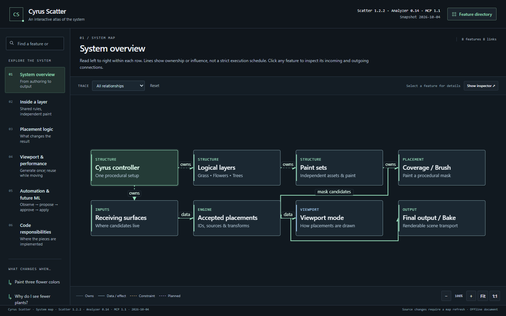

# Cyrus Scatter interactive system map

<!-- CURRENT_SYSTEM_2026-10-05 -->

This interactive map is a dated visualization; its UI/data were not regenerated during the documentation-only reconciliation. Use the [current system guide](../Current_System_2026-10-05/SYSTEM_GUIDE.md) and [capability matrix](../Current_System_2026-10-05/CAPABILITY_MATRIX.md) for the floating editor, model containers and current MCP gaps.

[Open the self-contained HTML](../../mockups/system-map/index.html).

This is a **frozen 4 October** visual guide: **Scatter 1.2.2, Surface Analyzer 0.14 and MCP 1.1**. Current source is [0.73](../Unified_System_0.73_2026-10-06/README.md); controls, policies and source anchors in this older map are historical. Copy/share `mockups/system-map/index.html` for that dated explanation only. It is self-contained documentation and never connects to Max.

## Explore

- **System overview:** the controller, logical layers, paint sets, receiving geometry, placements and output.
- **Inside a layer:** shared rules versus each set's assets and Brush history.
- **Placement logic:** what changes candidate eligibility, transforms, spacing and cleanup. The guided shared-solve walkthrough provides actual stage order; dependency arrows are not themselves an execution timeline.
- **Viewport & performance:** centres, Point Cloud, Proxy, Mesh, display budgets, retained buffers and GPU drawing.
- **Automation & future ML:** enrolled scope, validation, local approval, application, inspection and actual-result exports. Planned ML and semantic-zone work are explicitly marked.
- **Code responsibilities:** implementation boundaries and source references.

Select a feature for purpose, ownership, effects, options, restrictions and source evidence. Search also matches native control names and keys. Connections can be traced upstream or downstream. The feature directory and native-control catalog provide access independently of the active view. Guided examples explain painting several flower colors, count mismatches, hiding versus disabling, viewport orbit, CS Edit, an AI proposal and the shared solve.

## Coverage and limits

The model contains **52 features, 92 directed connections, six views and seven guided explanations**. All **194 unique controls in the current generated main-panel inventory** have a mapped feature and an individual effect description: 28 General/manager controls and 166 feature-section definitions. Repeated copies of a layer editor do not count as new controls.

This is not an exhaustive enumeration of every secondary dialog, the separate CS Edit/Analyzer panels or menu actions. Their main capabilities and dependencies are included. The nine MCP tools and all entries in its three closed settings registries are represented separately from the 194 native-control count.

An arrow can describe ownership, data/effect, a compatibility guard, invalidation or a future integration. It does not prove constant-time execution, a particular FPS, runtime qualification of every control, or that every native feature is remotely adjustable. Current, conditional and planned features are distinguished in the map.

Important source findings preserved in the guide include:

- Parent population is shared among enabled sets before masks; Brush does not refill rejected candidates.
- Hidden populations still take part in spacing and output; disabled populations do not.
- Source colors also determine cluster/assignment groups. Point-only rows can affect spacing but are omitted from output; Empty choices create holes before spacing.
- World-Z source offsets and source scale apply after Brush/falloff.
- Protected Edit rows survive shared spacing/cleanup, with conflicts reported. Generation changes can invalidate Edit bindings.
- Pair XY/3D and the persisted cleanup-plane setting are separate values.
- Native Update now and Refresh preview both call `refreshAll`; only specific display-mode/geometry-limit changes have the Manual display-only refresh route.
- Retained viewport drawing uses GPU graphics, not CUDA/OpenCL placement computation. CPU workers are synchronous bounded ranges, not a persistent worker pool.

## Sources and maintenance

The historical [builder source](https://github.com/MehranCyrus/Cyrus-Scatter/blob/01a04b296247d2c1f4c2c36d0a2cd87fb188c2b2/tools/docs/build_system_map.py) and frozen [model.json](model.json) retain their source hashes. The old builder is retired because it assumes removed schemas/templates; it must not rewrite this frozen map from current code. [Retirement receipt](../Unified_System_0.73_2026-10-06/evidence/retired-document-builder.json).

Current capability/control help is maintained through the [0.73 matrix](../Current_System_2026-10-05/CAPABILITY_MATRIX.md), semantic inventory and catalog builder:

```powershell
python tools/procedural_lab/build_feature_catalog.py
```

The builder validates unique IDs, all edge endpoints, lens membership, source anchors, guided-step targets and complete native-control mapping. It updates the HTML's `system-data` block without running or rebuilding the plugin. Semantic descriptions and relationships still require human/source review when behavior changes; this is not automatic code analysis.

Browser verification and screenshots are recorded beside this document. This task does not claim new Max host, renderer or performance qualification and does not change plugin runtime code.

## Browser checks

The standalone file was opened in Edge at 1440×900, 1265×715 and 390×844. The interaction sweep exercised all six lenses, seven guides and 43 steps; feature/options/connections selection; search and no-result handling; the 194-control catalog; Escape; zoom/fit and keyboard panning. It recorded no JavaScript errors, HTTP requests or horizontal page overflow. Dense maps deliberately support panning/zooming; a phone does not squeeze every node onto one tiny screen. Additional checks in the Codex browser exercised native-control search, options and the catalog against the local preview.

See [browser results](evidence/browser-checks.json), the [recorded recipe](evidence/browser-recipe.cjs) and [artifact identities](evidence/MANIFEST.json). The recipe records this machine's runtime/scratch paths; adapt those paths before replaying elsewhere. These are web-document checks, separate from the plugin qualification reports.

A [separate design review](evidence/design-evaluation.md) passed with fresh desktop/tablet/mobile checks at 1440, 768 and 375 pixels wide. It verified pointer/keyboard panning, deep-link reload and the main navigation flows. Optional refinements remain: a more visible mobile pan hint, preventing text selection during dragging, and easier reading of dense maps at Fit. Use 1:1 or the inspector to read those details. In the native search field, Escape first clears nonempty text; another Escape closes the directory.



[Inspector preview](evidence/inspector.png) · [Mobile layout](evidence/mobile.png)
