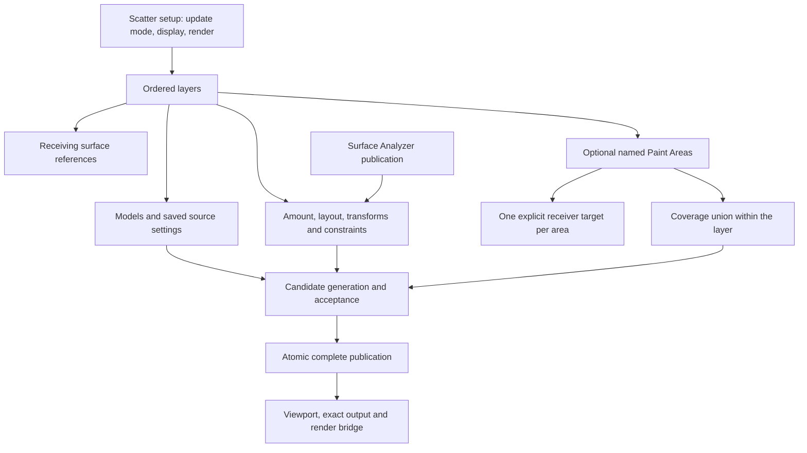

# Cyrus Scatter 0.75 — system qualification

9 October 2026. Current development handoff. Read the [artist guide](ARTIST_GUIDE.md), [feature checklist](CHECKLIST.md), [complete control register](CONTROL_REGISTER.md), [findings](FINDINGS.md) and [machine-readable evidence](EVIDENCE.json).

This campaign checks the existing system before final artist testing. It preserves version **0.75.0**, serialization **54** and calculation model **CyrusUnified1**. Surface Analyzer remains **0.14** and MCP remains **0.73.0**. Neither the control count nor a passing SDK build is release certification.

## Recorded result

- **14/14 Scatter native suites**, **1/1 Analyzer suite**, **141 Python tests**, generated UI and layout checks passed.
- All **234 mapped controls** bound in real Max views. Layout (94 assertions), regions (45), consolidation (22), 23 list grips, grip lifecycle and eight caption checks passed. Binding is distinct from complete interaction testing.
- Core geometry, source actions/metadata, containers, Include/Exclude, bands, Analyzer, independent spacing, protected Edit, exact/PFlow/baked output, units and save/reopen scenarios passed.
- The final clean playback run passed **942 Scatter/Analyzer assertions**. Eight Manual/Live/idle windows passed with node callbacks restored. Actual Corona floating IR, Live edit, save/resume, Stop, production render, diagnostic export and reset passed.
- The 100k navigation witness reused placements and buffers. Proxy remained expensive. One post-UI/legacy retained-buffer assertion failed and remains unresolved despite clean playback and isolated repeat passes.

This completes the recorded audit campaign, **not final release certification**. The checklist preserves untested physical controls, long sessions, receiver-add stability, Brush scaling, heavy assets, other renderers and Max 2026 as remaining gates. All eleven owned test hosts were closed; installed product hashes remained unchanged.

## Ownership being qualified



Areas share the layer's models and amount. Older model-owning sets remain a separate saved representation. Surface Analyzer assignment, area masks and boundary falloff have separate references. Source containers collect models; they are not receiving surfaces.

## Scope and method

- Fresh Max 2027 SDK builds of Scatter and Analyzer, native suites, Python contract/tool tests and generated-UI checks.
- Real plugin objects in owned disposable Max profiles. Exact script/native hashes and loaded module paths are recorded. No computer-use tools, artist scenes, normal-profile installation or vendor modification.
- Core geometry and publication assertions; scripted UI handlers; all mapped controls; model metadata, Point/Empty, layer/surface/Paint Area relationships; containers; Include/Exclude, bands and Analyzer; transforms, spacing, cleanup, Edit and persistence.
- 100k navigation counters/timings; timeline validity and relevant/unrelated updates; quiet Manual/Live windows; diagnostic recording; real Corona lifecycle where the receipt passes.
- Failures, obsolete fixtures, timeouts and retries are retained. A run that timed out is not relabeled as a pass because earlier scenarios completed.

The [evidence index](EVIDENCE.json) records each host's overall status and individual scenario status. [CHECKLIST.md](CHECKLIST.md) is the concise acceptance register. Binding, handler, geometry and physical interaction coverage are deliberately distinct.

## Changes

The pending UI caption fix now has current qualification: radio titles have their own reserved label row, correcting the Preview color overlap and clipped Layout heading. No placement algorithm was changed by this audit.

Qualification tooling now inventories all 234 controls, preserves per-scenario reports, supports bounded longer campaigns, and tests Point/Empty source actions and metadata. Historical fixtures were updated to use current layer receiver ownership and real source-container helpers. The renderer diagnostic-export fixture now uses the current Statistics section. Playback-isolation callbacks are restored before ordinary idle/Live qualification.

Current navigation, ownership documentation and the capability/catalog descriptions are reconciled. Historical receipts remain dated. The standalone visual website is explicitly a 0.73 snapshot; its diagrams and interactive ownership examples still need migration. The unrelated `Landing Page Design/` directory remains outside this change.

## Reproduction

The matching local Max 2027 development installer is [CyrusScatter-0.75.0-Max2027.mzp](../../dist/System_Qualification_0.75_2026-10-09/Max2027/CyrusScatter-0.75.0-Max2027.mzp). [PACKAGE.json](PACKAGE.json) records its hash and the verified source/package/loaded module match. It includes the caption correction; it was not installed into the artist profile. Installers remain local ignored artifacts and are not included in Git.

Use fresh output/profile names. These are local developer commands, not artist installation steps:

```powershell
python tools/procedural_lab/offline_build.py --year 2027 --project scatter --output build/<run>/scatter
python tools/procedural_lab/offline_build.py --year 2027 --project analyzer --output build/<run>/analyzer
python tools/procedural_lab/check_generated.py --output build/<run>/generated
build/mcp-venv/Scripts/python.exe -m pytest CyrusMCP/tests tools/tests -q
python tools/procedural_lab/system_075_inventory.py
```

The campaign driver is [system_075_campaign.py](../../tools/procedural_lab/system_075_campaign.py). Run it via [unified_073_qualification.py](../../tools/procedural_lab/unified_073_qualification.py), passing the fresh native/Analyzer receipts, the P07 acceptance definitions, `--external tools/procedural_lab/system_075_campaign.py` and `--external-timeout 1200`. Select `CYRUS_075_PHASE` as `ui`, `behavior`, `performance`, `ui-remaining`, `retained` or `lifecycle`. The latter runs complete Scatter/Analyzer playback and the real Corona lifecycle. Historical source-container fixtures require a private name beginning `procedural07-ui-`. Performance waits for this campaign's other owned hosts to settle. The retained legacy-scene fixture requires the local frozen 0.74 inputs; those ignored scenes are not portable Git artifacts.

Core qualification separately loads the P07 acceptance, advanced and Analyzer definitions and invokes `P07Acceptance()`, the units fixture, `U73Advanced()`, `U73ContainerEdges()` and `U73AnalyzerAssignment()`. Every launcher records cleanup and normal installed-product preservation. Do not point these reset-scene fixtures at an artist session.

## Next acceptance

Use the ordered open items in [CHECKLIST.md](CHECKLIST.md). The largest design/performance gaps remain stable generation on unchanged receivers, canonical final-region paint storage, heavy Proxy drawing, and long-session/physical artist acceptance. Keep these explicit rather than treating competitor behavior or decompiled code as a performance guarantee.

The [surface/paint vendor study](../Vendor_Surface_Paint_Research_2026-10-09/README.md) and [native follow-up](../Vendor_Native_Deep_Research_2026-10-09/README.md) are useful design evidence. This pass consumes their reports; it does not claim new Forest/Chaos measurements or recovery of vendor source code.
