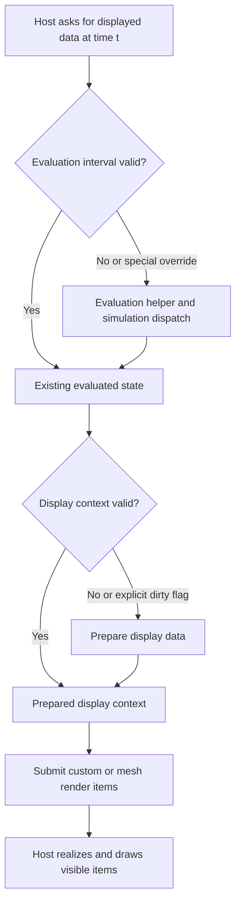

# Evaluation, calculations and viewport submission

6 October 2026. RVA anchors refer only to the target fingerprint in [Method](METHOD_AND_EVIDENCE.md). Static evidence is distinguished from vendor contracts and engineering inferences.

## Three different kinds of work

The examined tyFlow paths distinguish evaluation validity, display-data preparation validity and render-item submission. The viewport can request submission repeatedly while already prepared data remains usable. Drawing retained geometry still consumes CPU/GPU work, and a host redraw request does not by itself show that a simulation reran.

This is a synthesis of selected static paths, not a complete scheduler diagram. Special override branches and some indirect calls remain incompletely understood.

## Evaluation and invalidation: verified anchors

| Anchor | Evidence | Meaning / qualification |
| --- | --- | --- |
| Eval `0x03eff670`, batch02 | Constructs/returns an ObjectState around the object. | It is not the complete simulation method. Finding a cheap Eval alone would miss heavier work elsewhere. |
| ObjectValidity `0x03f03740`, batch02 | Different branches return FOREVER, NEVER, a point interval, or stored interval at object offset `0x3b0`; one condition tests PB parameter 5 for zero, others read parameters 5000/6000 and stored time/state. | Time validity is state-dependent. The parameter labels were not fully decoded, so these numeric IDs are not named as confirmed UI options. |
| Interval contains `0x01d9ae40`, batch05-v2 | Complete 17-byte leaf compares signed start/end against a time. | Confirms the meaning of the interval check used by the evaluation/display paths. |
| Evaluation helper `0x03f60b80`, batch03-v2 | Checks flags/frame-rate state and a stored interval; valid data usually avoids the larger `0x03f80b70` dispatch. Explicit flags, a state bit, network-render-server state and another time helper can alter that path. A busy bit brackets dispatch. | Cache-gated evaluation is confirmed. This does not prove a single universal static fast path or full reentrancy safety. |
| Time-dependence helper `0x03f0df10`, batch04 | Examines two stored intervals and NEVER state. | Additional cache/time conditions exist beyond the object's main interval. |
| Cache reset `0x03f8cb40`, batch02 | In one state ORs pending bits and invokes a helper; in another resets stored times/intervals, clears selected cached rows and invalidates display state. | Deferred reset and immediate invalidation are distinct. The selected body does not establish a permanent polling loop. |
| Invalidate/notify `0x03f12b20`, batch03-v2 | Invalidates selected intervals, calls display invalidation, sends SDK NotifyDependents with REFMSG_CHANGE, and can request RedrawViews/ForceCompleteRedraw. | Notifications and redraw are controlled operations. The trigger/call graph is not complete enough to promise this is never called unnecessarily. |
| NotifyRefChanged `0x03f03500`, batch02 | Examines the PB/reference, last changed parameter and selected parameter IDs; deletion clears a stored reference. | Reference notifications are classified. One called helper and other reference paths remain unresolved. |
| GetRenderMesh `0x03f01cd0`, batch02 | Compares the SDK main-thread ID with current thread ID, then uses the evaluation helper and a stored mesh; sets needDelete false. | Host/mesh ownership is significant. The observed comparison does not guard every downstream SDK operation; no universal worker-safety claim follows. |

The evaluation helper contains a conditional ExecuteMAXScriptScript call. A native plugin can still integrate MAXScript. No conclusion that tyFlow is wholly script-free is justified by its `.dlo` extension.

Autodesk defines validity intervals as the time range over which data remains valid. Its contract supports time-sensitive evaluation without equating every new frame to a new input value. The static state branches above are implementation observations, not a promise that every static scene yields FOREVER. [Interval](https://help.autodesk.com/cloudhelp/2027/ENU/MAXDEV-CPP-API-REF/class_interval.html).

## Display preparation and retained items: new deeper evidence

The TFlow IObjectDisplay2 thunks adjust `this` by `0x3f0` and jump to these bodies. `batch05-v2/` confirms the interface mapping; `batch06/` follows the display helpers.

| Anchor | Confirmed behavior |
| --- | --- |
| Requirement `0x03f469f0` | Returns the legacy display requirement and conditionally adds a per-view requirement. Per-view work is not universally disabled. |
| PrepareDisplay `0x03f46a60` | Queries display-driver capability. Most observed data preparation is elsewhere. |
| UpdatePerNodeItems `0x03f46a90` | Gets SDK display time; if evaluation interval is invalid, calls `0x03f60b80`. Invokes selected operator display paths. For an owned display context, tests its interval/flag, calls `0x01de2630` when required, updates context validity, and submits through `0x01ddf130`. |
| UpdatePerViewItems `0x03f474f0` | Calls node/per-view helpers only under selected active-context conditions. |
| Display context preparation `0x01de2630` | Builds/updates owned records containing mesh/transform data; the selected listing spans 8,825 bytes and 1,968 instructions. Some internal parallel helpers are not traced. |
| Display context submission `0x01ddf130` | Initializes CustomRenderItemHandle objects, assigns visibility groups/custom implementations, builds mesh render-item contexts, calls SetInstanceData with a VertexBufferHandle, accesses item arrays and applies decorators/material state. Selected span: 5,993 bytes, 1,306 instructions. |
| Display context invalidation `0x01de2470`, complete batch06-v2 | Under a global-state guard, clears selected item records, destructs stored Mesh entries and sets context interval to NEVER. Selected span: 152 bytes, 38 instructions. |

This confirms native Nitrous custom items and mesh instancing, not merely an import suggesting possible use. It also confirms that data preparation can be gated while render items are submitted. The private custom implementation's complete Realize policy, buffer replacement, device-loss recovery and per-frame upload counts remain unverified.

The host API explicitly separates preparation, node items and view items. Visible custom items have realization/drawing lifecycles; culling can skip realization. Neither implementation should require every culled group to have realized before treating an unchanged submitted generation as reusable. [IObjectDisplay2](https://help.autodesk.com/cloudhelp/2027/ENU/MAXDEV-CPP-API-REF/class_max_s_d_k_1_1_graphics_1_1_i_object_display2.html), [ICustomRenderItem](https://help.autodesk.com/cloudhelp/2027/ENU/MAXDEV-CPP-API-REF/class_max_s_d_k_1_1_graphics_1_1_i_custom_render_item.html).

## Calculation/data evidence and limits

The earlier handoff's exported particle accessors expose packed position/velocity storage with 12-byte element addressing and selected fields at context offsets `0xf38`/`0xf50`. Its quaternion trace calls Max's MakeClosest/Slerp. Those are narrow data-access/math observations, not a recovered particle storage schema or proof of a collision algorithm. No tyFlow spatial hash/BVH, deterministic ordering policy or atomic-publication protocol was established here.

The large simulation dispatch at `0x03f80b70` was disassembled, but its decompilation timed out. We therefore do not derive full simulation phases, worker ownership or fault recovery from an incomplete C listing. The next useful step is a targeted smaller-helper question, not unbounded whole-binary decompilation.

The vendor documents history-dependent versus history-independent flows and static reuse. That is relevant to separating animation from actual dependencies, but it does not make Scatter's ordered plant placement equivalent to a particle simulation. [Main settings](https://docs.tyflow.com/tyflow_objects/tyFlow/mainSettings/).

## Threading, memory and GPU guidance

tyFlow documents per-flow CPU controls and global thread-pool/affinity options. This is evidence of supported settings, not the private queue, locks or worker lifetime. Its GPU page warns that transfer overhead can make small workloads slower; GPU solver options are algorithm-specific. We did not infer active compute from CUDA sections or imports. [CPU settings](https://docs.tyflow.com/tyflow_objects/tyFlow/cpu/), [GPU settings](https://docs.tyflow.com/tyflow_objects/tyFlow/gpu/).

For Cyrus, maintain the Max-thread boundary for acquiring node geometry, evaluating controllers/maps and publishing host objects. Workers should receive owned numeric snapshots. Its current [forRanges implementation](../../AminScatter/include/execution.h#L31) joins workers before return; it is not a persistent background service. A worker pool may save thread-launch cost during real repeated jobs, but cannot cure UI feedback or unnecessary invalidation.

tyFlow documents memory/performance tradeoffs for cached channels and a global mesh cache reused until geometry changes. It also permits static terrain caching on entry, which deliberately changes how later input changes are consumed. These are user-visible semantic choices, not free optimizations to apply indiscriminately to Live Scatter. [Cache settings](https://docs.tyflow.com/tyflow_objects/tyFlow/cache/).

Scatter has explicit sample, neighbor-work and retained-display budgets. Keep them visible in engineering reports. Account separately for candidates, working arrays, source mesh copies, instance transforms, SDK system buffers and GPU buffers; reserved display bytes are not total process RSS. Larger cache limits may improve reuse while increasing residency, and can also lengthen one valid recalculation.

## Useful public extension boundary

tyFlow's documented SDK advises updating particle data before querying it, resolving named-channel indices for reuse, and respecting instance collection/cleanup ownership. UpdateTyParticles wraps UpdateParticles; calling both is redundant. This supports a narrow evaluate/publication/query contract rather than undocumented internal offsets. [tyParticleObjectExt](https://docs.tyflow.com/tyflow_SDK/tyParticleObjectExt/).

For Scatter MCP, a tool should read a declared completed publication and its capabilities/identity, without creating a UI or refreshing output just to inspect it. Mutation semantics require their own explicit transaction/update contract. Current policy 3 remains read-only; this research does not expand that boundary. The AI/ML loop remains planned work and must not be inferred from a recorder or vendor extension API.
