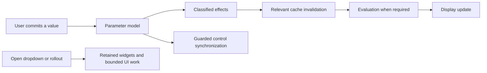

# UI construction, binding and layout

6 October 2026. Addresses below are RVAs in the pinned tyFlow binary; add image base `0x180000000` to obtain the analysis VA. Names of private functions are descriptive analyst labels. Evidence batches are defined in [Method](METHOD_AND_EVIDENCE.md).

## Confirmed native UI mechanisms

| Path / anchor | Static evidence | Practical meaning / limit |
| --- | --- | --- |
| Filter popup initialization `0x0401a3e0`, batch02 | Checks a stored popup pointer; if absent constructs a QFrame, QVBoxLayout, search QLineEdit, QListView and QStandardItemModel, then connects handlers. | Lazy construction and retained popup ownership are confirmed for this combo class. This is not proof that every tyFlow UI page is built only once. |
| Filter combo show `0x0401a8a0`, batch01 | Calls initialization, enumerates combo item text/icon/index into the popup model, resets search under signal blocking, sizes/positions the popup and restores selection/focus. | Opening does UI/model work proportional to item count. It does not, in the examined body, prove simulation is invoked. Untraced callbacks could still matter. |
| Filter combo hide `0x04018f10` and event filter `0x04018c90` | Hides the retained popup and routes keys/search while it is open. | The widget has a separate interaction lifecycle; opening a list is not intrinsically a placement change. |
| Selected signal handlers `0x0139e1a0` / complete `0x0139ffb0`, batch01/03-v2 | Block selected controls' signals, set values, synchronize related controls and unblock signals. | Prevents selected feedback loops. These examples force unblock; they do not establish universal RAII restoration or suppression of all events. |
| Rollout open/close `0x03ffaf30`, batch01 | Looks up an existing ID and returns if registered; missing entries use a factory and `CreateRParamMap2`, associate a widget/rollup and store a record. | Deduplicated registration at this boundary and Qt/Max parameter-map integration are confirmed. |
| Rollout order `0x03ffb300`, batch01 | Assigns categories to the requested order, calls `sortRollups`, restores open/closed state. | Ordering and expansion state are explicitly managed, rather than left to construction order. |
| Selection/transfer `0x0151e060`, batch01 | Existing matching rollouts use `takeRollup`/`addRollup`; unmatched ones are removed and use `deleteLater`. | Selective reuse and selective destruction coexist. |
| PB accessor Set `0x01dcbe00`, TabChanged `0x01dcc3d0`, batch01 | Reentrancy/owner guards, parameter-definition lookup, widget/map synchronization, custom parameter dispatch, then SDK RedrawViews at current time. | User changes have an explicit PB → UI/engine notification path. A redraw request is not by itself proof of simulation or buffer upload. |
| Widget binding metadata `0x03fe6960`, batch04 | Builds a descriptor vector only when empty and a PB exists; maps parameter names to Qt widget object names. | Binding metadata is cached. The exact descriptor type and all invalidation conditions remain inferred. |
| Widget synchronization `0x03fe4020`, batch04 | Walks parameter definitions, resolves cached/named controls and updates selected UI state. | Refresh can still iterate fields. Retention does not imply zero work. |
| TFlow PB dispatch `0x03ee5a00`, full batch03-v2 | Parameter-ID branches include an unchanged-value early return, reset paths, and IDs that skip that reset. | Parameter effects are classified. The complete semantic ID table has not been recovered. |

The Max SDK supplies rollout containers and parameter-bound Qt widgets with explicit retarget/update hooks. This matches the selected imports and RTTI; it does not reveal all private layout behavior. [QmaxRollupContainer](https://help.autodesk.com/cloudhelp/2027/ENU/MAXDEV-CPP-API-REF/class_max_s_d_k_1_1_qmax_rollup_container.html), [QMaxParamBlockWidget](https://help.autodesk.com/cloudhelp/2027/ENU/MAXDEV-CPP-API-REF/class_max_s_d_k_1_1_q_max_param_block_widget.html), [PBAccessor](https://help.autodesk.com/cloudhelp/2027/ENU/MAXDEV-CPP-API-REF/class_p_b_accessor.html).

Qt distinguishes signals associated with selection/value changes from user activation. Programmatic synchronization needs its own guard. For new Scatter Qt code, QSignalBlocker is a sensible scoped way to restore prior blocking state; that is our recommendation, not a recovered tyFlow class. [QComboBox](https://doc.qt.io/qt-6/qcombobox.html), [QSignalBlocker](https://doc.qt.io/qt-6/qsignalblocker.html).

This diagram describes the architectural separation supported by selected paths. It is not a complete private signal graph.

## How current Scatter compares

Scatter already lazily creates six popup topics and retains them. It has a binding guard, retains identical list contents, and remembers topic/open state by stable layer ID. Its [popup template](https://github.com/MehranCyrus/Cyrus-Scatter/blob/01a04b296247d2c1f4c2c36d0a2cd87fb188c2b2/AminScatter/tools/ui/templates/layer-editor.ms#L25) is MAXScript rollout code. Its [native command-panel helper](../../AminScatter/src/rollout_flow.cpp#L18) sets host panel categories/visibility and updates layout; it is not equivalent to a fully native Qt parameter-widget implementation.

Current sections bind to root, logical layer and sometimes paint set. [bindEditors](https://github.com/MehranCyrus/Cyrus-Scatter/blob/01a04b296247d2c1f4c2c36d0a2cd87fb188c2b2/AminScatter/tools/ui/templates/layer-editor.ms#L87) updates those references and invokes each active section's bind method. Avoiding this on every unchanged selection is useful, but the [same-topic shortcut](https://github.com/MehranCyrus/Cyrus-Scatter/blob/01a04b296247d2c1f4c2c36d0a2cd87fb188c2b2/AminScatter/tools/ui/templates/layer-editor.ms#L114) incorrectly assumes unchanged topic means unchanged owner. [retarget](https://github.com/MehranCyrus/Cyrus-Scatter/blob/01a04b296247d2c1f4c2c36d0a2cd87fb188c2b2/AminScatter/tools/ui/templates/layer-editor.ms#L145) changes root/owner before calling showTopic, which can take that shortcut. Existing controls, members and paint-set lists can still represent the preceding layer. See P1 in [Comparison](CYRUS_COMPARISON.md).

The relevant lesson is **retain widget construction, then rebind when identity changes**. Caching construction and caching the target are separate decisions. We should not replace a correctness guard with an optimization based solely on topic index.

## Proposed integrated workflow

This follows the user's preference for the Modify panel. It is a design proposal, not implemented in this task.

| Location | Controls / purpose | Frequency |
| --- | --- | --- |
| Setup header | Enable, Manual/Live, Update now, concise pending/result state | Always visible |
| Receiving surfaces | Pick/manage receivers and setup-wide source containers | Setup creation; usually collapsible afterwards |
| Layer manager | Ordered layers, enabled state, selection, add/remove/reorder, optional Edit layer | Frequent; keep compact and visible |
| Selected layer — Assets | Paint-set selector, source models/weights/radii, layer source containers | Frequent during setup |
| Selected layer — Population | Shared layer count/density/seed, Area; limits in advanced subsection | Frequent values first |
| Selected layer — Paint | Brush paint/erase, editable coverage, background coverage/fill choices | Frequent authoring; label paint-set ownership |
| Selected layer — Transform | Random rotation/scale/offset and diversity | Routine tuning |
| Selected layer — Spacing | Explicit self/set/layer scopes; source/instance radii; cleanup/refill options | Routine tuning; scopes must remain distinct |
| Diagnostics / advanced | Cached stats, recorder controls, fingerprints, rare limits and support export | Collapsed by default |

Layer and paint-set selection should determine one editing context. Shared layer defaults/population must not appear as independent per-set values. Each control should have a short tooltip stating what it changes, its scope and any meaningful gate; help text must not promise a count the bounded solver cannot guarantee. Statistics read the last completed publication and clearly mark pending Manual edits.

An optional popup may coexist over the same model. A second view has widget/binding cost when opened, but should not own a second solver, timer, parameter copy or independent publication. Closing it should release its view connections. Separate visual state can remember collapsed topics, while model identity comes from the selected root/layer/set.

Recommended context key: root identity, layer ID, paint-set ID and binding revision. Widget creation uses topic identity; retargeting uses the context key; status reads use publication epoch. Keep these meanings distinct. An Undo, deleted owner, scene reset or merged identity conflict must invalidate the appropriate key.

## Why a bounded native Qt pilot is appropriate

The evidence supports investigating a selected-layer widget hosted in the Max rollout container. It does not justify translating the entire generated script to C++ at once. First prove that the current scripted parameter model can be read/written from the proposed SDK bridge with correct Undo, animation, scene persistence and notifications. QMaxParamBlockWidget binding to an IParamBlock2 is an SDK mechanism; compatibility with every current scripted field is a pilot acceptance item.

A minimal pilot should cover layer/set retarget, one population field, one Brush command and one spacing control. It should measure cold creation, warm binding, value commit and dropdown opening independently. Retain the existing procedural solver and display snapshots during that experiment. Compare native Qt and the current rollout with identical data and handler effects.

The screenshots alone do not establish that tyFlow's visible layout is the cause of its responsiveness, or that loading a `.dlo` is faster than our current hybrid. The selected binary does use native Qt and data binding; the next question is which current Scatter handler dominates latency. [Roadmap](ROADMAP_AND_EXPERIMENTS.md) defines how to measure it.
