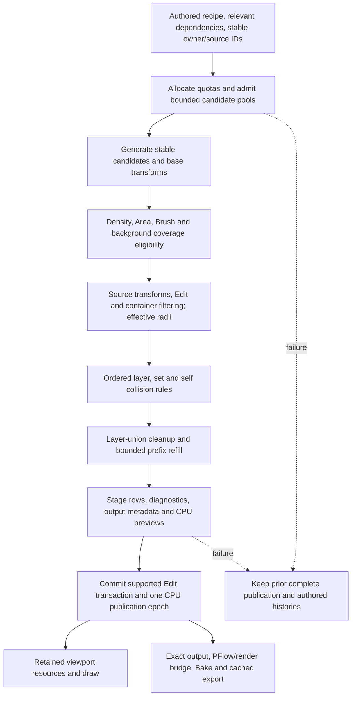

# Current Cyrus calculation, cache and publication model

6 October 2026; source facts at `01a04b2`, checked against the generated 0.72 script. Source links point to canonical templates/native files unless generator ordering is material. This is a trace of the supported system, not a redesign proposal.

## Ownership and identity

A Scatter controller owns global update/display/receiver settings and stored population objects. A logical layer is a parent population; additional paint sets reference its stable layer ID. They share declared parent defaults and an allocated population, while keeping independent assets, source metadata and Brush histories. Current inheritance is implemented by copying changed declared fields into child objects with Undo off during synchronization, not by a new native declarative graph. [Logical ownership/allocation/synchronization](https://github.com/MehranCyrus/Cyrus-Scatter/blob/01a04b296247d2c1f4c2c36d0a2cd87fb188c2b2/AminScatter/tools/ui/templates/logical-layers.ms#L13).

There are **ten total stored populations**, including layer parents and child sets, not ten layers each with ten extra sets. Weighted largest-remainder allocation conserves the enabled parent population. Creation-order allocation ties and explicit procedural evaluation order are distinct. Child seeds/sampling salts and candidate ordinals remain separate from UI selection. Order changes affect later eligibility; they should not silently invent new IDs. [Allocation](https://github.com/MehranCyrus/Cyrus-Scatter/blob/01a04b296247d2c1f4c2c36d0a2cd87fb188c2b2/AminScatter/tools/ui/templates/logical-layers.ms#L37), [procedural identities/order](https://github.com/MehranCyrus/Cyrus-Scatter/blob/01a04b296247d2c1f4c2c36d0a2cd87fb188c2b2/AminScatter/tools/ui/templates/procedural-model.ms#L89), [native candidate ordinal](../../AminScatter/src/scatter.cpp#L397).

Source containers admit or park registered source rows rather than deleting them. Membership uses a source pivot in each ordinary Rectangle's local XY plane, ignoring local Z; it does not test full object volume or generate a receiving surface. Global/inherited/own pools, transformed rectangles, 32 rectangles per pool and 1,024 registered rows are explicit bounds. Moving out/back preserves row settings and IDs; output membership can still affect later collision acceptance. [Container frames/membership](https://github.com/MehranCyrus/Cyrus-Scatter/blob/01a04b296247d2c1f4c2c36d0a2cd87fb188c2b2/AminScatter/tools/ui/templates/source-containers.ms#L21), [persistent registration/cache](https://github.com/MehranCyrus/Cyrus-Scatter/blob/01a04b296247d2c1f4c2c36d0a2cd87fb188c2b2/AminScatter/tools/ui/templates/source-containers.ms#L50).

## Pipeline and failure points

Some eligibility checks occur inside generation after movement. The diagram groups their roles; the exact sequence below matters for implementation changes.

1. **Prepare ownership and dependencies.** Synchronize layer defaults/receivers, reconcile relevant container membership and register stable source IDs. Validate policy capability, background references and required Edit capacity. Admit at most 100,000 candidate slots per set / 1,000,000 aggregate before Edit/publication mutation. [Evaluator admission](https://github.com/MehranCyrus/Cyrus-Scatter/blob/01a04b296247d2c1f4c2c36d0a2cd87fb188c2b2/AminScatter/tools/ui/templates/procedural-evaluation.ms#L124).
2. **Generate ordered candidates.** Native surface sampling is area-weighted. Opt-in stable RNG channels assign an ordinal before rejection/compaction; separate streams avoid shifting unrelated transformations when a feature's draws change. Random, spatially clustered placement and clustered source-diversity assignment have distinct roles. General movement projection currently checks every receiver triangle; density and Area eligibility use the supported final position/domain. [Native generation](../../AminScatter/src/scatter.cpp#L196), [projection](../../AminScatter/src/scatter.cpp#L358).
3. **Bind eligibility without renumbering.** The bridge attaches a canonical face/barycentric anchor to keyed rows. Brush uses a static indexed receiver, captured transform metric/view, connected face patches and deterministic thresholding. It is not an unrestricted geodesic/volume brush. Outside Coverage excludes selected earlier sibling fields; Between Plants is a separate applicable set-spacing requirement. [Keyed bridge](../../AminScatter/src/placement_identity.inc#L18), [Brush insertion/cache](https://github.com/MehranCyrus/Cyrus-Scatter/blob/01a04b296247d2c1f4c2c36d0a2cd87fb188c2b2/AminScatter/tools/ui/procedural-brush.cjs#L38), [background](https://github.com/MehranCyrus/Cyrus-Scatter/blob/01a04b296247d2c1f4c2c36d0a2cd87fb188c2b2/AminScatter/tools/ui/templates/procedural-model.ms#L241).
4. **Apply source and artist state.** In the generated placement body, eligibility, Empty/source handling, source lift/scale and applicable Analyzer/falloff precede the procedural prepare stage's Edit application. Edit can move/clone/delete and protect artist overrides. Container filtering retains registered slot correspondence; effective radii reflect the transformed row and follow-scale/world/multiplier settings. Stale instance-radius bindings fail explicitly. [Generated placement implementation](../../AminScatter/scripts/AminScatterObject.ms#L3269), [prepare/Edit](https://github.com/MehranCyrus/Cyrus-Scatter/blob/01a04b296247d2c1f4c2c36d0a2cd87fb188c2b2/AminScatter/tools/ui/templates/procedural-evaluation.ms#L24), [radii](https://github.com/MehranCyrus/Cyrus-Scatter/blob/01a04b296247d2c1f4c2c36d0a2cd87fb188c2b2/AminScatter/tools/ui/templates/procedural-model.ms#L211).
5. **Resolve three scopes deterministically.** The native plan is pure copied data. Earlier accepted sets/layers block later ordinary candidates; protected edits in later owners reserve their positions too. Scope reason priority is layer → sibling set → self. Radius-factor/gap and XY/3D choices are independent; protected conflicts survive and are reported. Default legacy fixed-distance self spacing remains possible: radius-aware self spacing requires the corresponding override/rule. [Native resolution](../../AminScatter/src/procedural.cpp#L71), [self defaults](https://github.com/MehranCyrus/Cyrus-Scatter/blob/01a04b296247d2c1f4c2c36d0a2cd87fb188c2b2/AminScatter/tools/ui/templates/procedural-model.ms#L207).
6. **Cleanup and refill.** Neighbor/island cleanup acts on each logical layer's accepted union. Protected edits survive removal; removed ordinary candidates are suppressed. Accepted-target refill grows the consumed prefix deterministically, bounded by attempt limit/rounds/work; Candidate Budget is a different contract. Between-plants filling is not retry replacement, and neither promises perfect coverage. [Cleanup/refill](../../AminScatter/src/procedural.cpp#L111).
7. **Stage then publish.** Compute accepted rows, radii, statistics, CPU preview caches and publication metadata before committing the supported Edit transaction. Ordinary tested calculation failures roll back Edit/prepared bindings and retain the prior complete CPU result. A failed successor cannot erase the previous preview. A restored exact last-successful recipe clears its earlier error on a cache hit. [Stage/commit/failure](https://github.com/MehranCyrus/Cyrus-Scatter/blob/01a04b296247d2c1f4c2c36d0a2cd87fb188c2b2/AminScatter/tools/ui/templates/procedural-evaluation.ms#L155).
8. **Consume one publication.** Preview-only changes use a display key over the epoch/settings; cached exact-output consumers and MCP pages use the published source/row/radius snapshot rather than evaluating on read. Point placeholders have display versus final-output flags; weighted Empty choices are disallowed in Accepted Target mode. Renderer/PFlow bridge updates have separate phases and guards. GPU realization occurs later: CPU publication is **not** a formal transaction guaranteeing successful driver allocation/drawing. [Display key](https://github.com/MehranCyrus/Cyrus-Scatter/blob/01a04b296247d2c1f4c2c36d0a2cd87fb188c2b2/AminScatter/tools/ui/templates/procedural-evaluation.ms#L68), [publication pages](https://github.com/MehranCyrus/Cyrus-Scatter/blob/01a04b296247d2c1f4c2c36d0a2cd87fb188c2b2/AminScatter/tools/ui/templates/publication-read.ms#L3), [render bridge](https://github.com/MehranCyrus/Cyrus-Scatter/blob/01a04b296247d2c1f4c2c36d0a2cd87fb188c2b2/AminScatter/tools/ui/templates/pflow.ms).

Important authoring tradeoff: Brush/Area eligibility uses the resolved input support anchor before source lift and Edit. Moving an eligible protected plant outside coverage is an authored exception; erasing its eligible input suppresses the bound output/clones without deleting stored Edit history. Protected instances can exceed a target or conflict and are reported, rather than silently discarded. This agrees with the [explicit Edit/coverage contract](../Procedural_Evaluation_2026-10-04/11_OPTION_CONTRACTS.md#identity-and-artist-edits) and current placement/prepare order.

Background outside coverage is currently earlier-sibling-scoped on one receiver/shared Area domain; it is not arbitrary cross-layer mask composition. Density maps/falloffs affect candidates but do not redefine the referenced authored Brush field. Automatic migration of combined Brush/Edit/radius data into different system units is not implemented; supported reopen adopts the scene's units and guards unsupported correspondence changes. [Dated implemented restrictions](../Procedural_Implementation_0.7_2026-10-04/IMPLEMENTATION.md#limits-and-compatibility).

## Dependency and lifetime map

| State | Relevant changes | Unchanged reuse / important limit |
| --- | --- | --- |
| Relevant input-time interval | Receiver/source/parent controllers, applicable maps, authored settings and Edit | Static recognized stock controllers may be FOREVER; unusual controllers conservatively use SDK validity. Cheap time callbacks still exist. [Native validity](../../AminScatter/src/input_validity.cpp), [time key](https://github.com/MehranCyrus/Cyrus-Scatter/blob/01a04b296247d2c1f4c2c36d0a2cd87fb188c2b2/AminScatter/tools/ui/templates/input-time.ms#L18). |
| Container membership | Rectangle config/transform, registered pivots, relevant add/delete/geometry events | Cached frames/pivots/active rows; some relevant events require a scene scan. Passive MCP inspection must not call reconciliation. |
| Base candidate cache | Source/surface/generation-affecting settings and input validity | Brush/history-only changes reuse the base candidates when eligible. Stable ordinals survive filtering. |
| Brush surface/Field | Geometry identity, document revision, stroke settings/captured data | BVH and per-face replay are reused after preparation; long/wide histories have separate preparation/resource costs. |
| Prepared procedural rows | Candidate pool, eligibility/background, Edit bindings and relevant source state | Cached preparation distinct from final collision result. |
| Accepted publication | Enabled/order/scoped rules/radii/cleanup/refill, prepared inputs | One cached complete epoch; Manual can retain an older complete result and report pending recipe changes. |
| CPU display cache | Published rows plus display mode/budgets/color/source geometry | Browsing/UI state is excluded; changing display mode can rebuild display without resampling. |
| Mesh/Point GPU resources | New immutable display generation or required resource recovery | Guarded Realize reuses unchanged data, independent of every Display call. Culling can prevent realization. |
| Proxy batches | Published transform/source/color data and budgets | Prepared world triangles are cached, but GraphicsWindow triangle submission repeats on redraw. |
| Render bridge | Relevant exact-publication/output signature and renderer lifecycle | Settled IR checks disarm; save/reset legitimately changes lifecycle. Stop failure must preserve renderer-owned data. |
| UI views | Owner/set/topic, changed list/value/status or lifecycle | One selected-layer view plus optional lazy popup, not one UI per layer. No second recipe/evaluator. |
| Diagnostics/MCP pages | Explicit recording/shared session or publication handle | Cached read/export; no automatic recording/scene solve/training. Snapshot freshness and health remain explicit. |

The template `procInputKey` still contains a `currentTime` placeholder. The later generator stage replaces it with `inputTimeKey()`; the generated 0.72 line is correct. Reviewing a template alone would produce a false time-invalidation finding. [Generator replacement](https://github.com/MehranCyrus/Cyrus-Scatter/blob/01a04b296247d2c1f4c2c36d0a2cd87fb188c2b2/AminScatter/tools/ui/input-time.cjs#L35), [actual generated key](../../AminScatter/scripts/AminScatterObject.ms#L4257).

## Resource and thread boundaries

The ordered solver caps ten total sets, one million admitted samples, 100,000 per-set budget/attempts, sixteen rounds and fifty million neighbor visits. The visit budget includes spacing and final cleanup; it does not cap geometry extraction, projection, sorting/grid allocation, Brush derived links or wall-clock duration. Underfill and bounded failure are expected outputs, not evidence of incorrect placement.

Retained Point accounting caps 64 MiB per owner / 128 MiB per process; Mesh 512 MiB / 1 GiB, with at most 1,024 groups. These are selected retained-payload reservations, not full RAM/VRAM bounds. CPU/SDK copies, driver memory, transient adapters and concurrently held old/new generations can add peaks. Mesh avoids source-face duplication per instance in retained data but still draws the submitted geometry; cached rendering cannot make actual draw cost zero. [Reservations](../../AminScatter/src/point_display.cpp#L68), [Mesh realization/drawing](../../AminScatter/src/mesh_display.inc#L50).

Scene/SDK/MAXScript access stays on the caller/host path. `forRanges` receives numeric data, joins before returning, preserves worker FP state and deterministic output order, handles launch fallback and propagates failures. Automatic participant cap is four; explicit configured limit can reach 64. Parallel work is currently limited to qualifying sufficiently large clustered queries; movement/density/areas/anchors keep the ordered path. [Execution policy](../../AminScatter/src/execution.cpp#L16), [range implementation](../../AminScatter/include/execution.h), [eligible batch](../../AminScatter/src/scatter.cpp#L300).

Preserve this foundation. SideFX's Cache If offers a useful example of dependency/data-ID-based reuse; it is inspiration for a later measured revision-key improvement, not a reason to add Houdini or replace Cyrus's evaluator. [Cache If](https://www.sidefx.com/docs/houdini/nodes/sop/cacheif.html).
