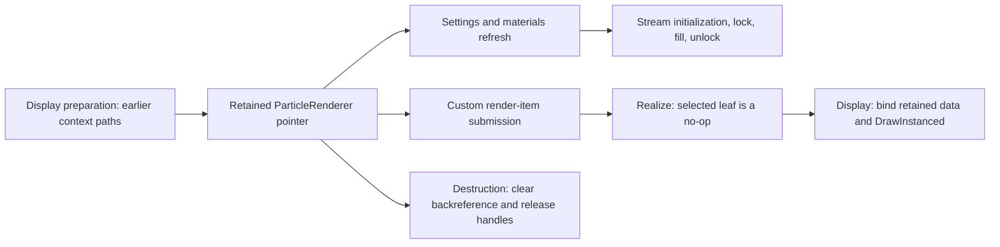

# What the tyFlow evidence actually establishes

6 October 2026. Binary claims below apply to the pinned Max 2027 DLL in [method and evidence](METHOD_AND_EVIDENCE.md). Addresses are RVAs; add `0x180000000` to obtain preferred virtual addresses. They are research anchors, never integration contracts or runtime hooks.

## UI and dependency decisions

The [earlier bounded UI investigation](../TyFlow_Architecture_Research_2026-10-06/UI_AND_BINDING.md) establishes native Qt/parameter-block binding, guarded signals, explicit rollout categories, retained popup construction and selective rollout reuse/destruction. The inspected filterable combo creates its popup lazily but rebuilds its displayed item model when opening it. Consequently, the user's impression that tyFlow reads the UI exactly once is not a proven engine rule.

Max provides parameter-block-connected Qt widgets; Qt provides scoped signal blocking to avoid treating programmatic updates as user changes. These mechanisms support stable views over one authoritative model. They do not eliminate layout, binding or drawing costs. [Autodesk QMaxParamBlockWidget](https://help.autodesk.com/cloudhelp/2027/ENU/MAXDEV-CPP-API-REF/class_max_s_d_k_1_1_q_max_param_block_widget.html), [Qt QSignalBlocker](https://doc.qt.io/qt-6/qsignalblocker.html).

Prior checked anchors separate `Eval` (`03eff670`), `ObjectValidity` (`03f03740`), reference invalidation (`03f03500` / `03f12b20`) and an interval-gated heavier evaluator (`03f60b80`). Numeric parameter IDs and some opaque branches remain unmapped. These facts support selective invalidation, not a blanket guarantee of no evaluation while playing or of zero CPU when the UI is open. See [earlier evaluation evidence](../TyFlow_Architecture_Research_2026-10-06/EVALUATION_AND_DISPLAY.md).

Official tyFlow controls distinguish static/history-independent and history-dependent flows, frame/subframe caching, static terrain and downstream changes. Cyrus's ordered static placement calculation is closer to the former workload than to a complete particle simulation. Copying simulation-frame caches or a node graph would add semantics Cyrus has not requested. [Main settings](https://docs.tyflow.com/tyflow_objects/tyFlow/mainSettings/), [cache controls](https://docs.tyflow.com/tyflow_objects/tyFlow/cache/).

## Retained display: new connected evidence

RTTI identifies `ParticleRenderer` and `TerrainRendererItem` as `ICustomRenderItem` implementations. A fresh SDK compile witness maps primary virtual slots 6/7/8 to Realize/Display/GetPrimitiveCount, and virtual-device slot 34 to DrawInstanced. The particle primary vtable is at `06bc3a20`; terrain's is at `073dd7a0`.

This is a selected path, not a complete control-flow model of all display modes.

| Anchor | Verified behavior | Limit |
| --- | --- | --- |
| `01de48b0` item initialization, 500 decoded bytes | Reads a record's item pointer at `+0x248`; allocates a 0x3d0-byte renderer only when missing; initializes SDK handles, stores the pointer and runs settings/material/stream helpers. | Reusing the object does not prove its data stays unchanged on every subsequent preparation call. |
| `01ddf130`, prior context submission | Uses the retained record pointer/flag and custom render-item implementation. Prior path also uses SDK instanced-mesh data. | Different display representations can use different paths. |
| `01df25c0` stream preparation, 3,921 bytes / 928 instructions | Releases/reinitializes a selected VertexBufferHandle, selects a 24- or 36-byte stride, locks for writes, fills data, unlocks and updates drawable count. Includes a large-work parallel-helper branch. | Does not establish when every caller invalidates this stream, actual driver upload bytes, or device-loss behavior. |
| `01deeb50` Realize, 3-byte leaf | Returns immediately in this implementation. | Buffer preparation occurs elsewhere here. Do not assume all plugins allocate only in Realize. |
| `01dee8d0` Display, 588 bytes / 145 instructions | Gates on drawable count, binds retained streams/index/format/material, draws instanced geometry and restores selected depth/blend state. | No buffer initialization/lock in this body; transitive work and other modes were not globally ruled out. SDK tail dispatch causes a decompiler warning. |
| `01dedc20` destruction, 319 decoded bytes | Clears the record backreference and releases SDK buffer/material/interface ownership. | Tail destructor dispatch is corroborated by the import, not clean pseudocode alone. |
| `03ea9ff0` / `03ea9990` terrain leaves | No-op Realize; Display conditionally tail-delegates to `03ea90a0` through an owned pointer. | The delegate's complete rendering/upload behavior was not recovered. |

Autodesk explicitly permits Display more than once per frame and recommends reusing geometry prepared outside repetitive display calls. A render item may be culled before realization. Thus “redraw count” and “upload count” must remain separate measurements. [ICustomRenderItem contract](https://help.autodesk.com/cloudhelp/2027/ENU/MAXDEV-CPP-API-REF/class_max_s_d_k_1_1_graphics_1_1_i_custom_render_item.html).

**Cyrus implication:** preserve the retained Mesh/Point design. Its implementation puts one-time upload in guarded Realize rather than exactly copying this tyFlow split; both can separate publication/preparation from draw. Proxy's current immediate submission is the source-established architectural exception to profile. Native suffix `.dlo` versus `.dlx` does not establish load speed, cache policy or UI latency.

## Thread pool and numerical work

RTTI confirms `ThreadPool` and a derived class named `ThreadPool_lockless`. Checked paths show callable jobs, multiple queues, a bank-selection bit and worker wake logic. A class name does not prove the whole scheduler is lock-free.

| Anchor | Supported conclusion |
| --- | --- |
| `03fcc5e0` / `03fcc680` | Clone/copy callable jobs into selected worker/caller queues. One selection uses a queue index modulo the configured queue count. |
| `03fcc520` | Queue storage grows by 50,000 64-byte job records when full. This is a selected allocation policy, not evidence of a globally bounded allocator. |
| `03fcd1f0` | Iterates worker records and issues wake operations for pending work/override conditions. |
| `03fccce0` | Executes stored jobs from the caller queue until it is exhausted. |
| `03fcc750` | Reads numeric settings and clamps a requested worker count to available pool capacity, at least one. Semantic setting labels are not independently mapped. |
| `03fcd110` | Checks an enabled progress/UI path and compares the SDK main-thread ID with the current thread before selected UI work. **Earlier provisional label “dispatch parameters” was wrong.** |
| `01de1230` / `01de0a00` | Bounded numerical/display data processing bodies decoded. They do not establish that all their callees are host-free workers. |

Two surrounding parallel helpers have incomplete instruction coverage; pool slot 2 has unreliable decompiler flow. The complete submit/join/cancel/barrier protocol and exception propagation remain unverified. Nothing here justifies moving Max object access into Cyrus worker threads. Autodesk's [thread-safety guidance](https://help.autodesk.com/cloudhelp/2017/ENU/Max-SDK/files/GUID-610CE507-CD6B-4D82-A248-50BCB7F9CD40.htm) remains a caution, while the current Cyrus numeric-worker source can be examined directly.

tyFlow's public CPU settings expose per-flow and global worker controls, hardware-dependent scheduling choices and limitations. The vendor also describes memory-bandwidth and data-transfer costs; adding cores or GPU compute is not a universal speedup. [CPU controls](https://docs.tyflow.com/tyflow_objects/tyFlow/cpu/), [performance FAQ](https://docs.tyflow.com/faq/performance/), [GPU controls](https://docs.tyflow.com/tyflow_objects/tyFlow/gpu/). Public pages can describe different feature generations; this review does not infer an installed kernel inventory from them.

Cyrus currently creates/join numeric worker ranges for qualifying clustered queries, with at most four automatic participants and a separate explicit cap of 64. A persistent pool is a **proposal only if** frequent eligible batches make thread construction a measured cost. Ordered collision/refill remains serial for deterministic dependencies; it cannot be parallelized by merely adding a queue.

## Spatial algorithms, IDs and extension contracts

Earlier exported accessors show selected particle position/velocity addressing with 12-byte elements and context offsets 0xf38/0xf50. A quaternion path uses Max MakeClosest/Slerp. This establishes narrow channel/math operations, not the full particle schema or interpolation policy. [Prior numerical evidence](../TyFlow_Architecture_Research_2026-10-06/EVALUATION_AND_DISPLAY.md#calculationdata-evidence-and-limits).

Cyrus's numeric core intentionally represents Vec3 with three doubles and carries stable candidate/receiver anchors into the bridge. [Current types](../../AminScatter/include/scatter.h#L7). Reducing numeric storage to match one vendor channel could change geometry/tie/radius behavior. First measure working-set and copy/conversion cost; pilot compact display-only or scratch data where it preserves the calculation contract. No original vendor class definitions or source code were recovered.

Binary type strings mention a spatial-hash type, neighborhood/KD-tree libraries and other embedded dependencies. No standalone `tfSpatialHashmapFlat` RTTI definition or complete relevant scatter-collision implementation was recovered. These names do not prove which algorithm tyFlow uses for a particular operator, its complexity, or whether it solves Cyrus's three-scope problem.

Documented Position Object distinguishes placement and source-order choices, stable birth-ID versus compact event indexing, and bounded density/separation trials. Birth Paint provides position-space choices and painting/erasing, but it is a particle-birth workflow rather than Cyrus's persistent coverage field and later eligibility test. These are useful comparisons, not interchangeable semantics. [Position Object](https://docs.tyflow.com/tyflow_particles/operators/position_object/), [Birth Paint](https://docs.tyflow.com/tyflow_operators/particles/birth_paint/).

The public SDK exposes particle/instance queries, ownership/release rules and custom channels. It warns against calling two update routines when one already wraps the other, and recommends resolving channel names outside a particle loop. Those are good extension-boundary lessons: explicit versions, ownership, update versus read, and cheap indexed access. It does not expose tyFlow's private engine implementation. [tyParticleObjectExt](https://docs.tyflow.com/tyflow_SDK/tyParticleObjectExt/).

For Cyrus, MCP help, cached publication reads and a future typed recipe adapter should share one documented calculation contract. A help entry is not permission to call any arbitrary property. The current policy-3 readers deliberately avoid evaluating/reconciling the scene. A renderer adapter would need separately qualified ownership and artifact-completion rules.

## Diagnostics lessons and unresolved questions

tyFlow documents separate simulation, cache and GPU mesh/particle timing, input-reset notifications, profiler controls and the cost of printing diagnostic details. It also documents geometry-bound culling tradeoffs and rogue Alembic notifications. These are directly useful experiment ideas for Cyrus; they are not proof Cyrus has the same defects. [Debugging controls](https://docs.tyflow.com/tyflow_objects/tyFlow/debugging/).

Keep Cyrus recording opt-in and bounded; distinguish host callback receipt from causal initiation. Add actionable summaries and correlation to existing data before inventing a large logging framework. Never infer that skipping all geometry notifications is safe. In particular, the vendor's position-only bounds tradeoff should not replace Cyrus's source-geometry bounds without a deliberate visibility contract.

The remaining private unknowns are the full evaluation scheduler, collision/neighbor implementation by operator, complete cache dependencies, GPU kernels, device recovery, publication/failure guarantees and actual matched performance. The next useful investigation is a controlled profile of Cyrus, not further indiscriminate decompilation.
