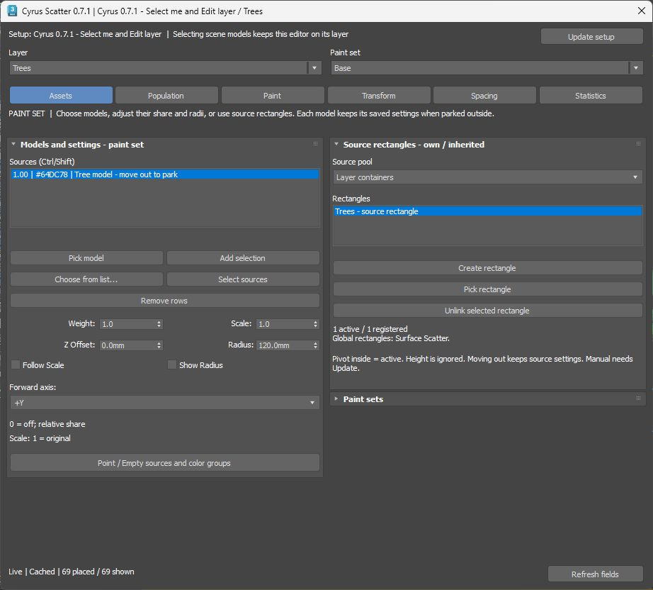

# Cyrus Scatter 0.7.1 — floating Layer Editor

> Historical implementation record. For the current product use [the documentation index](../README.md) and [backlog](../BACKLOG.md). Measurements and instructions below apply to their recorded build.

<!-- CURRENT_SYSTEM_2026-10-05 -->

Current coordination: [system guide and next loops](../Current_System_2026-10-05/README.md). This UI qualification remains valid within its recorded scope; the later [IR restart finding](../Current_System_2026-10-05/CURRENT_STATE.md) is unresolved and was not qualified by the UI pass.

5 October 2026. Development version **0.7.1**, scene serialization **53**. Baseline `addccb492a88292529594de81c287cc26e5ffe98`; implementation branch `codex/floating-layer-editor-0.7.1`. This replaces the long per-layer stack in the command panel with one retained modeless editor.

## Try it

Run [Launch_Preview.cmd](../../tools/procedural_lab/layer_editor_071/Launch_Preview.cmd). It launches a separate Max 2027 profile and a disposable two-layer scene, with matching script/native hashes. The demo opens the editor. This is a local development preview; existing MZPs and your normal Max profile have not been updated.

For your workflow, select the Scatter controller, then **Modify → Layer Manager → Edit layer**, or double-click a layer. Switch layers and paint sets at the top of the editor. Selecting a source model in the scene keeps the editor attached to its current layer.

| Where | What belongs there |
| --- | --- |
| Modify | Setup enable, receiving surfaces, global source rectangles, Manual/Live and Update, viewport/render, ordered Layer Manager |
| Assets | Models, per-model share/scale/offset/radius, layer/set source rectangles; paint-set administration starts collapsed |
| Population | Layer count/density and seed, include/exclude Area, bounded target/retry options |
| Paint | Independent coverage and Brush strokes, background fill/references |
| Transform | Layer randomization and source assignment |
| Spacing | Explicit self/set/layer scopes, pair selection, instance radii, final cleanup |
| Statistics | Cached counts and rejection information, workflow/ownership help |

Common actions stay visible. Advanced Point/Empty/color, Brush history, Analyzer/falloff and instance-radius tools expand in place. The window resizes; its two columns scroll independently. Short hover tips explain scope and effect. Spacing saves when a field is committed, without Apply. Background mode plus its reference list still has one explicit Apply action.

Read [workflow and design contracts](WORKFLOW.md), [qualification results](RESULTS.md), and the [preview launcher guide](../../tools/procedural_lab/layer_editor_071/README.md). The previous [0.7 implementation outcome](../Independent_Review_0.7_2026-10-05/CURRENT_OUTCOME.md) remains the baseline for calculation, containers and default-off licensing.
