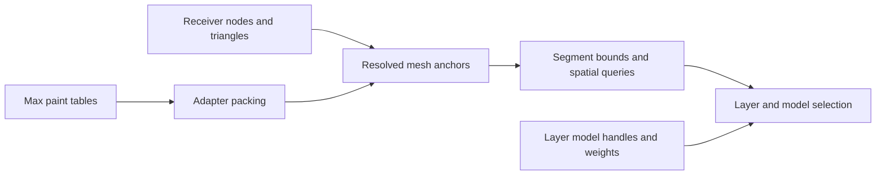

# Partial native implementation map

Addresses are **RVAs** for the hash-pinned modules in [EVIDENCE.json](EVIDENCE.json), with preferred image base `0x180000000`. Function roles below are research interpretations. An exported/RTTI/profiling name is identified when it survives; other labels are not original author names. This is a navigation map, not proprietary source code.

## Chaos Max adapter — ScatterMax_Release-2027.dll

| RVA | Role / evidence | Boundary |
|---|---|---|
| `0x7050` | Parameter registration: IDs/types/names below, checked in assembly and SDK witnesses | Large registration body; not the scatter algorithm |
| `0x86a00` | Public paint-table to core-record conversion, from the preceding report | Packed bit interpretation corrected by this pass's scene probe |
| `0x82060` | Surviving profiling name `ScatterObject::onDistributionNodesChanged`; calls signature comparison and stroke remapping | Some callback/queue semantics unresolved |
| `0x88330`, `0x88f30` | Build/replace paint-receiver signature, including empty-data guards | Paint metadata cache, not placement-cache reuse |
| `0x25ab0` | Ordered node-reference and evaluated face-count signature | Full topology hashing not present in this selected comparison |
| `0x26180` | Match same node plus count, calculate ordinal mapping or negative result | In-memory node references do not establish a persistent UUID |
| `0x95c20`, `0x95cb0` | Evaluate object, acquire/convert triangle object, including native TriObject construction | All special-case geometry conversion paths not followed |
| `0x97ce0` | Remap and compact surviving stroke records/points; hold/restorer integration | Decompiler prototypes are poor; interpretation cross-checked with adapter packing and host removal evidence |
| `0x6e840` | Build the observed topology-change warning | Actual host warning witnessed in the preceding report |
| `0x9c9e0` | Session receiver transforms, evaluated triangles and cumulative face offsets | No complete painter input pipeline recovered |
| `0x9c650`, `0x9c870` | All/selected layer paint removal paths | “Targets cache reset” identifies metadata refresh |
| `0x73de0` | Construct shared native `CoreDataCache` owner and initialize flags | Full stage invalidation policy unqualified; unrelated trailing paths not pursued |

### Public transport schema

| Property | Parameter ID | Max SDK table type | Recovered meaning |
|---|---|---|---|
| `layerData` | `0x9e` | Point3, `0x803` | X=u, Y=v; integer bits of Z=local face index |
| `layerRecords` | `0x9f` | Point4, `0x816` | Integer bits of X=point count, Y=receiver ordinal; Z high 16=layer, low 16=operation; W=radius |
| `layerList` | `0xa0` | Integer, `0x801` | Integer layer-related table; full record grammar not recovered |
| `layerListRecords` | `0xa1` | INode, `0x811` | Model-node references; adapter/core model-handle mapping supplies layer membership |

Internal point stride **12 bytes**: face int at `+0`, u float at `+4`, v float at `+8`. Internal stroke stride **20 bytes**: point count `+0`, receiver `+4`, layer `+8`, operation `+12`, radius `+16`. In the saved fixture, operation 1 belongs to the earlier artist-authored erase stroke; the selected spatial query checks operation parity. A complete operation enum is not claimed.

## Chaos scatter core — ScatterCore.ForScatter_Release.dll

| RVA | Recovered role | Evidence strength / limit |
|---|---|---|
| `0x331e0` | Layer-data factory, previously inspected | RTTI identifies `LayerDataImpl`; input validation does not recover its original header |
| `0x16870` | Construct `StrokesEvaluator` with a `ClusterLayersEvaluator` | RTTI, constructor writes and calls |
| `0x15910` | Resolve layer model handles, build model-index/cumulative-frequency tables | Native matching and accumulation; all model-group edge cases untested |
| `0x15790` | Construct cluster/layer query structure | Calls bounds preparation and hierarchy construction |
| `0x153b0`, `0x16510` | Resolve face/u/v endpoints; prepare stroke-segment bounds | Barycentric arithmetic verified in assembly |
| `0x17330` | Recursive segment-bound hierarchy split | Spatial hierarchy established; no unverified “kd-tree” label |
| `0x14a20` | Query hierarchy; resolve segment endpoints; invoke tubular containment; collect layer candidates | Selected query has a two-candidate bound; full overlap precedence not qualified |
| `0x32bd0` | Exported `STubularVolume` constructor | Stores endpoints and radius squared |
| `0x33130` | Exported `STubularVolume::contains` | Entire 130-byte / 39-instruction body decoded; ordinary 3D endpoint/segment distance, inclusive radius boundary for finite values |
| `0x179f0` | Select model from applicable layer's cumulative weights | Calls spatial query; backtracks through empty model sets; full fallback/precedence behavior needs host tests |
| `0x5b5e0`, `0x508c0` | Scatter task dispatch and per-instance worker | Worker calls the stroke/model selection path; thread use does not certify all host API safety |
| `0x17fc0` | Public instance-to-target index lookup, previously inspected | Output mapping, not a stable authoring-ID API |

This diagram covers the selected paint/model path. It does not place all generation, collisions, maps or rendering into a recovered full pipeline.

## Forest Lite — ForestPackLite.dlo

| RVA | Role | Newly resolved / limit |
|---|---|---|
| `0x1ec530` | Contour vertex fill, preceding brush report | Provides the caller for prepared XY lookup |
| `0x942e0` | XY bounds/grid lookup, candidate chain and point-in-triangle tests | Native spatial lookup; receiver precedence and full height projection unresolved |
| `0x930a0` | Triangle-coordinate/barycentric solve | Native CrossProd/MaxComponent and arithmetic; all degenerate cases untested |
| `0x79520` | Initialize source-sample validity/state and last-use timestamp | `_time64` assignment recovered |
| `0x79b80` | Source-sample lookup, interval hit return, timestamp refresh; construction on miss | Strong binary sample-reuse evidence; no measured runtime hit count |
| `0x7a650` | Sample sort comparator | Previously missing function now recovered as a bounded 28-byte straight-line leaf; ascending signed timestamp |
| `0x7a670` | Cost-bound eviction, oldest timestamps first, release eligibility checks | Not strict LRU; referenced samples may remain |
| `0x7aed0` | Sample-cost aggregation, preceding report | Runtime cost units and active allocations unmeasured |
| `0x415a0` | Display revision/force gate | Complete dirty-event ownership still unknown |

The timestamp field is sample offset `0xf48f0`; initialization and successful lookup write `_time64(0)`, and the comparator reads it. The comparator can have ties within a second. This resolves the previous comparator/policy gap without asserting a total-order LRU cache.

## Excluded and corrected interpretations

- Initial candidate “vtables” were RTTI hierarchy descriptors, not validated CompleteObjectLocator-backed tables. Their sampled entries were non-executable. Those guesses are excluded; the reliable static RTTI mapping replaced them.
- Export label `canvas_hit_path` (`0xa1b70`) is session/control logic, not the recovered per-point hit callback. `canvas_hit_dispatch` (`0x9fe80`) sets a Painter interface pointer. `canvas_node_map` (`0xa0650`) is an eligibility/control path. Their historical filenames remain in the raw ledger as exploratory labels.
- Export label `stroke_layer_query` (`core 0x16ca0`) actually performs color-based model selection. The worker branches separately to `0x179f0` for the inspected stroke path.
- `CoreDataCache` RTTI, a function filename and a “cache reset” profiling label are navigation evidence. None measures placement reuse.
- The first reference probe wrote a valid TSV but tried to parse the textual endpoint receipt as JSON. That harness error was corrected; it was not a vendor plugin failure.
