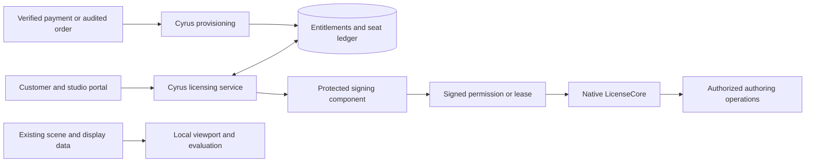

# Licensing architecture

**Reconciled:** 2026-10-02; rendering, offline and device policy clarified 2026-10-04. **Status:** current engineering design; implementation and security qualification are pending. Start with the [roadmap](ROADMAP.md); commercial choices and continuity outcomes are tracked in [decisions](DECISIONS.md).

Cyrus should own its licensing service, customer and studio records, entitlement policy, and native integration. The user selected that direction in this discussion. Established cryptographic, authentication, database and hosting components remain appropriate building blocks; operating our own licensing does not require inventing those primitives.

Keep Scatter computation and viewport drawing local. Separate purchases, product permissions and seat allocation so ordinary feature development and studio seat purchases do not require redesigning licensing. First prove the native authorization boundary; then build an independently testable policy core and small service, followed by native integration and a controlled pilot.

This is the implementation authority for licensing. The [September package](../CyrusScatter_Licensing_Implementation_Package_2026-09-27/README.md) remains historical evidence, with corrections mapped in the [document audit](DOCUMENT_AUDIT.md). Its native boundaries, scene preservation and testing principles remain useful. Vendor-first sequencing, price comparisons and old schedule estimates no longer guide implementation. Pricing, durations and detailed customer promises remain undecided.

## What the industry evidence establishes

This comparison covers published behavior and deployment models. It does not reveal proprietary verification code, cryptographic algorithms, anti-tamper internals or measured resistance to cracking.

| Company | Verified public behavior | Implication for Cyrus |
| --- | --- | --- |
| Autodesk | Administrators allocate product access to users and groups. The named-user FAQ describes initial online authorization, periodic refresh and up to 30 days offline for the specified single-user subscription model. | Identity, assignment and offline policy can be separate from individual features. The duration is vendor policy, not a universal security recommendation. [Assignment](https://www.autodesk.com/support/account/admin/users/assign-access), [authorization](https://www.autodesk.com/support/account/admin/licensing-faq/authorization). |
| SideFX Houdini | A client helper communicates with a license server. Documentation covers hosted login requiring internet and a studio-managed server setup. | Hosting location and seat management are separate choices. Always-online login is not the only professional studio deployment. [System](https://www.sidefx.com/faq/license-management/), [login](https://www.sidefx.com/docs/houdini/licensing/login_licensing.html), [studio](https://www.sidefx.com/docs/houdini/licensing/studio_licensing.html). |
| Chaos | Named licenses belong to people; floating licenses share a limited concurrent pool. An organization can use both through common sign-in. | One customer system can support individual and studio offers with different allocation policies. [Models](https://support.chaos.com/hc/en-us/articles/35342660398225-What-is-the-difference-between-named-and-floating-licenses), [combined setup](https://support.chaos.com/hc/en-us/articles/35342476069905-I-have-both-named-and-floating-licenses-What-is-the-recommended-setup). |
| ITOOSOFT | A network server manages a limited pool; additional purchases increase capacity. That documented mode requires a reachable server. | Seat quantity is server/account data. A product binary need not change when capacity increases. [Network licensing](https://docs.itoosoft.com/installation/installing-a-network-license). |

These sources validate design patterns, not our future implementation. Their render restrictions and offline periods should not automatically become Cyrus policy. The [source register](SOURCES.md) records scope and retrieval limitations.

## Protection objective

Discourage copying license data, sharing beyond purchased capacity, forging purchase claims and accessing another studio's records. Make bypass harder than changing a MAXScript boolean, while preserving work during service, clock, machine or entitlement changes.

A desktop owner can modify code and storage. Signed permissions protect authenticity when verification executes correctly; they cannot force a modified binary to perform verification. A distributed crack can also be easy for a nontechnical user to install. Do not promise a piracy-prevention percentage or uncrackable local computation. [Keygen's security guidance](https://keygen.sh/docs/api/security/) acknowledges this limitation; it is context, not a selected service.

Running an essential operation on our server creates an additional boundary for that operation. Moving scatter computation there solely for protection would introduce latency, availability, data-transfer and operating-cost requirements. No such migration is proposed.

## Separate commerce from permissions and seats

| Responsibility | Question | Owner |
| --- | --- | --- |
| Commerce | What was purchased, in what quantity and for which term? | Cyrus provisioning module, connected to future payment processing or audited manual orders |
| Licensing | Which rights exist, who may receive them and is capacity available? | Cyrus service and transactional database |
| Local authorization | Can this operation start using verified permissions and its runtime context? | Native LicenseCore consuming an immutable validated snapshot |

An account proves identity; an entitlement grants product rights; a lease reserves a seat. Login alone is not proof of purchase. Trial/support grants may exist without payment but must be explicit, scoped and audited.



Start with one service codebase with clear modules and one authoritative database for seat writes. Many microservices are unnecessary. A protected signing boundary may use a managed key service. Infrastructure and libraries can be third-party while product policy, code and customer records remain under our control.

## Add features without rewriting licensing

Separate product permissions, native operation categories and development feature flags. A rollout flag can enable an algorithm or UI but cannot grant paid access. Initially offer one complete authoring feature set; avoid an entitlement for every checkbox or distribution method.

| Product change | Expected licensing work |
| --- | --- |
| Faster preview, new sampling algorithm or placement option | Reuse existing rights and verify operation coverage; no new purchase/token format. |
| New Brush workflow in the same product | Reuse authoring/edit rights; register new native mutations and test direct calls. No service rewrite. |
| Studio increases from 10 seats to 15 | Record an authorized five-seat addition in the server ledger; no plugin rebuild. |
| Different volume discount | Change the server catalogue and checkout rules; no native permission change. |
| Separately sold product later | Add an explicit product/permission ID, catalogue mapping and relevant native checks; retain the signed-envelope protocol. |
| New security requirement or incompatible token meaning | Version the affected contract and test a compatibility transition; some future updates are unavoidable. |

Centralization cannot protect a function that never calls the authority. New mutation entry points need registration and tests. Unknown operations deny new mutation by default. A native command may reuse a category, but caller-supplied strings or `evaluation=true` must not confer authority.

Keep policy variation explicit and bounded. Supported term/device/seat rules belong in validated authority and versioned policy inputs, while signature verification and scene-preservation invariants remain enforced. Customer-editable configuration cannot grant rights. Test changing supported policy values without editing scatter algorithms or distributing checks throughout the UI. New operation meanings or incompatible security semantics can still require a versioned client change.

Version the service API, signed schema, native ABI, policy semantics and product releases independently. Allow explicitly optional additive fields, reject unsupported critical semantics, and let unknown permission strings grant nothing. Keep rollout flags separate from commercial grants. [OWASP authorization guidance](https://cheatsheetseries.owasp.org/cheatsheets/Authorization_Cheat_Sheet.html) supports explicit mapping and tests; this product contract is our proposal.

## Individual and studio models

Represent an individual as an account with one member and a studio as an organization with many members. Each person signs in separately; no shared master password or unrestricted license key is needed.

| Proposed offer | Meaning | Suggested order |
| --- | --- | --- |
| Individual | One assigned person, with a separately defined device allowance | First pilot |
| Studio assigned seats | Organization buys N seats and assigns up to N people | First pilot after individual flow passes |
| Studio floating seats | N concurrent reservations shared among authorized members | After concurrency and outage qualification |
| Studio offline server | Studio service receives a bounded allocation | Later, after demand and deployment/support qualification |

Ten assigned seats mean ten assigned people under the proposed assigned-user offer. Ten floating seats can serve a larger organization with at most ten valid reservations at once. Membership consumes no authoring seat. Number of assigned people, activation allowance and simultaneous-use limit are different fields. D13 now requests one authorized device per purchased seat; keep that activation limit separate from person assignment and Max process count.

Use separate accounting rules:

- **Assigned offers:** one assigned person consumes one purchased assignment. Their installation allowance and simultaneous-use rule are separate constraints; do not charge another assigned seat just because the same person starts another Max process.
- **Floating offers:** propose one `user + registered installation + product pool` as one reservation unit. Multiple Max processes register as child sessions; closing one must not release authority still usable by another. A second installation is another reservation, subject to the approved policy.
- **Offline authority:** record which assignment or reservation backs it. Reassignment, release and lost-device recovery cannot erase an already issued disconnected copy.

The floating counting rule and simultaneous-use details remain proposed. The one-device preference is recorded in D13, but Windows-account/reinstall identity and effective transfer remain B02/B08 decisions; none is implemented or ready as customer terms.

A shared DLL coordinates modules within one process, not different Max processes or machines. Start with server grouping and native session registration. Test atomic credential/cache writes, refresh-token rotation and process crashes; server grouping alone does not coordinate local refresh credentials. Use a minimal OS synchronization mechanism or separate authenticated sessions where appropriate. Add a per-user broker only if those experiments justify it. Device identifiers and local keys provide practical binding, not proof against an administrator cloning a machine.

The portal needs owner, licensing administrator, billing administrator and member roles. Billing access must not grant signing privileges or cross-customer access. Invitations, employee departure, reassignment and lost machines need audited recovery. Knowledge of an organization ID grants no access.

## Volume pricing and additional purchases

Keep discounts in a versioned server catalogue. Store product, offer, seat model, quantity, term, currency, price rule and effective date with each order. Both one discounted rate for all seats and graduated quantity bands can fit the same licensing protocol.

Example: an organization with 10 seats buys 5 more. Trusted provisioning records a unique adjustment and capacity becomes 15 at its effective time. Replaying the event must leave it at 15. The plugin learns about the change through normal refresh.

Retain grant lots with their origin, quantity, term and release eligibility. Aggregate compatible lots only; do not erase different expiry dates or combine incompatible rights. Reductions and term expiry must respect outstanding signed reservations or take effect at a defined later boundary.

Discount amounts, floating pricing, refunds and proration remain commercial decisions. No price is proposed here. A payment processor need not own licensing. A pilot can use audited manual grants before automating commerce.

## Service records and API boundaries

| Record | Purpose |
| --- | --- |
| Account and membership | Identity and tenant-scoped roles |
| Product and offer | Stable product ID, permission bundle, seat model and catalogue version |
| Order and provisioned event | Trusted commercial origin, deduplication and reconciliation |
| Entitlement grant lot | Quantity, owner, rights, term, maintenance eligibility, status and provenance |
| Assignment | Named-user allocation within capacity |
| Activation | Registered installation, subject binding and recovery history |
| Lease group and process session | Seat unit, session membership, renewal and effective deadlines |
| Borrow reservation | Offline allocation removed from available online capacity |
| Release identity | Immutable product/build identity and publication eligibility |
| Audit and issuance record | Administrative history and exact signed authority issued |

Every API operation checks actor, organization membership, role, object ownership and product scope. Client-submitted price, quantity, role or `paid=true` is never authoritative. Read/list endpoints need tenant isolation too.

Use a small versioned API for activation, refresh, acquire/renew/release, status, assignment and later borrowing. Mutations use idempotency keys scoped to the authenticated actor and request content. Different input with the same key is an error; a retry returns the original result.

Keep a fake backend for tests and implement `CyrusServiceBackend` as the first real backend. Retain a narrow interface without unused vendor SDKs. Product code must not depend on payment-vendor types or service database tables. Development trust roots and fake grants must be excluded from production targets; an environment variable or hidden UI control must not turn a production build into an unlocked test client.

## Local state and operation decisions

Represent independent facts rather than one giant license-state enum:

| Fact | Example |
| --- | --- |
| Verified authority | Rights, owner, product, assignment/reservation and signed deadline |
| Build eligibility | Release identity is within the purchased update entitlement |
| Connectivity | Reachable, retrying or unavailable |
| Capacity | Assigned, leased, exhausted or reservation ending |
| Time confidence | Normal, bounded uncertainty or recovery required |
| Runtime operation | New mutation, faithful evaluation, inspection, recovery or approved rendering |

A valid cached grant can coexist with a service outage. Expired maintenance can coexist with permission to use an older build. Never overwrite either fact with a flat `ProviderUnavailable` or `Expired` label.

Derive a user-facing summary from these facts. A pure `authorize(operation, snapshot, release, time, context)` decision returns allow/deny, reason and a bounded operation permit; it does not perform I/O or mutate the scene. Host adapters translate denied mutations into useful messages. Automatic evaluation must not blanket-throw or silently produce an empty scatter.

The native authority owns operation categories. Unknown categories deny mutation. No caller-provided context flag, price, permission list or `paid=true` establishes authority. Full boundary coverage remains an experiment, not a property conferred by naming a DLL LicenseCore.

## Floating capacity and offline use

The proposed invariant, to be proved by testing, is:

```text
outstanding authoring seat units + distinct offline reservations
    <= effective purchased pool capacity
```

Count shared process sessions once and avoid counting one online/offline reservation twice during transition. Capacity remains outstanding until all issued authority expires or a tested, explicitly accepted early-return policy applies.

This is a service accounting invariant under the validated client/time policy, not an unbreakable concurrency limit for modified binaries or cloned local state.

Serialize pool changes in database transactions. Lock the pool row, resolve expiry, check eligibility and grant lots, locate or allocate a reservation, persist an issuance intent, and commit. Acquire, renew, borrow, reduce and administrative adjustment paths obey the same ordering. Bound retries for transaction failures. PostgreSQL documents row locking; our transaction design still needs race tests. [Database reference](https://www.postgresql.org/docs/current/explicit-locking.html).

Signing and database commit are not automatically atomic. Persist the reservation and exact claims before returning a signed artifact. Retried issuance must not accidentally extend validity. If signing fails, retain a recoverable reservation. After an ambiguous HTTP outcome, do not free capacity merely because a client timed out: it may already hold the token.

Renewal cadence and allowed-use duration are different. If offline/grace policy permits authoring until T, reserve capacity until at least T plus the maximum accepted clock uncertainty and any allowed operation-completion window. A missed heartbeat cannot instantly make that seat available elsewhere. D12 requests T at the subscription end for normal offline use; this does not introduce a shorter refresh deadline or an extra grace period. Actual term lengths and clock/recovery tolerances still need policy and experiments.

Reserve explicit offline borrowing for the entire signed period. A server cannot instantly revoke a token on a disconnected machine. Initially, do not reclaim a long reservation merely because a client reports deleting the file. A later convenient early-return policy must acknowledge and test replay risk.

Named reassignment and device transfer have the same overlap issue while old offline grants remain valid. Keep the prior assignment/activation reservation outstanding until its authority ends, or document an explicitly accepted overlap policy. A “release received” response is not proof of deletion. Do not promise both instant universal revocation and long autonomous offline use.

Use one authoritative writer initially. Failover and restoration must preserve lease history. After restoring a stale database, reconstruct outstanding signed grants or wait out their maximum validity before reallocating uncertain capacity. Independent regional writers cannot safely issue the same pool without a stronger coordination design.

## Authentication and signed permissions

Use a maintained asymmetric-signature implementation and a strict format profile. JWS is a candidate to test, not an invitation to write cryptographic primitives. Choose the algorithm after native-toolchain and protected-signer compatibility tests; bind each trusted key to its permitted algorithm and purpose.

A grant needs schema/type, issuer, audience/product, grant ID, subject/organization, activation binding where applicable, explicit rights, build eligibility, issue/not-before/expiry times and lease identity where applicable. Resolve its key identifier only against trusted keys. Login tokens, receipts, worker grants and authoring grants have distinct validation rules.

Bound input size and parsing work before verification. Parse the untrusted envelope needed to select an allowed verifier, verify the signed bytes, and validate required claims before constructing the trusted snapshot. Reject unsigned data, key/algorithm confusion, ambiguous fields, wrong audiences, unsupported critical schemas and untrusted key locations. [JWT security practices](https://www.rfc-editor.org/rfc/rfc8725).

For login, use a maintained authentication component operated as part of our system, with the system browser and authorization code plus PKCE. Specify OIDC identity validation, exact redirect handling, state/nonce where applicable and account recovery in the integration contract. Native apps are public clients; no shared secret should ship in the plugin. Protect stored credentials and test multi-process refresh. Public-client refresh tokens require rotation/replay handling or supported sender constraints. [Native login](https://www.rfc-editor.org/rfc/rfc8252), [OAuth security](https://www.rfc-editor.org/rfc/rfc9700), [OIDC validation](https://openid.net/specs/openid-connect-core-1_0.html#IDTokenValidation). MFA, recovery and session revocation are part of our operational responsibility.

Later offline request/response needs explicit device/product binding, nonce, validity and reservation rules. Local encryption does not establish entitlement authenticity. Offline clock rollback detection is best effort: combine bounded signed time, monotonic elapsed time during a run, tolerances and a recovery path without claiming perfect protection.

## Offline deadline and device activation

The following is the engineering proposal for D12/D13, not a delivered security guarantee. Initial activation obtains a server-signed grant bound to the account/product, activation identity and purchased calendar deadline. For the requested full-term mode, normal offline authoring lasts until that deadline. Renewal requires newly verified authority. Closing Max, reinstalling, deleting cache files or turning the computer off must not restart or pause the subscription term. A local countdown or file creation date is never entitlement authority.

Store signed grants, protected credentials and time observations outside plugin installation folders; `%LOCALAPPDATA%\Cyrus\Licensing\` is a candidate per-user location, not a secret boundary. Windows [DPAPI](https://learn.microsoft.com/en-us/windows/win32/api/dpapi/nf-dpapi-cryptprotectdata) can protect local secrets under an appropriate user/machine scope. Its roaming-profile and machine-scope behavior must be considered; encryption does not prove current time, prevent restoring an older valid blob, or make client administration impossible. Coordinate writes across Max processes and provide recovery for reinstall/profile changes.

Use an authenticated server-time anchor, elapsed-time observation within its valid boot/session scope, UTC calendar comparison and a protected last-observed time record. Choose and qualify the actual clock API, suspend/hibernate behavior and reboot handling; [GetTickCount64](https://learn.microsoft.com/en-us/windows/win32/api/sysinfoapi/nf-sysinfoapi-gettickcount64) measures time since system start, not a permanent trusted calendar. A persisted timestamp adds evidence but does not turn an offline machine into a trusted time source. Significant rollback, forward jumps or missing history need a distinct recovery state and tested tolerance. A proposed response is to pause new authoring and request online time recovery while preserving work and the selected rendering path. This exception must be disclosed before promising full-term offline use. [Offline clock limitations](https://keygen.sh/docs/api/security/#clock-tampering).

Re-evaluate the local deadline when starting meaningful authoring operations and on relevant lifecycle/timer events so leaving Max open does not extend access. Check the verified snapshot and current time; no disk/network/signature work belongs in viewport or per-point loops. Reach a bounded safe boundary for operations already in progress. Expiry changes authoring permission, not scene data or plugin class availability.

Prefer a server activation ID plus a locally generated, protected device key, with selected stable device signals for matching and recovery. Bind issuance to possession of that registered key; this remains a practical client binding rather than proof against a patched client or copied software key. The issuer's signing private key stays only on the server. Qualify the simplest Windows storage/profile model first; hardware-backed keys are an optional later experiment, not an assumed dependency.

Do not use IP as device identity: addresses can be reassigned by [DHCP](https://learn.microsoft.com/en-us/windows-server/networking/technologies/dhcp/dhcp-top), and [NAT](https://www.rfc-editor.org/rfc/rfc3022) can expose many devices through one public address. The [SMBIOS UUID exposed through WMI](https://learn.microsoft.com/en-us/windows/win32/cimwin32prov/win32-computersystemproduct) can be unavailable/all-zero and is an identifier, not a secret or purchase proof. Minimize collected identifiers, document their use and provide hardware/profile recovery; a hash does not automatically make persistent device data anonymous.

The portal transfers an activation, retaining the purchase and issuance audit history. For example, if device A holds a grant with six months remaining and stays offline, removing A on the website cannot inform that client; immediately granting B may leave both usable for those six months. This follows from the disconnected design, not a server API omission. A server-side generation number also cannot notify an offline client. An honest online deactivation can disable its current copy but cannot prove an older backup unusable.

Choose B08 before shipping transfers: preserve full-term offline use and delay capacity reuse; preserve it and explicitly accept controlled transfer overlap; or revise the offer to shorter offline grants with periodic refresh. The latter bounds the old grant's remaining exposure but does not provide instant offline revocation. Refunds, lost machines and employee removal have the same outstanding-authority consequence. No option is silently selected, and D12 must not be copied into a floating offer without separate capacity qualification.

## Native integration and continuity

Keep LicenseCore independent of Max SDK headers, with a narrow stable ABI and one intended runtime identity per process. Authoring operations consume decisions from an immutable verified snapshot. Network calls, signature refresh, file I/O and seat transitions stay outside placement loops and viewport callbacks.

| Source anchor checked on 2026-10-02 | Integration concern |
| --- | --- |
| `aminScatterAdvanced_cf` / `aminScatterTransforms_cf` in `AminScatter/src/max_bridge.cpp` | Distinguish new authoring from faithful saved-state evaluation without a caller-controlled bypass. |
| CS Edit mutations and script-facing primitives in `AminScatter/src/cyrus_edit.cpp` | Cover move/rotate/scale, clone/delete/reset and direct calls; selection/restoration have separate purposes. |
| `cyrusAnalyzeSurface_cf` in `CyrusSurfaceAnalyzer/src/bridge.cpp` | Separate new analysis from evaluation dependencies. |
| `bakeInstances` in `AminScatter/tools/ui/templates/before.ms` | A separate script check is bypassable; define meaningful native authority before claiming enforced bake permission. |
| Generator and preview/display code | Generate recovery UI from templates; drawing uses prepared data without licensing work. |

The follow-up [codebase audit](CODEBASE_AUDIT.md) expands these anchors into ten findings, 37 selected file fingerprints and 38 native declarations. This is static discovery, not a complete enforcement map. Use symbols and generator inputs rather than generated line numbers. Concurrent viewport/Brush changes exist; reconcile all parameter changes, native primitives, callbacks and restore paths against the integration commit before adding gates.

Keep `cyrusEnabled` as an artist control; it intentionally changes scene output and must not represent license status. Admit a new operation before preview cache reset, PFlow cleanup or shared CS Edit mutations. Evaluation also updates edit identities and legacy bookkeeping, so rejecting every write would break continuity. Distinguish these operations before inserting checks, and stage/rollback partial work where necessary.

Preserve saving, parameters, stable IDs, stored edits and approved historical scene behavior. If authorization changes during an operation, finish at a defined boundary and apply the new decision to subsequent mutation. Continuation beyond a seat deadline needs a bounded reservation or tested checkpoint/cancellation; an indefinite permit would undermine accounting.

Rendering existing work after subscription expiry is selected in D11. Worker deployment, changed-dependency scope, bake/export and perpetual continuity still need explicit policy. A process filename or script flag cannot prove legitimate farm use. Locally exposed transforms may serve authoring, evaluation and export; this proposal does not claim an unbypassable free-worker boundary.

The first experiment must follow a parameter change through the script-owned controller and native computation. Merely labeling the call “evaluation” can let arbitrary new inputs reach a nominally free path. Demonstrate the intended restriction in the unmodified plugin before committing to the service contract. If it requires substantial native ownership of saved state, compare that cost with a narrower worker policy or explicitly accepted limits. Do not change scene IDs/schemas or build a second render engine to conceal an unresolved policy conflict.

A preview cache is not evidence of complete, durable render state. Scene continuity must be verified with regeneration, animation, missing caches, Undo/Redo and qualified renderer paths.

Decisions D09/D11 select preservation and rendering of existing work, a lock on new authoring after subscription authority ends, and editing recovery after verified renewal. The permission design must not treat authoring-token expiry as a blanket ban on renderer evaluation. B07 must define what "unchanged work" means for procedural dependencies: moving a source or surface, changing an animation frame, or reopening without caches can require computation. Preserve state first; do not equate an authoring lock with a proven immutable geometry snapshot. Include offline expiry, rendering and the expired-to-renewed transition in the boundary experiment.

Runtime initialization and bounded shutdown belong outside `DllMain`. Qualify one intended per-process identity across Scatter and Analyzer, deliberate dependency paths, and account/cache storage outside replaceable program folders. Source-audit C08–C10 records the current generator, loader and packaging evidence; no installer or core-algorithm rewrite is needed merely to start the prototype.

## Security and operational requirements

| Area | Required outcome |
| --- | --- |
| Signing | Private keys isolated from clients/repository, restricted signing identity, audit trail, separate production/test keys and tested rotation |
| Trust updates | Authenticated trusted-key distribution; no arbitrary URL from `kid`; compromised-key recovery with offline consequences |
| Administration | Least privilege, privileged-account MFA, tenant isolation, audited manual grants and support actions |
| API | TLS validation, bounded input, rate limits, replay handling and sanitized diagnostics |
| Commerce | Verified origin, durable ingestion, idempotent effects and reconciliation of missing, duplicated and unordered events |
| Release | Signed artifacts, authenticated release metadata, protected CI, dependency maintenance, provenance and rollback |
| Recovery | Lost machine, account recovery, stale database, signer/service outage and product-shutdown continuity |
| Privacy | Defined retention and minimal licensing data; no routine geometry, scene-name or asset-path uploads |

Stripe documents duplicate/unordered delivery and webhook signature verification; it is an implementation example, not a provider selection. [Webhook reference](https://docs.stripe.com/webhooks). Code signing establishes publisher/integrity information, not licensing authority. [Microsoft reference](https://learn.microsoft.com/en-us/windows/win32/seccrypto/cryptography-tools).

Normal signing-key rotation can overlap old and new trusted keys for a bounded transition. A compromised key is different: stop issuance, revoke trust through authenticated updates where reachable and assess forged-grant exposure. Disconnected clients remain exposed until compromised trust is removed or a separately enforced trust deadline is reached. Ordinary token expiry is insufficient when an attacker can forge replacements. Do not keep a compromised key trusted as a routine convenience. Separate license-signing, authentication, release-signing and test keys.

Trusting an entitlement verification key differs from pinning an HTTPS certificate. Certificate pinning needs its own proxy/rotation analysis. Embedded shared HMAC secrets, hidden strings and whole-plugin virtualization are not substitutes for these controls.

Building this ourselves also means maintaining monitoring, security updates, backups and customer support. Managed infrastructure can reduce that workload without outsourcing licensing policy.

## Implementation authority and evidence

Follow [ROADMAP.md](ROADMAP.md) for dependencies, acceptance experiments and the immediate coding packet. [DECISIONS.md](DECISIONS.md) is the only current commercial/continuity decision register. Those documents distinguish selected direction, engineering recommendations, unresolved policy and measured results.

This review changed documentation only. It inspected prior documents, current source anchors and official references. It did not implement a licensing service, run licensing tests, test vendor internals or change Scatter, Analyzer or viewport behavior. Native builds and performance results from other tasks do not qualify licensing.
