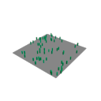
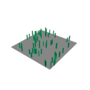

# First licensing coding loop: policy and Max boundary experiment

**Result: bounded experiment PASS; L0 boundary qualification remains IN PROGRESS.** The policy prototype works for the tested synthetic inputs. No commercial authorization is enforced in the product, and no real token, issuer, device binding or clock protection was implemented.

The useful result is twofold: the intended active → expired → saved/reopened/renderable → renewed workflow can be exercised without erasing this fixture's work, and the experiment demonstrates exactly why a script wrapper is not a sufficient enforcement boundary.

## Implemented

- [Host-independent C++ policy](../../CyrusLicensing/README.md): default-deny authoring, separate product/build/device/capacity/time facts, UTC deadline comparisons, continuity permissions and structured reasons. No Max dependency, I/O or custom cryptography.
- [Isolated Max lab](../../tools/licensing_lab/README.md): opt-in synthetic native bridge, immutable run snapshots, two SDK builds, disposable Max profiles, verified loaded-module hashes, saved-scene lifecycle and image comparison.
- [Operation contract](OPERATION_CONTRACT.md): current integration families, representative runtime observations and the native state-ownership question. [69 native declarations](evidence/l0-2026-10-04/native_inventory.json) are inventoried; they are not 69 verified authorization paths.

The product source, generated scripts, installers and artist scenes were not edited by this experiment. The lab is a separate target and was not installed into the artist's Max. Other ongoing repository/document work was preserved.

## Reproducible evidence

The final run was `python tools/licensing_lab/run.py --run run04`. Its full local artifacts are under `build/licensing-l0-2026-10-04/run04/`; the small [curated evidence](evidence/l0-2026-10-04/summary.json) and [SHA-256 manifest](evidence/l0-2026-10-04/manifest.json) are kept with these docs. Binaries and `.max` scenes remain under ignored build storage.

| Item | Actual scope/result |
| --- | --- |
| Source identity | HEAD `53bfc5d1c76929958dbeb29f5d4c746b2321d0ac` plus new, uncommitted policy/lab files; [163-file snapshot](evidence/l0-2026-10-04/source.json). HEAD alone is insufficient. No file drift at evidence capture. |
| Compiler | MSVC 19.38.33145.0 from toolset 14.38.33130, Windows SDK 10.0.19041.0, x64 Release |
| Lab SDK builds | Native lab bridge and policy tests built against Max 2026 and Max 2027 SDK configurations |
| Policy tests | Six CTest groups per build, 138 assertions per build; [2026](evidence/l0-2026-10-04/lab-2026-tests.log), [2027](evidence/l0-2026-10-04/lab-2027-tests.log) |
| Product build used by fixture | Fresh Max 2027 Scatter, CS Edit, Brush, Brush Storage and Analyzer from the source snapshot |
| Actual host | Max 2027.1, reported `29.1.0.11426`; two batch processes, [create](evidence/l0-2026-10-04/create/launch.json) and [reopen](evidence/l0-2026-10-04/reopen/launch.json) |
| Loaded identities | Six modules, including the lab, verified by exact path and SHA-256 in [create](evidence/l0-2026-10-04/create/verified_modules.json) and [reopen](evidence/l0-2026-10-04/reopen/verified_modules.json) |
| Host assertions | [48 create assertions](evidence/l0-2026-10-04/create/checks.tsv), [27 reopen assertions](evidence/l0-2026-10-04/reopen/checks.tsv), plus five explicit observations. Some assertions repeat across render/process stages; this is not 75 independent product tests. |
| Rendering | Default Scanline, 64 instances, 128×128; active, expired-in-process and expired-after-reopen images are pixel-identical |
| Dependency counterexample | Doubling source height changes the render while placement positions/source indices retain the same diagnostic fingerprint |
| Test isolation | [Configuration without explicit lab opt-in was rejected](evidence/l0-2026-10-04/optin-default.json). Product CMake/package inputs have no lab reference. This is not final distributable qualification. |

The fixture's simulated timestamps are 100–200 for the initial authoring term, 150 for active, 200/250 for expiry and 400 for a renewed deadline. These are test values, not approved commercial durations. Renewal is a synthetic facts replacement, **not verified server issuance**. No months of offline use or actual system-clock manipulation were simulated.

## What passed

Active wrappers changed layer amount, moved an instance through CS Edit, filled a Brush field and ran Analyzer. Synthetic expiry denied those wrapper paths before they changed state. Preview denial retained the existing cache and its build count. Artist enable flags and layer/edit identity were preserved.

CS Edit Undo/Redo and Brush Undo succeeded in the exercised cases. The scene saved under the expired scenario, reopened in a fresh process, rebuilt placement/edit output with the preview cache explicitly discarded, and rendered the same 64-instance result. A synthetic renewed term allowed another native edit; Undo restored the saved result.

These small diagnostic renders establish this fixture's output, not renderer compatibility or artistic image quality.

## What the counterexamples establish

1. Direct `cyrusBrushFill` still changed the field while the lab wrapper denied it. Undo restored the field.
2. Direct parameter assignment followed by `placements` generated a new 81-row layout in a separate probe controller.
3. Direct `aminScatterTransforms` produced 83 new rows without visiting the wrapper.
4. Moving the probe's receiving surface changed evaluated placements.
5. Changing the source box height left the placement fingerprint unchanged but changed the rendered geometry.

These are expected properties of the currently unlicensed product, not security regressions introduced by this loop. They reject the proposition that wrapping buttons or trusting a script-provided “existing state” flag would solve licensing. They also show that preserving authored Cyrus parameters does not freeze all external geometry. See [B07 in the contract](OPERATION_CONTRACT.md#b07-what-existing-work-means).

The diagnostic `cyrusEditFingerprint` covers placement translation and source indices. It is neither cryptographic nor a full transform/geometry/state signature. The `ApprovedExistingState` test input does not authenticate it.

## Qualification status

| Roadmap experiment | Status after this loop |
| --- | --- |
| E01 native coverage | Partial discovery; concrete wrapper bypasses observed. Complete enforcement criterion **not met**. |
| E02 extension | Partial: ordinary placement, CS Edit and Brush wrappers reuse one product right; policy values vary in native tests. No signed schema or ABI extension proved. |
| E04 fact combinations | Partial: policy combinations and synthetic expiry/renewal tested. No verified cache, server outage, maintenance catalogue or real entitlement integration. |
| E13 time/lifetime | Deadline arithmetic tested. Real clock confidence, rollback, sleep, restart/recovery and expiry mid-gesture untested. |
| E15 scene/render | Partial: this static Scanline fixture, native edit/identity retention, Undo/Redo and dependency counterexamples. Animation, missing Analyzer caches, bake/export, render workers and other renderers untested. |
| E17 packaging/hosts | Lab build/load evidence only. No production installation/signing, ordinary-user, Max 2026 runtime or mixed-version qualification. |
| E03, E05–E12, E14, E16 | Not run. No parser/signature, backend, transfer/accounting, recovery-drill or viewport performance claim. |

L1 has a small policy precursor, not its completed signed-permission harness. L2 service work has not started. D12/B08 full-term offline and device-transfer accounting remain unchanged and unresolved; no shorter refresh period was adopted.

## Next implementation packet

Prototype native ownership of **one** authored layer revision and one edit operation. Test that UI, direct script calls and changed parameters cannot author a replacement after expiry, while load/Undo/render can evaluate the admitted existing state. Include denial before destructive cleanup and a saved scene reopened without transient caches. Measure scope/cost before applying this to all authoring paths.

Use those results to settle B07's dependency contract. Then select and qualify one maintained signature verifier and strict envelope profile for L1. Clock recovery and the B08 transfer/overlap choice must be explicit before real grants or customer promises. The full licensing backend is not the immediate next step while the native owner remains unproven.

## Fixture development failures retained

`run01` failed on the test helper's MAXScript optional-argument syntax. `run02` reached save but failed while enumerating a .NET module collection. `run03` reopened/rendered successfully but attempted to move an instance in a deliberately hidden layer; the fixture now restores the ordinary visible editing context before testing renewal. These were harness corrections. No product code was changed to make the checks pass. `run04` rebuilt from the corrected snapshot and completed all reported checks; previous logs remain in their separate local run folders.
