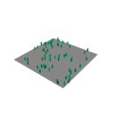

# Signed-license experiment: standard components, isolated Max fixture

**Result: bounded experiment PASS. L0/L1 and production qualification remain incomplete.** Real P-256/SHA-256 signatures generated by Python cryptography/OpenSSL were verified by Windows CNG. A disposable Max 2027 fixture exercised signed activation, synthetic expiry, save/reopen/render and signed renewal. No enforcement was installed into the artist's plugin.

The recommendation is to own Cyrus's license policy and reuse maintained cryptography and parsing components. [Component choices](IMPLEMENTATION_COMPONENTS.md) explain the Windows API/open-source split, alternatives and dependency notices. The [strict candidate profile](SIGNED_TOKEN_PROFILE.md) records the exact tested protocol; it is not a final customer contract.

## What was built

- An optional native verifier using Windows CNG, Crypt32 and pinned nlohmann/json 3.12.0. It accepts only bounded compact JWS/ES256 with explicitly trusted keys and typed application claims.
- A single-owner `LicenseSession` that admits verified claims, checks application context and consults the existing pure policy. Invalid replacement imports preserve the previous grant. Routine decisions do not repeat signature verification or perform I/O.
- A separate lab issuer using cryptography 50.0.2 / OpenSSL 4.0.3. Its private P-256 key exists only in memory during fixture generation; the lab DLL embeds only that run's public key.
- An opt-in `CyrusSignedLicenseLab.dlx`, standalone tests and two disposable Max batch stages. The product CMake targets and installers were not connected to licensing.

No public server is needed for this development experiment: the local issuer generates test files and the native client checks them. This is not yet a customer activation tool, persistent issuer or protected signing service. A future manual-grant pilot can reuse the verified-message design after the other acceptance gates pass.

## Exact evidence and scope

Final command: `python tools/licensing_lab/run_signed.py --run run03`. Full artifacts remain under ignored `build/licensing-l1-2026-10-04/run03/`. The [curated summary](evidence/l1-2026-10-04/summary.json), [results](evidence/l1-2026-10-04/result.json) and [SHA-256 manifest](evidence/l1-2026-10-04/manifest.json) retain the small evidence set; binaries and `.max` scenes are not added to Git.

| Item | Measured or recorded result |
| --- | --- |
| Source identity | HEAD `53bfc5d1c76929958dbeb29f5d4c746b2321d0ac` plus the [177-file snapshot](evidence/l1-2026-10-04/source.json). New licensing/lab files were uncommitted; HEAD alone is insufficient. |
| Product baseline | Product source, five native modules and scene reused from passed L0 `run04`, with source/binary hashes checked. Concurrent procedural-engine edits in the live checkout were excluded deliberately. This run does not qualify those newer edits. |
| Compiler | MSVC 19.38.33145.0, toolset 14.38.33130, Windows SDK 10.0.19041.0, x64 Release |
| SDK builds | Signed lab and standalone tests built against SDK 2026 and SDK 2027 |
| Native tests | **12/12 groups passed in each build:** six signed groups with 876 assertions, plus six policy groups with 138 assertions. [2026 log](evidence/l1-2026-10-04/lab-2026-tests.log), [2027 log](evidence/l1-2026-10-04/lab-2027-tests.log). |
| Signed cases | 148 named vectors: 27 profile, 71 signature, 42 claim, eight context cases; plus lifecycle/isolation checks and 256 deterministic malformed-input probes. Counts include 64 signature-bit mutations, repeated checks and group guards; they are not hundreds of independent security findings. |
| Actual host | Max 2027.1, `29.1.0.11426`, two fresh batch processes. **No Max 2026 runtime test.** |
| Host assertions | [31 create assertions and one observation](evidence/l1-2026-10-04/create/checks.tsv); [25 reopen assertions](evidence/l1-2026-10-04/reopen/checks.tsv). Some assertions repeat between stages. |
| Loaded binaries | Six modules verified by exact paths and SHA-256 in [create](evidence/l1-2026-10-04/create/verified_modules.json) and [reopen](evidence/l1-2026-10-04/reopen/verified_modules.json). The original synthetic L0 bridge was not loaded. |
| Render comparison | Default Scanline, 64 instances, 128×128. Active, expired and reopened-expired RGB pixels matched exactly. |
| Key handling | [Issuer metadata](evidence/l1-2026-10-04/fixtures/issuer.json) records the independent crypto backend and ephemeral public-key fingerprint. Private key export/storage is absent from the generator. |
| Snapshot drift | No licensing build/test code drift at capture. Two README files were updated after the build; the manifest retains the exact build-time copies' identities. |

Batch profiles isolate startup/scripts/plugin paths and use disposable scenes. Installed Autodesk/global application plugins still load, as the retained session logs show. This is a local host experiment, not a clean-machine packaging test. The artist's live Max session was not used or terminated.

## What the tests establish

The client accepted independently signed valid messages and rejected changed signed bytes, a wrong signing key, malformed signatures, unsupported algorithms, untrusted key IDs, injected key locations, wrong token purpose and ambiguous JSON. Claim checks rejected unsupported schema/rights, wrong types, invalid ranges and mismatched account, tenant, product, synthetic device or build context. Whitespace/key order in legitimately signed JSON is accepted because verification covers the received bytes rather than reserialized JSON.

The lab accepted a valid grant, applied a real CS Edit operation through its wrapper and preserved the previous grant when a tampered replacement was submitted. At the exact signed deadline, the wrapper denied new authoring before changing edits or preview caches. Enable flags stayed intact. The saved scene reopened with the preview cache discarded and rendered identically. Importing a newly signed renewal restored wrapper authoring; Undo restored the saved result.

The term `[1800000000, 1800003600)` and renewal ending at `1800007200` are synthetic test values. The host supplies the observed timestamp. Reimporting the old grant did not restart its deadline; this does **not** demonstrate resistance to real clock rollback, cache restoration or Windows reinstall.




These small images test fixture continuity, not artistic quality or all renderer integrations.

## What remains unproved

| Boundary | Current limitation |
| --- | --- |
| Actual product enforcement | A direct `aminScatterTransforms` call still produced 83 rows outside the denied wrapper. Signing solves message authenticity; it does not gate existing native entries. |
| Device binding | Tests compare a signed identifier against a synthetic native context. No device key, protected storage, possession proof or real second machine was tested. |
| Calendar time | Time/confidence is supplied by the test. Offline rollback/recovery and expiry during long-running operations remain open. |
| Scene authority | The fixture supplies `ApprovedExistingState`. A license signature does not authenticate the scene, external assets or its authored history. L0/B07 ownership and dependency behavior remain unresolved. |
| Service and seats | No account service, studio isolation, transactional allocation, transfers, floating leases, payment integration or protected issuer exists. |
| Trust and deployment | The reusable library has no embedded issuer key and the empty-trust test rejects the lab grant. Production trust distribution, key rotation/compromise response and final-artifact exclusion of lab authority are not yet qualified. |
| Lifetime and performance | The session assumes one owner/thread. No shared-process runtime, atomic snapshot publication, bounded operation permit or viewport/authorization performance budget was qualified. |
| Security review | No independent audit, coverage-guided fuzzing or claim of resistance to patched binaries follows from these tests. |

L1 has **partial E03 evidence** for parsing/signatures and additional partial E04/E15 evidence for signed renewal and fixture continuity. E01/E02/E13/E17 retain bounded evidence from the two experiments. E05–E12/E14/E16 remain unqualified; E08's real device/process requirement is not met by a string-matching test. None of E01–E17 has met its complete acceptance condition.

## Failed attempts and reproduction

`dev01` was the initial SDK 2027 development build and passed 12 native groups. `run01` stopped before building when its current product sources differed from the L0 binaries. The final runner now deliberately combines the frozen L0 product snapshot with current licensing sources and records that choice.

`run02` reached a build-command timeout despite compiled output files being present. It has no complete CTest/host qualification. The runner was changed from captured pipes to direct log files and explicit process waits, retaining diagnostics on timeout. `run03` then completed both builds, tests and host stages. The exact cause of `run02`'s wait was not proved; successful binaries alone were not treated as a passing run. Failed local directories remain available.

Follow the [lab setup and reproduction](../../tools/licensing_lab/README.md#signed-license-experiment). A new run creates a new ephemeral issuer and rebuilds its matching lab binary; never mix tokens with another run's binary. Reproduction on another checkout requires generating a passed L0 baseline because ignored product binaries/scenes are not distributed with these docs.

The evidence collector can be run against a completed run and a **new** destination:

```powershell
python tools/licensing_lab/collect_signed_evidence.py --run run03 --destination docs/licensing/evidence/l1-2026-10-04
```

The command above produced this evidence directory; it refuses to replace an existing directory.

Post-run local validation passed: 247 local Markdown destinations across 16 documents, balanced code fences, four Python files parsed, both L0/L1 evidence manifests, image equality, recorded dependency pins, seven inspected product/package inputs without lab references and scoped tracked-diff whitespace. The corrected evidence collector also ran successfully into a separate local validation directory. The checker/result are retained under `_local/maintenance/2026-10-04-signed-license-validation/`. These are documentation/tooling checks, not additional security or runtime qualification.

## Next implementation decision

Keep the component combination as the candidate. Do not copy the laboratory DLL into the main installation. Next prove native ownership/admission for one authored revision across direct calls, load, Undo and rendering, preserving scene data on denial. Then add the production-owned trust/context boundary, device/time recovery and operation lifetime, followed by the smallest owned service. [ROADMAP.md](ROADMAP.md) remains the single implementation sequence; this experiment does not resolve B07/B08 or silently change the user's full-term offline preference.
